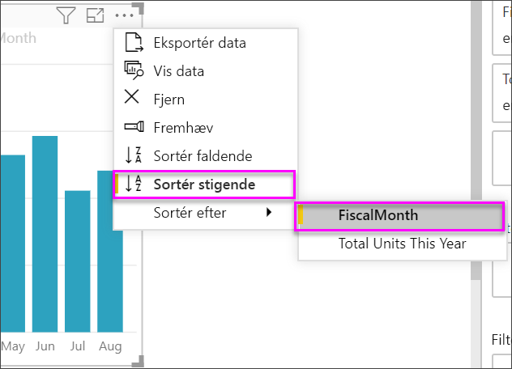
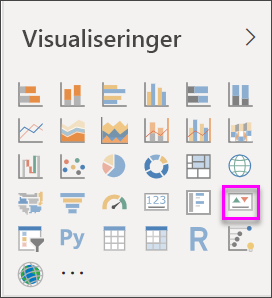
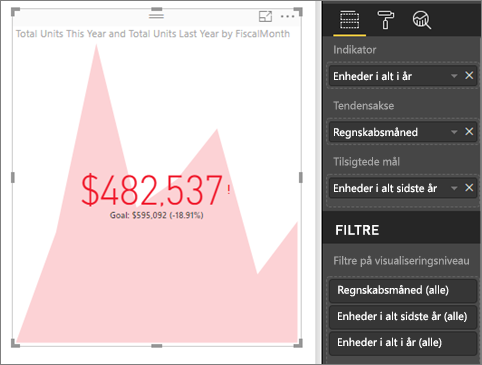

# Opret KPI-visualiseringer (Key Performance Indicator)

[!INCLUDE [power-bi-visuals-desktop-banner](../includes/power-bi-visuals-desktop-banner.md)]

Et nøgletal (KPI) er en visuel ledetråd, der viser fremgangen mod et målbart mål. Du kan finde flere oplysninger om KPI'er under [KPI'er-indikatorer (Key Performance Indicators) i PowerPivot](/previous-versions/sql/sql-server-2012/hh272050(v=sql.110)).

Se med, når Will viser, hvordan du opretter visualiseringer med en enkelt måling: målere, kort og KPI'er.
   > [!NOTE]
   > I denne video bruges en ældre version af Power BI Desktop.
   > 
   > 
<iframe width="560" height="315" src="https://www.youtube.com/embed/xmja6EpqaO0?list=PL1N57mwBHtN0JFoKSR0n-tBkUJHeMP2cP" frameborder="0" allowfullscreen></iframe>

## Hvornår bruger man et KPI

KPI'er er et godt valg:

* Til at måle status. Besvarer spørgsmålet "Hvor er jeg foran eller bagud?"

* Til at måle, hvor langt du har til et mål. Besvarer spørgsmålet "Hvor meget er jeg foran eller bagud?"

## KPI-krav

En designer baserer KPI-visualiseringer på et bestemt mål. Formålet med KPI'en er at hjælpe dig med at evaluere den aktuelle værdi og status for en metrikværdi i forhold til et angivet mål. En KPI-visualisering kræver en *udgangsmåling*, som evalueres til en værdi, en *destinationsmåling* eller -værdi og en *tærskel* eller et *mål*.

Et KPI-datasæt skal indeholde målværdier for en KPI. Hvis dit datasæt ikke indeholder målværdier, kan du oprette dem ved at føje et Excel-ark med mål til din datamodel eller PBIX-fil.

## Forudsætninger

I dette selvstudium bruges [PBIX-filen med eksemplet Detailhandelsanalyse](https://download.microsoft.com/download/9/6/D/96DDC2FF-2568-491D-AAFA-AFDD6F763AE3/Retail%20Analysis%20Sample%20PBIX.pbix).

1. Vælg **Fil** > **Åbn** i øverste venstre afsnit af menulinjen

1. Find din kopi af **PBIX-filen med eksemplet Detailhandelsanalyse**

1. Åbn **PBIX-filen med eksemplet Detailhandelsanalyse** i rapportvisning. 

1. Vælg **+** for at tilføje en ny side. 

## Sådan opretter du et KPI

I dette eksempel skal du oprette en KPI, der måler status i forhold til et defineret salgsmål.

1. I ruden **Felter** skal du vælge **Sales > Total Units This Year**.  Denne værdi er indikatoren.

1. Tilføj **Time > FiscalMonth**.  Denne værdi repræsenterer tendensen.

1. Vælg ellipsen i øverste højre hjørne af visualiseringen, og kontrollér, at Power BI har sorteret kolonnerne i stigende rækkefølge efter **FiscalMonth**.

    > [!IMPORTANT]
    > Når du har konverteret visualiseringen til et KPI, er der **ikke** muligt at sortere den. Du skal sortere den korrekt nu.

    

    Når visualiseringen er sorteret korrekt, ser den sådan ud:

    

1. Konvertér visualiseringen til en KPI ved at vælge ikonet **KPI** i ruden **Visualiseringer**.

    

1. Hvis du vil tilføje et mål, skal du trække **Total Units Last Year** til feltet **Target goals**.

    

1. Du kan eventuelt formatere KPI'et ved at vælge malerrulleikonet for at åbne ruden Formatering.

    * **Indicator** – -styrer indikatorens visningsenheder og decimalpladser.

    * **Trend axis** – når det er slået **Til**, viser visualiseringen tendensaksen som baggrund i KPI-visualiseringen.  

    * **Goals** – når det er slået **Til**, viser visualiseringen målet og afstanden til målet som en procentdel.

    * **Color coding > Direction** – nogle KPI'er anses som bedre for *højere* værdier, og nogle anses som bedre for *lavere* værdier. For eksempel indtægter i forhold til ventetid. En højere værdi for indtjening er typisk bedre i forhold til en højere værdi for ventetid. Vælg **Høj er godt**, og rediger eventuelt farveindstillingerne.

KPI'er er også tilgængelige i Power BI-tjenesten og på dine mobilenheder. Det giver dig mulighed for altid at have fingeren på pulsen i virksomheden.

## Overvejelser og fejlfinding

Hvis KPI'en ikke ligner det ovenfor, kan det skyldes, at du ikke har sorteret efter **FiscalMonth**. KPI'er har ikke en sorteringsindstilling. Du skal starte igen og sortere efter **FiscalMonth**, *før* du konverterer din visualisering til en KPI.

## Næste trin

* [Tip og tricks til Power BI-kortvisualiseringer](power-bi-map-tips-and-tricks.md)

* [Visualiseringstyper i Power BI](power-bi-visualization-types-for-reports-and-q-and-a.md)

Har du flere spørgsmål? [Prøv at spørge Power BI-community'et](https://community.powerbi.com/)
