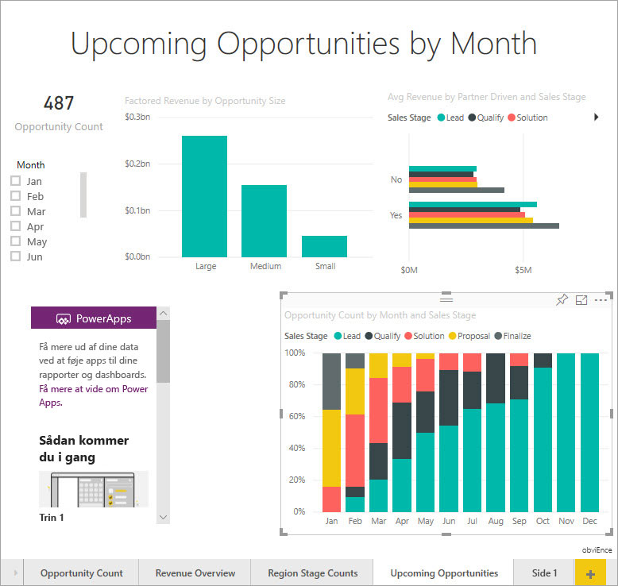
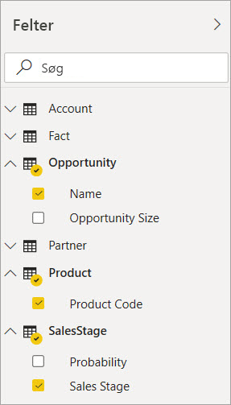
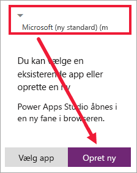
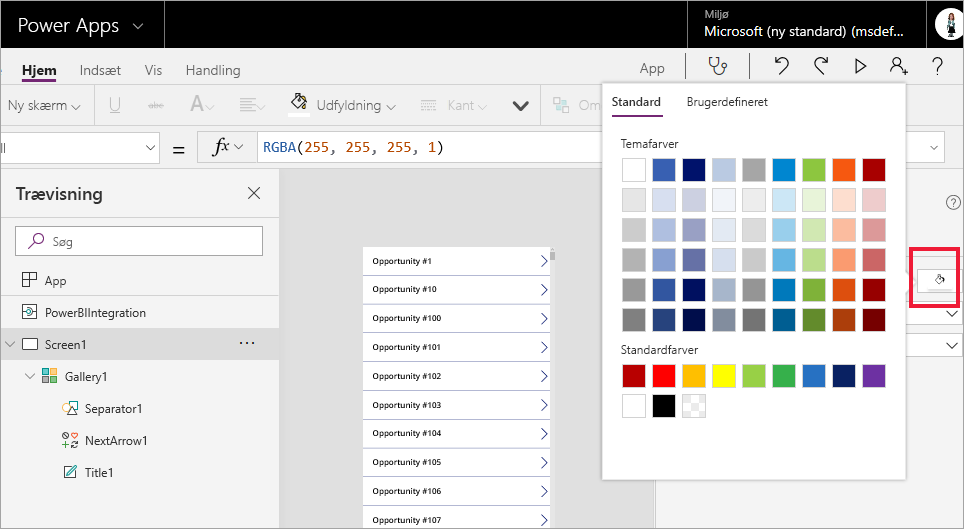
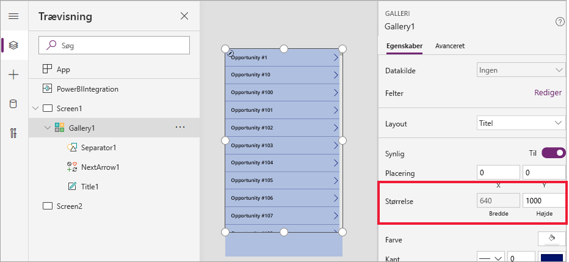
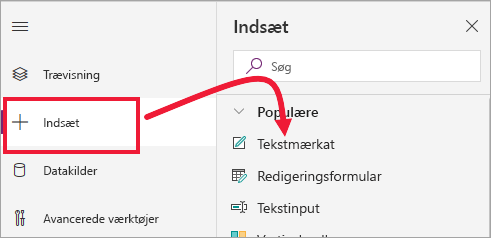
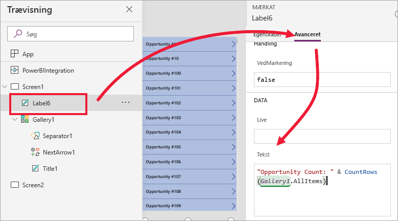
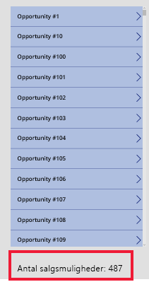
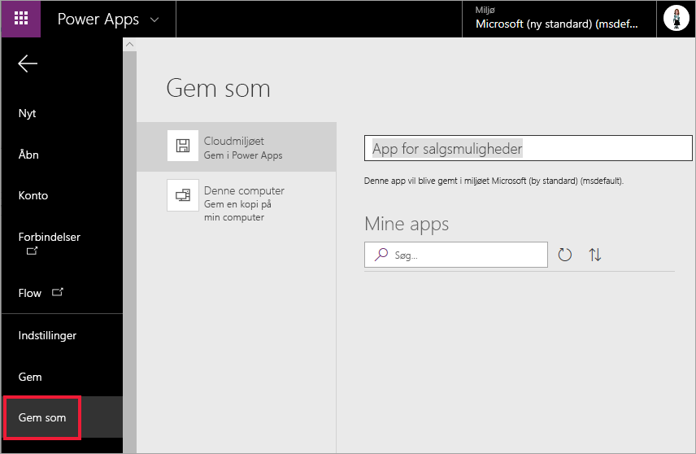
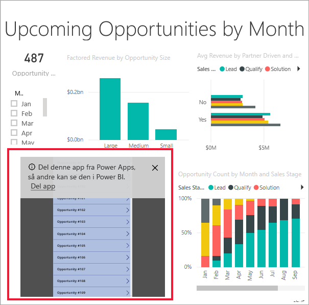

# Selvstudium: Integrer en Power Apps-visualisering i en Power BI-rapport

I dette selvstudie bruger du Power Apps-visualiseringen til at oprette en ny app, der er integreret i et eksempel på en Power BI-rapport. Denne app interagerer med andre visualiseringer i rapporten.

Hvis du ikke har et Power Apps-abonnement, skal du [oprette en gratis konto](https://web.powerapps.com/signup?redirect=marketing&email=), før du begynder.

I dette selvstudium lærer du, hvordan du kan:
> [!div class="checklist"]
> * Føj en Power Apps-visualisering til en Power BI-rapport
> * Arbejde i Power Apps for at oprette en ny app, der bruger data fra Power BI-rapporten.
> * Få vist og interagere med Power Apps-visualiseringen i rapporten.

## Forudsætninger

* En af browserne [Google Chrome](https://www.google.com/chrome/browser/) eller [Microsoft Edge](https://www.microsoft.com/windows/microsoft-edge).
* Et [Power BI-abonnement](https://docs.microsoft.com/power-bi/service-self-service-signup-for-power-bi) med [Eksempel på analyse af salgsmuligheder](https://docs.microsoft.com/power-bi/sample-opportunity-analysis#get-the-content-pack-for-this-sample) installeret.
* En forståelse af, hvordan du [opretter apps i Power Apps](https://docs.microsoft.com/powerapps/maker/canvas-apps/data-platform-create-app-scratch) og [redigerer Power BI-rapporter](https://docs.microsoft.com/power-bi/service-the-report-editor-take-a-tour).

## Opret en ny app
Når du føjer Power Apps-visualiseringen til din rapport, starter den Power Apps Studio med en dynamisk dataforbindelse mellem Power Apps og Power BI.

1. Åbn rapporten Eksempel på analyse af salgsmuligheder, og vælg siden *Kommende salgsmuligheder*. 

2. Flyt og tilpas størrelsen på nogle af rapportfelterne for at gøre plads til en ny visualisering.

    

2. I ruden Visualiseringer skal du vælge ikonet for Power Apps og derefter tilpasse størrelsen på visualiseringen, så den passer til den plads, du har lavet.

    

3. I ruden **Felter** skal du vælge **Name**, **Product Code** og **Sales Stage**. 

    

4. I Power Apps-visualiseringen skal du vælge det Power Apps-miljø, hvor du vil oprette appen og derefter klikke eller trykke på **Opret ny**.

    

    I Power Apps Studio kan du se, at der oprettes en grundlæggende app med et *galleri*, hvor der vises et af de felter, du valgte i Power BI.

    

5.  Tilpas størrelsen på galleriet, så det kun fylder halvdelen af skærmen. 

6. I venstre rude skal du vælge **Screen1** og derefter angive egenskaben **Fill** for skærmen til "LightBlue" (så det ser pænere ud i rapporten).

    

6. Gør plads til et mærkatkontrolelement. 

    

8. Indsæt et kontrolelement af typen tekstmærkat under **galleri**.

   

7. Træk mærkatet til bunden af visualiseringen. Angiv egenskaben **Text** til `"Opportunity Count: " & CountRows(Gallery1.AllItems)`. Nu vises det samlede antal salgsmuligheder i datasættet.

    

    

7. Gem appen med navnet "Salgsmuligheder". 

    

## Se appen i rapporten.
Appen er nu tilgængelig i Power BI-rapporten, og den interagerer med de øvrige visualiseringer, da den bruger den samme datakilde.

I Power BI-rapporten skal du vælge udsnittet **Jan**, som filtrerer hele rapporten inklusive dataene i appen.

Bemærk, at det viste antal salgsmuligheder i appen stemmer overens med tallet øverst til venstre i rapporten. Du kan vælge andre elementer i rapporten, hvorefter dataene i appen opdateres.

## Fjern ressourcer
Hvis du ikke længere vil bruge Eksempel på analyse af salgsmuligheder, kan du slette dashboardet, rapporten og dataarket.

## Næste trin
[Visual til Spørgsmål og svar](power-bi-visualization-types-for-reports-and-q-and-a.md)    
[Selvstudium: Integrer et Power Apps-visual i en Power BI-rapport](https://docs.microsoft.com/powerapps/maker/canvas-apps/powerapps-custom-visual)