# Introduktion til visualiseringen til Spørgsmål og svar i Power BI

[!INCLUDE [power-bi-service-new-look-include](../includes/power-bi-service-new-look-include.md)]

## Hvad er visualiseringen til Spørgsmål og svar

Visualiseringen til Spørgsmål og svar giver brugerne mulighed for at stille spørgsmål på et naturligt sprog og få svar i form af en visualisering. 

[!INCLUDE [power-bi-visuals-desktop-banner](../includes/power-bi-visuals-desktop-banner.md)]

Visualiseringen til Spørgsmål og svar kan både bruges som et værktøj til at give *forbrugerne* svar på deres data hurtigt og af *designere* til at oprette visualiseringer i rapporter ved blot at dobbeltklikke et vilkårligt sted i en rapport og bruge et naturligt sprog til at komme i gang. Da det fungerer som en hvilken som helst anden visualisering, kan visualiseringen til Spørgsmål og svar krydsfiltreres/-fremhæves, og den understøtter også bogmærker. Visualiseringen til Spørgsmål og svar understøtter også temaer og andre standardformateringsindstillinger, der er tilgængelige i Power BI.

Visualiseringen til Spørgsmål og svar består af fire kernekomponenter.

- Spørgsmålsfeltet. Det er her, brugerne skriver deres spørgsmål og får vist forslag, der kan hjælpe dem med at fuldføre deres spørgsmål.
- En foruddefineret liste over foreslåede spørgsmål.
- Ikonet for at konvertere visualiseringen til Spørgsmål og svar til en standardvisualisering. 
- Ikonet for at åbne værktøjet Spørgsmål og svar, der giver designere mulighed for at konfigurere det underliggende program til naturligt sprog.

## Forudsætninger

1. I dette selvstudium bruges [PBIX-filen med eksemplet til Salg og marketing](https://download.microsoft.com/download/9/7/6/9767913A-29DB-40CF-8944-9AC2BC940C53/Sales%20and%20Marketing%20Sample%20PBIX.pbix). 

1. Vælg **Fil** > **Åbn** på menulinjen i øverste venstre afsnit af Power BI Desktop
   
2. Find din kopi af **PBIX-filen med eksemplet til Salg og marketing**

1. Åbn filen i rapportvisning .

1. Markér  for at tilføje en ny side.

Hvis du får vist en fejl, når du opretter visualiseringen til Spørgsmål og svar, skal du kontrollere afsnittet med [begrænsninger](../natural-language/q-and-a-limitations.md) for at se, om konfigurationen af datakilden understøttes.

## Opret visualiseringen til Spørgsmål og svar ved hjælp af et foreslået spørgsmål
I denne øvelse vælger vi et af de foreslåede spørgsmål til at oprette vores visualisering til Spørgsmål og svar. 

1. Start på en tom rapportside, og vælg ikonet for visualiseringen til Spørgsmål og svar i ruden Visualiseringer.

    

2. Træk kanten for at tilpasse størrelsen af visualiseringen.

    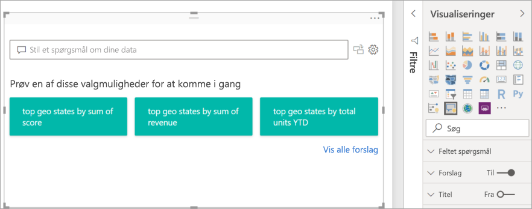

3. Hvis du vil oprette visualiseringen, skal du vælge et af de foreslåede spørgsmål eller begynde at skrive i spørgsmålsfeltet. I dette eksempel har vi valgt **de mest populære geo-stater efter omsætningssum**. Power BI gør sit bedste for at vælge den visualiseringstype, der skal bruges. I dette tilfælde er det et kort.

    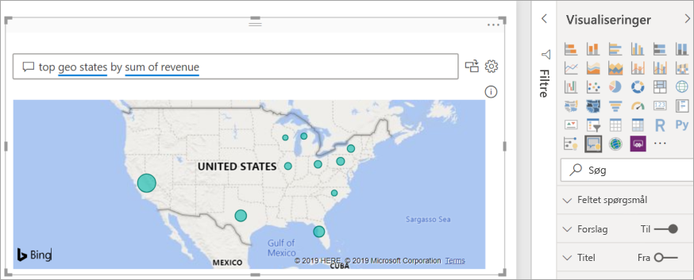

    Men du kan fortælle Power BI, hvilken visualiseringstype du vil bruge, ved at føje den til din forespørgsel på et naturligt sprog. Vær opmærksom på, at det ikke er alle visualiseringstyper, der vil fungere eller give mening for dine data. Disse data ville f.eks. ikke resultere i et meningsfyldt punktdiagram. Men de fungerer som et kartogram.

    

## Opret en visualisering til Spørgsmål og svar ved hjælp af en forespørgsel på et naturligt sprog
I ovenstående eksempel valgte vi et af de foreslåede spørgsmål til at oprette vores visualisering til Spørgsmål og svar.  I denne øvelse skriver vi vores spørgsmål. I takt med at vi skriver vores spørgsmål, hjælper Power BI os med autofuldførelse, forslag og feedback.

Hvis du er usikker på, hvilken type spørgsmål du skal stille, eller hvilken terminologi du skal bruge, skal du udvide **Vis alle forslag** eller gennemse ruden Felter, som findes i højre side af lærredet. På den måde bliver du bekendt med begreberne og indholdet i datasættet Salg og marketing.

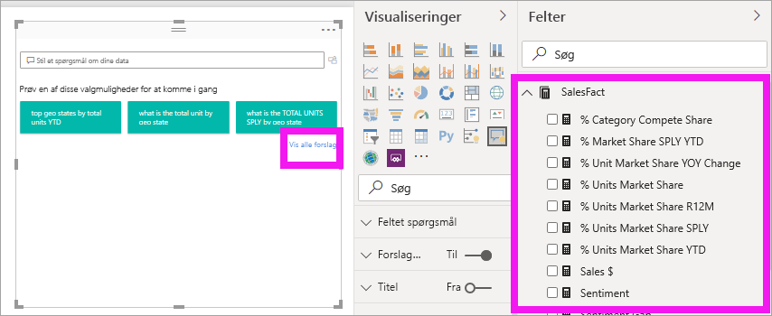

1. Skriv et spørgsmål i feltet Spørgsmål og svar. Power BI føjer en rød understregning til ord, der ikke genkendes. Når det er muligt, hjælper Power BI med at definere ord, der ikke genkendes.  I det første eksempel nedenfor vil valg af begge forslag fungere.  

    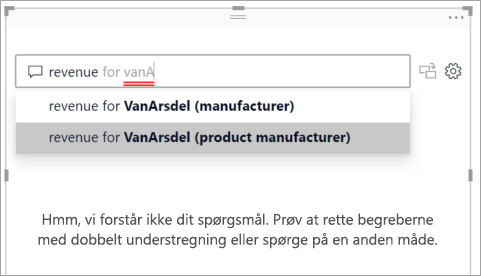

2. I takt med at vi skriver mere af spørgsmålet, giver Power BI os besked om, at spørgsmålet ikke er forstået, og forsøger at hjælpe. I eksemplet nedenfor spørger Power BI os "Mente du..." og foreslår en anden måde at formulere spørgsmålet på ved hjælp af terminologi fra vores datasæt. 

    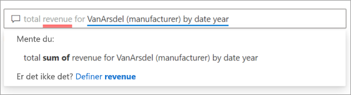

5. Ved hjælp af Power BI kunne vi stille et spørgsmål kun med genkendelige begreber. Power BI viser resultaterne som et kurvediagram. 

    

6. Lad os ændre visualiseringen til et søjlediagram. 

    

## Formatér og tilpas visualiseringen til Spørgsmål og svar
Visualiseringen til Spørgsmål og svar kan tilpasses ved hjælp af formateringsruden og anvendelse af et tema. 

### Anvend et tema
Når du vælger et tema, anvendes temaet på hele rapportsiden. Der er mange temaer at vælge imellem, så prøv dem, indtil du får det ønskede udseende. 

1. På menulinjen skal du vælge fanen **Start** og vælge **Skift tema**. 

    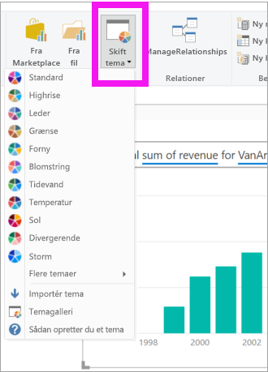

    
    
2. I dette eksempel har vi valgt **Flere temaer** > **Kan bruges af farveblinde**.

    

### Formatér visualiseringen til Spørgsmål og svar
Formatér visualiseringen til Spørgsmål og svar, spørgsmålsfeltet og den måde, som forslagene vises på. Du kan ændre alt lige fra en titels baggrund til den pegefølsomme farve for ord, der ikke genkendes. Her har vi føjet en grå baggrund til spørgsmålsfeltet og ændret understregningerne til gul og grøn. Titlen er centreret og har en gul baggrund. 

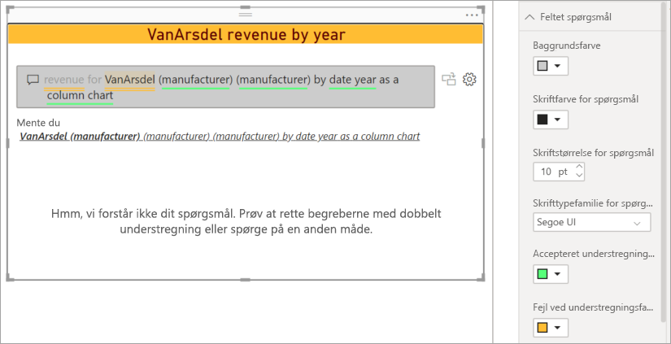

## Konvertér din visualisering til Spørgsmål og svar til en standardvisualisering
Vi har formateret vores visualisering som et søjlediagram, der kan bruges af farveblinde, og tilføjet en titel og en kant. Nu er vi klar til at konvertere den til en standardvisualisering i vores rapport samt fastgøre den til et dashboard.

Vælg ikonet  for at **omdanne dette resultat fra Spørgsmål og svar til en standardvisualisering**.

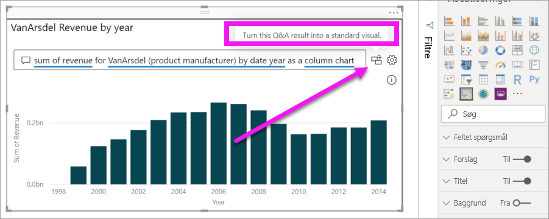

Denne visualisering er ikke længere en visualisering til Spørgsmål og svar, men et standardsøjlediagram. Den kan fastgøres til et dashboard. I rapporten fungerer denne visualisering ligesom andre standardvisualiseringer. Bemærk, at der vises et ikon for et søjlediagram i ruden Visualiseringer i stedet for et ikon for visualiseringen til Spørgsmål og svar.

Hvis du bruger ***Power BI-tjenesten***, kan du nu fastgøre visualiseringen til et dashboard ved at vælge fastgøringsikonet. 

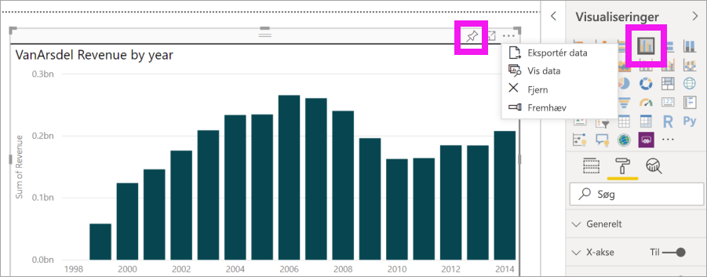

## Avancerede funktioner i visualiseringen til Spørgsmål og svar
Når du vælger tandhjulsikonet, åbnes ruden med værktøjer til visualiseringen til Spørgsmål og svar. 

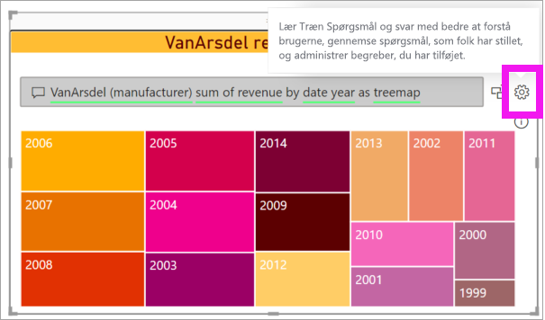

Brug ruden Værktøjer til at lære Spørgsmål og svar begreber, det ikke genkender, til at administrere disse begreber og administrere de foreslåede spørgsmål til dette datasæt og denne rapport. I ruden Værktøjer kan du også gennemse spørgsmål, der er blevet stillet ved hjælp af denne visualisering til Spørgsmål og svar, og se spørgsmål, som brugerne har markeret med et flag. Hvis du vil vide mere, skal du se [Værktøjer til Spørgsmål og svar](../natural-language/q-and-a-tooling-intro.md).

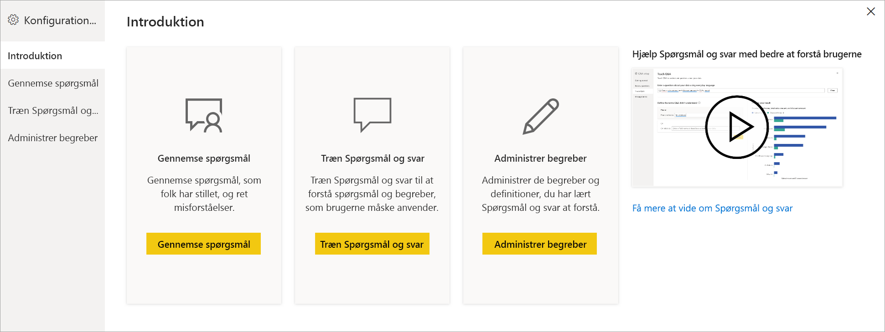

## Overvejelser og fejlfinding
Visualiseringen til Spørgsmål og svar kan integreres med Office og Bing for at forsøge at matche almindelige ord, der ikke genkendes, med felter i dit datasæt.  

## Næste trin

Du kan integrere et naturligt sprog på flere forskellige måder. Du kan få flere oplysninger i følgende artikler:

* [Værktøjer til Spørgsmål og svar](../natural-language/q-and-a-tooling-intro.md)
* [Bedste praksis for Spørgsmål og svar](../natural-language/q-and-a-best-practices.md)
