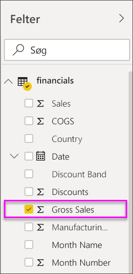
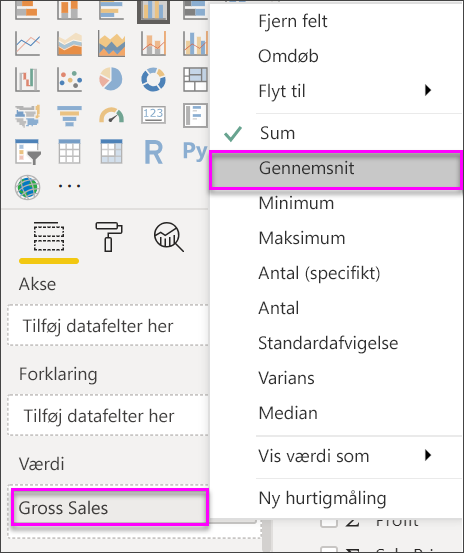
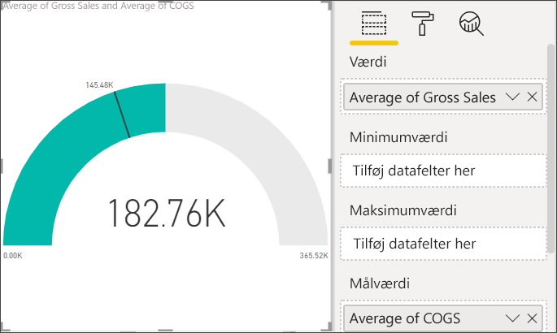
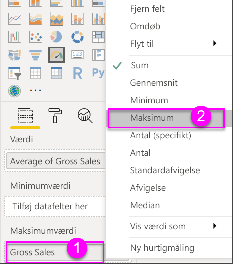
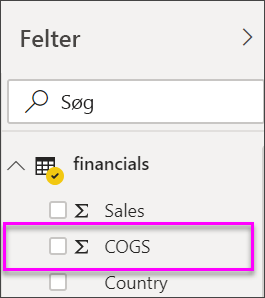
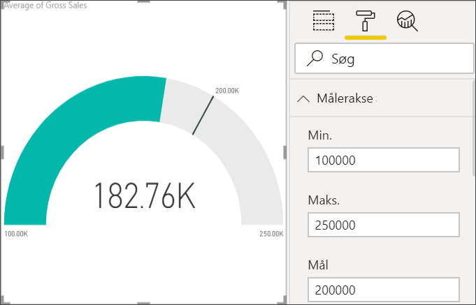

# Radiale målerdiagrammer i Power BI

[!INCLUDE[consumer-appliesto-nyyn](../includes/consumer-appliesto-nyyn.md)]

[!INCLUDE [power-bi-visuals-desktop-banner](../includes/power-bi-visuals-desktop-banner.md)]

Et radialt målerdiagram har en cirkulær bue og viser en enkelt værdis status i forhold til et mål eller en KPI (Key Performance Indicator). Linjen (eller *nålen*) repræsenterer målet eller målværdien. Skyggen repræsenterer status i forhold til målet. Værdien i buen repræsenterer statusværdien. Power BI spreder alle de mulige værdier langs buen fra minimumværdien (længst til venstre) til maksimumværdien (længst til højre).

I dette eksempel er du en bilhandler, der sporer det gennemsnitlige salg pr. måned for salgsteamet. Nålen repræsenterer et salgsmål på 140 biler. Det mindst mulige gennemsnitssalg er 0, og maksimum er 200.  Den blå farve viser, at teamet i øjeblikket er på et salg på 120 i denne måned. Der er heldigvis stadig en uge til at nå målet.

> [!NOTE]
> Når du deler din rapport med en Power BI-kollega, kræves det, at I begge har individuelle Power BI Pro-licenser, eller at rapporten er gemt i en Premium-kapacitet.

## Situationer, hvor du kan bruge en radial måler

Radiale målere er fantastiske til:

* at vise status i forhold til et mål

* at repræsentere en måling i procenter, f.eks. KPI

* at vise tilstanden for en enkelt måling.

* Viser oplysninger, du hurtigt kan gennemse og forstå.

## Forudsætninger

I dette selvstudium bruges [Excel-filen med eksemplet Økonomisk](https://download.microsoft.com/download/9/6/D/96DDC2FF-2568-491D-AAFA-AFDD6F763AE3/Retail%20Analysis%20Sample%20PBIX.pbix).

1. Vælg **Hent data** > **Excel** i øverste venstre afsnit af menulinjen
   
2. Find din kopi af **Excel-filen med eksemplet Økonomisk**

1. Åbn **Excel-filen med eksemplet Økonomisk** i rapportvisning .

1. Vælg **financials** og **Sheet1**

1. Klik på **Indlæs**

1. Markér  for at tilføje en ny side.

## Opret en grundlæggende radial måler

### Trin 1: Opret en måler for at spore bruttoomsætningen (Gross Sales)

1. Start på en tom rapportside

1. Vælg **Gross Sales** i ruden **Felter**.

   

1. Ret aggregeringen til **Gennemsnit**.

   

1. Vælg målerikonet  for at konvertere søjlediagrammet til et målerdiagram.

    

    Afhængigt af, hvornår du henter filen **Financial Sample**, får du muligvis vist tal, der ikke stemmer overens med disse tal.

    > [!TIP]
    > Som standard opretter Power BI et målerdiagram, hvor det antages, at den aktuelle værdi (i dette tilfælde **Gennemsnit af Gross Sales**) er midtvejspunktet for måleren. Da værdien i **Gennemsnit af Gross Sales** er 182,76tusind, er startværdien (Minimum) indstillet til 0, og slutværdien (Maksimum) er indstillet til det dobbelte af den aktuelle værdi.

### Trin 3: Indstil en målværdi

1. Træk **COGS** fra ruden **Felter** til området **Målværdi**.

1. Ret aggregeringen til **Gennemsnit**.

   Power BI tilføjer en nål, der repræsenterer målværdien **145,48tusind**.

   

    Bemærk, at vi er over vores mål.

   > [!NOTE]
   > Du kan også angive en målværdi manuelt. Se afsnittet [Brug manuelle formateringsindstillinger til at angive værdierne for Minimum, Maksimum og Mål](#use-manual-format-options-to-set-minimum-maximum-and-target-values).

### Trin 4: Angiv en maksimumværdi

I trin 2 brugte Power BI feltet **Værdi** til automatisk at angive minimum- og maksimumværdier. Hvordan kan du angive din egen maksimumværdi? Lad os antage, at i stedet for at anvende det dobbelte af den aktuelle værdi som maksimumværdi vil du anvende det højeste tal i Gross Sales fra datasættet.

1. Træk **Gross Sales** fra ruden **Felter** til området **Maksimumværdi**.

1. Ret aggregeringen til **Maksimum**.

   

   Måleren gentegnes med en ny slutværdi, som er på bruttoomsætningen 1,21 millioner.

   

### Trin 5: Gem din rapport

1. [Gem rapporten](../create-reports/service-report-save.md).

## Brug manuelle formateringsindstillinger til at angive værdierne for Minimum, Maksimum og Mål

1. Fjern **Maks. af Gross Sales** fra **Maksimumværdi**.

1. Vælg malerrulleikonet for at åbne ruden **Formatér**.

   

1. Udvid **Målerakse**, og angiv værdier for **Min.** og **Maks.**

    

1. Fjern markeringen i indstillingen **COGS** i ruden **Felter** for at fjerne målværdien.

    

1. Når feltet **Mål** vises under **Målerakse**, skal du angive en værdi.

     

1. Fortsæt eventuelt med at formatere dit målerdiagram.

Når du er færdig med disse trin, har du et målerdiagram, der ser nogenlunde sådan ud:

## Næste trin

* [KPI-visualiseringer (Key Performance Indicator)](power-bi-visualization-kpi.md)

* [Visualiseringstyper i Power BI](power-bi-visualization-types-for-reports-and-q-and-a.md)

Har du flere spørgsmål? [Prøv at spørge Power BI-community'et](https://community.powerbi.com/)

