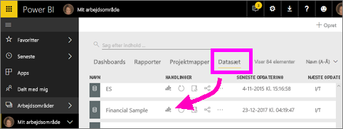
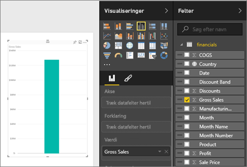
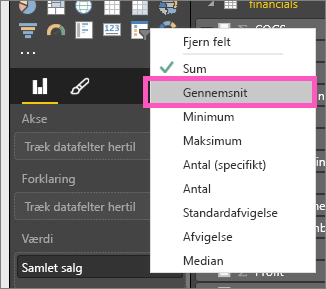
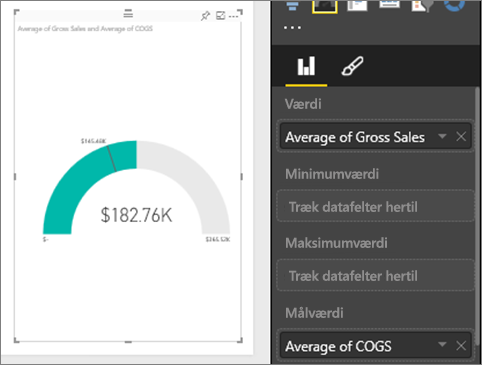
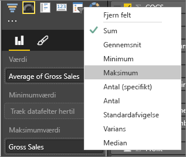
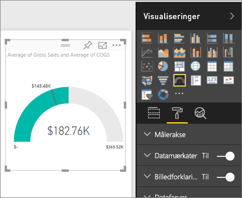
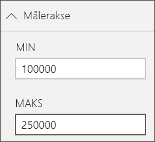
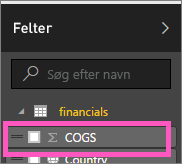
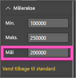

# Radiale målerdiagrammer i Power BI
Et radialt målerdiagram har en cirkulær bue og viser en enkelt værdis status i forhold til et mål/en KPI.  Målet, eller målværdien, er repræsenteret med en streg (nål). Statussen mod målet repræsenteres med en skygge.  Den værdi, der repræsenterer statussen, vises med fed i buen. Alle de mulige værdier er fordelt langs buen fra minimumværdien (længst til venstre) til maksimumværdien (længst til højre).

I eksemplet nedenfor spores det gennemsnitlige salg pr. måned for salgsteamet hos en bilforhandler. Målet er 140, hvilket repræsenteres med den sorte nål.  Det mindst mulige salg er 0, og vi har angivet maksimum til 200.  Den blå farve viser, at vi i øjeblikket er på 120 salg i denne måned. Der er heldigvis stadig en uge til at nå målet.

## Situationer, hvor du kan bruge en radial måler
Radiale målere er fantastiske til:

* At se statussen mod et mål.
* Repræsentere en percentil måling, for eksempel en KPI.
* Vise statussen for en enkelt måling.
* Vise oplysninger, der er hurtige at skimme og forstå.

### Forudsætninger
 - Power BI-tjenesten eller Power BI Desktop
 - Projektmappen Financial Sample: [download eksemplet direkte](http://go.microsoft.com/fwlink/?LinkID=521962).

## Opret en grundlæggende radial måler
Denne vejledning bruger Power BI-tjenesten. Følg med ved at logge på Power BI og åbne filen Excel Financial Sample.  

Eller du kan se med, når Will viser, hvordan du opretter visualiseringer med en enkelt måling: målere, kort og KPI'er.

<iframe width="560" height="315" src="https://www.youtube.com/embed/xmja6EpqaO0?list=PL1N57mwBHtN0JFoKSR0n-tBkUJHeMP2cP" frameborder="0" allowfullscreen></iframe>

### Trin 1: Åbn filen Financial Sample i Excel
1. [Download Excel-filen med eksemplet Financial Sample](../sample-financial-download.md), hvis du ikke allerede har gjort det. Husk, hvor du gemmer den.

2. Åbn filen i ***Power BI-tjeneste*** ved at vælge **Hent data\> Filer**, og gå til det sted, hvor du gemte filen. Vælg **Importér**. Financial Sample-filen tilføjes i dit arbejdsområde som et datasæt.

3. Vælg **Financial Sample** på indholdslisten **Datasæt** for at åbne det i udforskningstilstand.

    

### Trin 2: Opret en måler for at spore bruttoomsætningen (Gross Sales)
1. Vælg **Gross Sales** i ruden **Felter**.
   
   
2. Ret aggregeringen til **Gennemsnit**.
   
   
3. Vælg målerikonet  for at konvertere søjlediagrammet til en måler.
   
   Som standard vil Power BI oprette et målerdiagram, hvor den aktuelle værdi (i dette tilfælde Gennemsnit af Gross Sales) antages at være midtvejspunktet for måleren. Da gennemsnittet af Gross Sales er 182,76tusind, er startværdien (Minimum) indstillet til 0, og slutværdien (Maksimum) er indstillet til det dobbelte af den aktuelle værdi.
   
   

### Trin 3: Indstil en målværdi
1. Træk **COGS** til området **Målværdi**.
2. Ret aggregeringen til **Gennemsnit**.
   Power BI tilføjer en nål, der repræsenterer målværdien **145,48tusind**. Bemærk, at vi er over vores mål.
   
   
   
   > [!NOTE]
   > Du kan også angive en målværdi manuelt.  Se "Brug formateringsindstillinger til manuelt at angive værdierne Minimum, Maksimum og Mål" nedenfor.
   > 
   > 

### Trin 4: Angiv en maksimumværdi
På trin 2 brugte Power BI feltet Værdi til automatisk at angive en minimum- (start) og maksimumværdi (slut).  Men, hvordan kan du angive din egen maksimumværdi?  Lad os antage, at i stedet for at anvende det dobbelte af den aktuelle værdi som maksimumværdi, vil du anvende det højeste tal i Gross Sales fra datasættet? 

1. Træk **Gross Sales** fra listen **Felter** til **Maksimumværdi**.
2. Ret aggregeringen til **Maksimum**.
   
   
   
   Måleren gentegnes med en ny slutværdi, som er på bruttoomsætningen 1,21 millioner.
   
   

### Trin 5: Gem din rapport
1. [Gem rapporten](../service-report-save.md).
2. [Tilføj målerdiagram som et dashboardfelt](../service-dashboard-pin-tile-from-report.md). 

## Brug formateringsindstillinger til manuelt at angive værdierne Minimum, Maksimum og Mål
1. Fjern **Maks. af Gross Sales** fra **Maksimumværdi**.
2. Åbn formateringsruden ved at vælge ikonet med malerullen.
   
   
3. Udvid **Målerakse**, og angiv værdier for **Min** og **Maks**.
   
    
4. Fjern den aktuelle målværdi ved at fjerne afkrydsningsfeltet ud for **COGS**.
   
    
5. Når feltet **Mål** vises under **Målerakse**, skal du angive en værdi.
   
    
6. Fortsæt eventuelt med at formatere dit målerdiagram.

## Næste trin

[Målere i Power BI](power-bi-visualization-kpi.md)

[Visualiseringstyper i Power BI](power-bi-visualization-types-for-reports-and-q-and-a.md)
