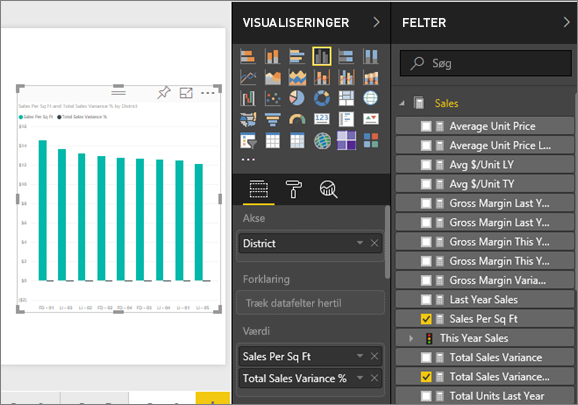
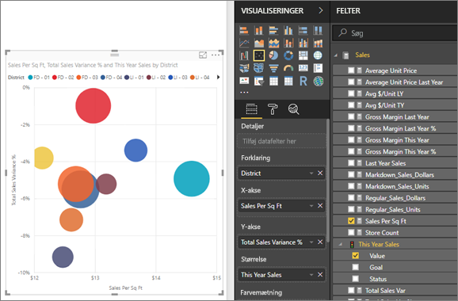
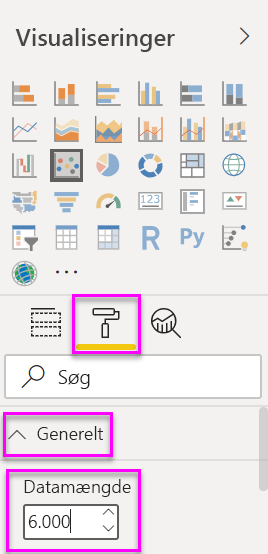
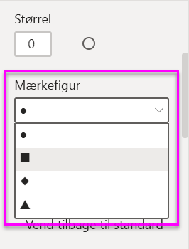
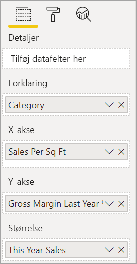
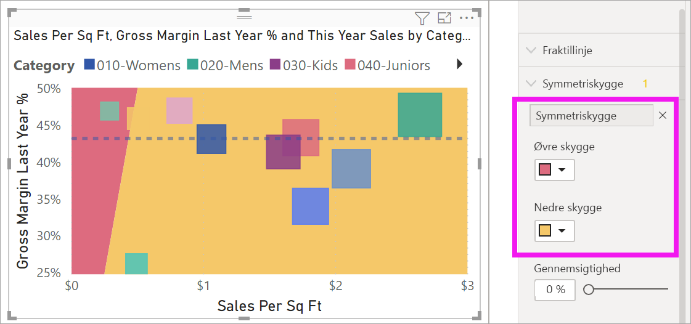
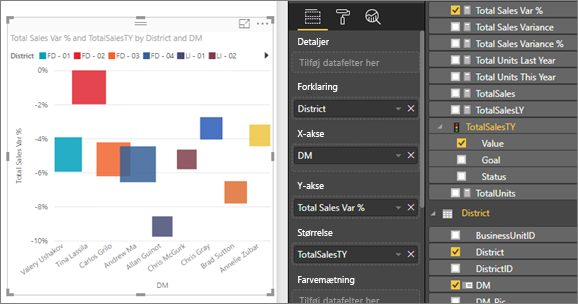
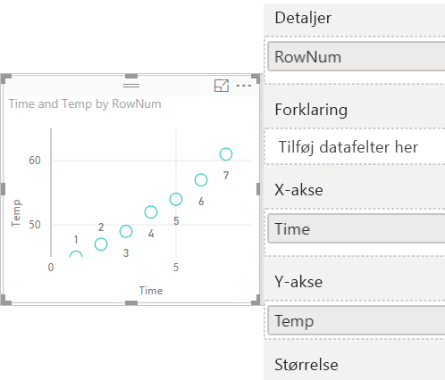
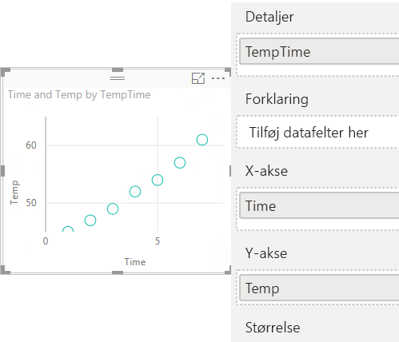

# Punktdiagrammer, boblediagrammer og prikdiagrammer i Power BI

[!INCLUDE[consumer-appliesto-nyyn](../includes/consumer-appliesto-nyyn.md)]

[!INCLUDE [power-bi-visuals-desktop-banner](../includes/power-bi-visuals-desktop-banner.md)]

Et punktdiagram har altid to værdiakser, der vises: ét sæt numeriske data langs en vandret akse og et andet sæt numeriske værdier langs en lodret akse. Diagrammet viser punkter ved skæringspunktet for en numerisk x- og y-værdi og kombinerer disse værdier i enkelte datapunkter. Power BI kan fordele disse datapunkter jævnt eller ujævnt på tværs af den vandrette akse. Det afhænger af de data, der repræsenteres i diagrammet.

Du kan fastsætte antallet af datapunkter, højst 10.000.  

## Hvornår skal man bruge et punktdiagram, et boblediagram eller et prikdiagram?

### Punkt- og boblediagrammer

Et punktdiagram viser relationen mellem to numeriske værdier. Et boblediagram erstatter datapunkter med bobler, hvor boblernes *størrelse* repræsenterer en yderligere tredje dimension af dataene.

Punktdiagrammer er praktiske til følgende situationer:

* Hvis du vil vise relationer mellem to numeriske værdier.

* Hvis du vil afbilde to grupper af tal som en serie af x- og y-koordinater.

* Hvis du vil bruge det i stedet for et kurvediagram, når du vil ændre skalaen for den vandrette akse.

* Hvis du vil ændre den vandrette akse til en logaritmisk skala.

* Hvis du vil vise projektmappedata, der inkluderer par eller grupperede værdisæt.

    > [!TIP]
    > I et punktdiagram kan du tilpasse akseskalaerne uafhængigt af hinanden for at afsløre flere oplysninger om grupperede værdier.

* Hvis du vil vise mønstre i store datasæt, for eksempel ved at vise lineære eller ikke-lineære tendenser, klynger og udenforliggende værdier.

* Hvis du vil sammenligne store antal datapunkter uden hensyntagen til tiden.  Jo flere data du medtager i et punktdiagram, jo bedre sammenligninger kan du udføre.

Ud over det, punktdiagrammer kan gøre for dig, er boblediagrammer et godt valg:

* Hvis dine data har tre dataserier, som hver især indeholder et sæt værdier.

* Hvis du vil præsentere finansielle data.  Forskellige boblestørrelser er praktiske til visuel fremhævning af specifikke værdier.

* Til brug med kvadranter.

### Prikdiagrammer

Et prikdiagram ligner et boblediagram og et punktdiagram, men bruges i stedet til at angive kategoriske data langs X-aksen.

De er et godt valg, hvis du vil medtage kategoriske data langs X-aksen.

## Forudsætninger

I dette selvstudium bruges [PBIX-filen med eksemplet Detailhandelsanalyse](https://download.microsoft.com/download/9/6/D/96DDC2FF-2568-491D-AAFA-AFDD6F763AE3/Retail%20Analysis%20Sample%20PBIX.pbix).

1. Vælg **Fil** > **Åbn** i øverste venstre afsnit af menulinjen
   
2. Find din kopi af **PBIX-filen med eksemplet Detailhandelsanalyse**

1. Åbn **PBIX-filen med eksemplet Detailhandelsanalyse** i rapportvisning .

1. Markér  for at tilføje en ny side.

> [!NOTE]
> Når du deler din rapport med en Power BI-kollega, kræves det, at I begge har individuelle Power BI Pro-licenser, eller at rapporten er gemt i en Premium-kapacitet.    

## Opret et punktdiagram

1. Start på en tom rapportside, og vælg følgende felter i ruden **Felter**:

    * **Salg** > **Salg pr. kvm.**

    * **Salg** > **Samlet salgsvarians i %**

    * **Distrikt** > **Distrikt**

    

1. I ruden **Visualiseringer** skal du vælge  for at konvertere det grupperede søjlediagram til et punktdiagram.

   

1. Træk **District** fra **Detaljer** til **Forklaring**.

    Power BI viser et punktdiagram med **Total Sales Variance %** langs Y-aksen og **Sales Per Square Feet** langs X-aksen. Datapunkternes farver repræsenterer distrikter:

    

Nu tilføjer jeg en tredje dimension.

## Opret et boblediagram

1. I ruden **Felter** skal du trække **Sales** > **This Year Sales** > **Value** til området **Størrelse**. Datapunkterne udvides til mængder, der er proportionale med salgsværdien.

   

1. Peg på en boble. Boblens størrelse afspejler værdien af **This Year Sales**.

    

1. Hvis du vil angive antallet af datapunkter, der skal vises i dit boblediagram, skal du udvide **Generelt** i ruden **Visualiseringer** i sektionen **Formatér** og justere **Datamængde**.

    

    Du kan angive, at den maksimale datamængde skal være et vilkårligt tal op til 10.000. Når du når til højere tal, anbefaler vi, at du tester det først for at sikre, at der bibeholdes en brugbar ydeevne.

    > [!NOTE]
    > Flere datapunkter kan betyde en længere indlæsningstid. Hvis du vælger at publicere rapporter med begrænsninger i den højere ende af skalaen, skal du sørge for at teste dine rapporter på både internettet og mobilenheder. Du ønsker at bekræfte, at diagrammets ydeevne svarer til dine brugeres forventninger.

1. Fortsæt med at formatere farver, navne, titler, baggrund og mere i dine visualiseringer. Hvis du vil [forbedre tilgængeligheden](../create-reports/desktop-accessibility-overview.md), bør du overveje at føje mærkeformer til hver enkelt linje. Hvis du vil vælge mærkeformen, skal du udvide **Figurer**, vælge **Mærkeform** og derefter vælge en form.

    

    Ret mærkeformen til en diamant, trekant eller firkant. Hvis du bruger en anden mærkeform for hver enkelt linje, kan brugere af rapporter nemmere adskille linjer (eller områder) fra hinanden.

1. Åbn ruden Analyse  for at føje flere oplysninger til din visualisering.  
    - Tilføj en medianlinje. Vælg **Medianlinje** > **Tilføj**. Som standard tilføjes der en medianlinje for *Salg pr. kvm* i Power BI. Det er ikke videre praktisk, da vi kan se, at der er 10 datapunkter, og vi ved, at medianen oprettes med fem datapunkter på hver side. Du skal i stedet ændre **målingen** til *Afvigelse i samlet salg i %* .  

        

    - Tilføj symmetriskygger for at vise, hvilke punkter der har en højere værdi for målingen på x-aksen i forhold til målingen på y-aksen og omvendt. Når du slår symmetriskygger til i ruden Analyse, får du vist baggrunden af dit punktdiagram symmetrisk baseret på aksens øverste og laveste grænser. Du kan bruge denne metode til hurtigt at finde ud af, hvilket aksemål et datapunkt favoriserer, især når du har et andet akseområde til din x- og y-akse.

        a. Ret feltet **Afvigelse for samlet salg i %** til **Bruttoavance for sidste år i %**

        

        b. Tilføj **symmetriskygge** fra ruden Analyse. Ud fra skyggen kan vi se, at Hosiery (den grønne boble i det lyserøde område) er den eneste kategori, der favoriserer bruttoavancen frem for salget pr. butikskvadratmeter. 

        

    - Fortsæt med at udforske ruden Analyse for at se mere om dine data. 

        

## Opret et prikdiagram

Hvis du vil oprette et prikdiagram, skal du erstatte det numeriske felt **X-akse** med et kategorifelt.

Fra ruden **X-akse** skal du fjerne **Sales per sq ft** og erstatte det med **District** > **District Manager**.

## Overvejelser og fejlfinding

### Dit punktdiagram har kun ét datapunkt

Har dit punktdiagram kun ét datapunkt, der aggregerer alle værdierne på X- og Y-aksen?  Eller aggregeres alle værdierne langs en enkelt vandret eller lodret linje?

Tilføj et felt i området **Detaljer** for at angive, hvordan værdierne skal grupperes i Power BI. Feltet skal være entydigt for hvert punkt, der skal afbildes. Et enkelt rækkenummer eller id-felt er nok.

Hvis det ikke findes i dine data, kan du oprette et felt, der sammensætter X- og Y-værdierne til noget entydigt pr. punkt:

Du kan oprette et nyt felt ved at [bruge Forespørgselseditor i Power BI Desktop til at tilføje en indekskolonne](../create-reports/desktop-add-custom-column.md) i dit datasæt. Tilføj derefter denne kolonne i området **Detaljer** for din visualisering.

## Næste trin

Du vil måske også være interesseret i følgende artikler:

* [Stikprøvetagning med høj tæthed i Power BI-punktdiagrammer](../create-reports/desktop-high-density-scatter-charts.md)
* [Visualiseringstyper i Power BI](power-bi-visualization-types-for-reports-and-q-and-a.md)
* [Tip til sortering og distribution af dataafbildninger i Power BI-rapporter](../guidance/report-tips-sort-distribute-data-plots.md)

Har du flere spørgsmål? [Prøv at spørge Power BI-community'et](https://community.powerbi.com/)
