# Udsnitsværktøjer i Power BI

[!INCLUDE [power-bi-visuals-desktop-banner](../includes/power-bi-visuals-desktop-banner.md)]

Du kan f.eks. give rapportlæserne mulighed for at se de overordnede salgstal, men samtidig fremhæve resultaterne for individuelle distriktschefer og forskellige tidsperioder. Du kan oprette separate rapporter eller diagrammer til sammenligning. Eller du kan bruge udsnitsværktøjer. Et udsnit er en alternativ metode til filtrering, som begrænser den del af datasættet, der vises i andre visualiseringer i en rapport. 

I dette selvstudium bruges det gratis [eksempel på detailhandelsanalyse](../sample-retail-analysis.md) til at gennemgå, hvordan du opretter, formaterer og bruger liste- og datointervaludsnit. Mor dig med at opdage måder, du kan formatere og bruge udsnit på. 

## Hvornår man bruger et udsnit
Udsnit er et fantastisk valg, når du vil:

* vise almindeligt anvendte eller vigtige filtre på rapportlærredet for at få lettere adgang.
* gøre det nemmere at se den aktuelle filtrerede tilstand uden at skulle åbne en rulleliste 
* filtrere efter kolonner, der ikke er behov for, og som er skjult i datatabeller
* oprette mere fokuserede rapporter ved at placere udsnit ved siden af vigtige visualiseringer.

Power BI-udsnitsværktøjer understøtter ikke:

- Inputfelter
- Detailudledning

## Opret udsnit

**Opret et nyt udsnit for at filtrere data efter distriktschef**

1. Download [PBIX-filen Retail Analysis Sample](https://download.microsoft.com/download/9/6/D/96DDC2FF-2568-491D-AAFA-AFDD6F763AE3/Retail%20Analysis%20Sample%20PBIX.pbix).

1. Vælg **Filer** > **Åbn** på menulinjen i Power BI Desktop.
   
1. Gå til filen **Retail Analysis sample PBIX.pbix**, og vælg derefter **Åbn**.

1. I ruden til venstre skal du vælge ikonet **Rapport**  for at åbne filen i rapportvisning.

1. Uden at have markeret noget på rapportlærredet skal du på siden **Oversigt** vælge ikonet **Udsnit**  i ruden **Visualiseringer** for at oprette et nyt udsnit. 

1. Med det nye udsnit markeret skal du vælge **Distrikt** > **DM** i ruden **Felter** for at udfylde udsnittet. 

    Det nye udsnit er nu udfyldt med en liste over distriktschefernes navne og deres markeringsfelter.
    
    
    
1. Tilpas størrelsen på og træk elementerne på lærredet for at gøre plads til udsnittet. Bemærk, at hvis du ændrer størrelsen på udsnittet, så det bliver for lille, afskæres elementerne. 

1. Vælg navne på udsnittene, og bemærk, hvordan det påvirker de øvrige visualiseringer på siden. Vælg navnene igen for at fjerne markeringen af dem, eller hold **Ctrl** nede for at markere mere end ét navn. Hvis du markerer alle navnene, vil det have samme effekt som ikke at markere nogen af dem. 

1. Du kan også vælge **Format** (ikonet med malerrullen) i ruden **Visualiseringer** for at formatere dit udsnit. 

   Der er for mange muligheder til at kunne beskrive dem alle her. Eksperimentér, og opret et udsnit, der fungerer for dig. På følgende billede er retningen vandret i det første udsnit, og der bruges farvede baggrunde til elementerne. I det andet udsnit er retningen lodret, og der bruges farvet tekst, så du får et mere standardiseret udseende.

   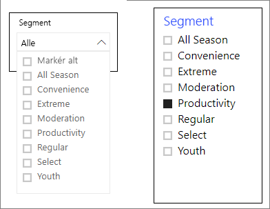

   >[!TIP]
   >Udsnitslisteelementer sorteres som standard i stigende rækkefølge. Hvis du i stedet vil ændre sorteringsrækkefølgen til faldende, skal du vælge ellipsen ( **...** ) i øverste højre hjørne af udsnittet og vælge **Sortér faldende**.

**Opret et nyt udsnit for at filtrere data efter datointerval**

1. Vælg siden **Oversigt** i rapporten. Hvis der ikke er valgt noget på rapportlærredet, skal du vælge **Store** >  **OpenDate** i ruden **Felter**.

    Denne handling udfylder feltet **Værdier** i ruden **Visualiseringer** for at oprette en ny visualisering.

1. Mens den nye visualisering er valgt i rapporten, skal du vælge ikonet **Udsnit** i ruden **Visualiseringer** for at konvertere den nye visualisering til et udsnit. Dette **OpenDate**-udsnit er en skyder med det angivne datointerval.
    
    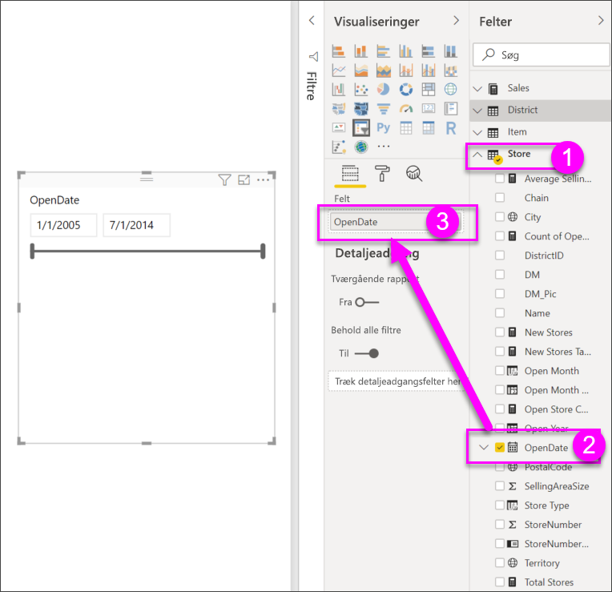

1. Tilpas størrelsen på udsnittet, og træk udsnittet og de andre elementer på lærredet for at gøre plads til udsnittet. Selvom udsnittets størrelse tilpasses i forhold til udsnittet, skjules det, og datoerne beskæres, hvis udsnittet bliver for lille. 

1. Vælg et andet datointerval på skyderen, vælg et datofelt for at angive en dato, eller brug en pop op-kalender for at gør det nemt at vælge nøjagtige datoer. Bemærk, hvordan det påvirker de øvrige visualiseringer på siden.
    
    >[!NOTE]
    >Numeriske data og data af typen dato/klokkeslæt kan oprettet udsnit med skydere som standard. Fra og med Power BI-opdateringen i februar 2018 vil skyderen med heltalsintervaller nu fastgøre til heltalsværdier og ikke vise decimaler. 

1. Hvis du vil ændre udsnitstypen, skal du markere udsnittet, pege på det øverste højre hjørne af udsnittet, vælge karatikonet, der vises, og vælge en af de andre indstillinger, for eksempel **Liste** eller **Før**. Bemærk, hvordan udsnittets udseende og indstillingerne ændres. 
 
    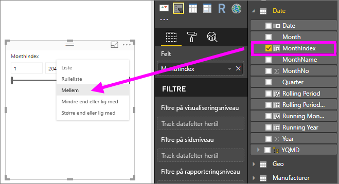

Hvis du vil have flere oplysninger om, hvordan du opretter udsnit med datoområder eller talintervaller, skal du se følgende video og se [Brug udsnittet til talintervaller i Power BI Desktop](../desktop-slicer-numeric-range.md).
   > [!NOTE]
   > I denne video bruges en ældre version af Power BI Desktop.
   > 
   > 

<iframe width="560" height="315" src="https://www.youtube.com/embed/zIZPA0UrJyA" frameborder="0" allowfullscreen></iframe> 

## Styr, hvilke visualiseringer på siden der påvirkes af udsnit
Som standard påvirker udsnit på rapportsider alle andre visualiseringer på den samme side – også hinanden. Når du vælger værdier i de liste- og datoudsnit, du har oprettet, kan du se ændringerne i de andre visualiseringer. De filtrerede data er skæringspunktet for de værdier, der er valgt i begge udsnit. 

Brug visuelle interaktioner til at forhindre, at nogle visualiseringer på siden bliver påvirket. På siden **Oversigt** viser diagrammet **Total Sales Variance by FiscalMonth and District Manager** de overordnede sammenlignelige data for distriktschefer efter måned, som du vil vise hele tiden. Brug visuelle interaktioner for at forhindre, at valg i udsnit filtrerer dette diagram. 

1. Gå til siden **Oversigt** i rapporten, og vælg derefter det **DM**-udsnit, du har oprettet tidligere.

1. I Power BI Desktop-menuen skal du vælge **Formatér** under **Visuelle værktøjer** og derefter vælge **Rediger interaktioner**.
   
   Kontrolelementer til filtrering , der hver især har et **filter** og indstillingen **Ingen**, vises over alle de visuelle elementer på siden. Indstillingen **Filter** er valgt på forhånd for alle kontrolelementerne.
   
1. Vælg indstillingen **Ingen** i kontrolelementet til filtrering over diagrammet **Total Sales Variance by FiscalMonth and District Manager** for at forhindre, at **DM**-udsnittet filtrerer diagrammet. 

1. Vælg udsnittet **OpenDate**, og vælg derefter **Ingen** over diagrammet **Total Sales Variance by FiscalMonth and District Manager** for at forhindre, at dette udsnit filtrerer diagrammet. 

   Når du vælger navne og datoområder i udsnittet, vil diagrammet **Total Sales Variance by FiscalMonth and District Manager** nu forblive uændret.

Du kan finde flere oplysninger om redigering af interaktioner under [Rediger, hvordan visualiseringer interagerer i en Power BI-rapport](../service-reports-visual-interactions.md).

## Synkroniser og brug udsnit på andre sider
Fra og med opdateringen af Power BI i februar 2018 kan du synkronisere et udsnit og bruge det på en hvilken som helst side i en rapport. 

I den aktuelle rapport på siden **Månedligt salg for distrikt** er der et udsnit af typen **District Manager**, men hvad nu hvis vi også gerne vil have dette udsnit på siden **Nye butikker**? Siden **Nye butikker** har et udsnit, men det indeholder kun oplysninger om **Butiksnavn**. Ved hjælp af ruden **Synkroniser udsnit** kan du synkronisere udsnittet **District Manager** med disse sider, så markeringer af udsnit på en hvilken som helst side påvirker visualiseringerne på alle tre sider.

1. I menuen **Vis** i Power BI Desktop skal du vælge **Synkroniser udsnit**.

    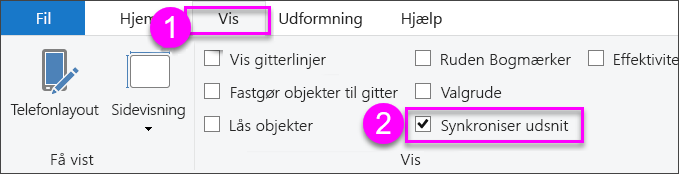

    Ruden **Synkroniser udsnit** vises mellem ruderne **Filtre** og **Visualiseringer**.

    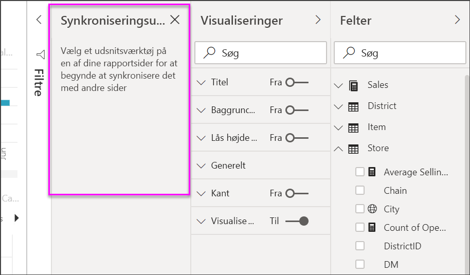

1. På siden **Månedligt salg for distrikt** i rapporten skal du vælge udsnittet **District Manager**. 

    Da du allerede har oprettet udsnittet **District Manager** (**DM**) på siden **Oversigt**, vises ruden **Synkroniser udsnit** på følgende måde:
    
    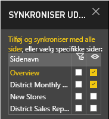
    
1. I kolonnen **Synkroniser** i ruden **Synkroniser udsnit** skal du vælge siderne **Oversigt**, **Månedligt salg pr. distrikt** og **Nye butikker**. 

    Dette valg medfører, at udsnittet **Månedligt salg pr. distrikt** synkroniseres på tværs af disse tre sider. 
    
1. I kolonnen **Synlig** i ruden **Synkroniser udsnit** skal du vælge siden **Nye butikker**. 

    Dette valg medfører, at udsnittet **Månedligt salg pr. distrikt** er synligt på disse tre sider. Ruden **Synkroniser udsnit** vises nu på følgende måde:

    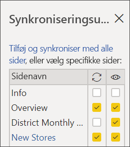

1. Se, hvordan synkronisering af slideren påvirker de andre sider. På siden **District Monthly Sales** skal du lægge mærke til, at udsnittet **District Manager** nu viser de samme valg som dem på siden **Oversigt**. På siden **Nye butikker** er udsnittet **District Manager** nu synligt, og valgene påvirker, hvilke valg der er synlige i udsnittet **Store Name**. 
    
    >[!TIP]
    >Selvom udsnittet vises på de synkroniserede sider med samme størrelse og placering som på den oprindelige side, kan du flytte dem, ændre deres størrelse og formatere dem uafhængigt på de enkelte sider. 

    >[!NOTE]
    >Hvis du synkroniserer et udsnit med en side, men ikke gør det synligt på siden, vil udsnitsvalgene på de andre sider stadig filtrere dataene på siden.
 
## Formatér udsnit
Der findes forskellige indstillinger til formatering afhængigt af udsnitstypen. Hvis du bruger retningen **Vandret**, layoutet **Dynamisk** og **elementfarver**, kan du oprette knapper eller felter i stedet for almindelige listeelementer og få elementer i udsnit til at tilpasse størrelse, så de passer til forskellige skærmstørrelser og layout.  

1. Med udsnittet **District Manager** markeret på en vilkårlig side skal du i ruden **Visualiseringer** vælge ikonet **Formatér**  for at få vist kontrolelementerne til formatering. 
    
    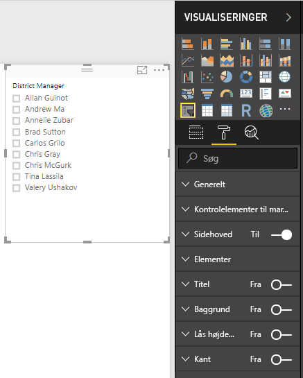
    
1. Klik på pilene i rullelisten ud for hver kategori for at få vist og redigere indstillingerne. 

### Generelle indstillinger
1. Under **Format** skal du vælge **Generelt**, vælge en rød farve under **Konturfarve** og derefter ændre **Konturtykkelse** til *2*. 

    Denne indstilling ændrer konturens farve og tykkelse eller understregning for overskrifter og elementer.

1. Under **Retning** er **Lodret** valgt som standard. Vælg **Vandret** for at få et udsnit med vandret arrangerede felter eller knapper, og rul med pilene for at få adgang til elementer, der ikke vises på skyderen.
    
    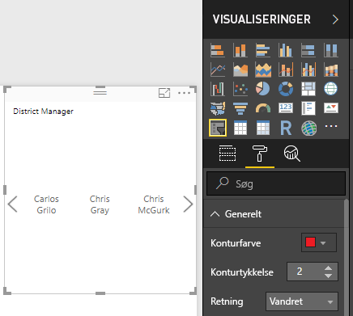
    
1. Slå layoutet **Dynamisk** **til** for at ændre størrelsen på og placeringen af udsnitselementerne efter visningsskærm og udsnitsstørrelse. 

    For listeudsnit forhindrer dynamisk layout, at elementer afskæres på små skærme. Det er kun tilgængeligt i vandrette retninger. For udsnit med intervalskydere vil dynamisk formatering ændre formatet for skyderen og give mere fleksible muligheder for tilpasning af størrelsen. Begge typer udsnit ændres til filterikoner ved små størrelser.
    
    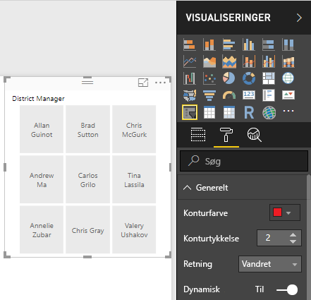
    
    >[!NOTE]
    >Ændringer af dynamisk layout kan tilsidesætte særlig formatering af overskrifter og elementer, som du har angivet. 
    
1. Under **X-placering**, **Y-placering**, **Bredde** og **Højde** skal du angive skyderens placering og størrelse med tal eller flytte og tilpasse størrelsen på udsnittet direkte på lærredet. 

    Afprøv forskellige størrelser på og placering af elementer, og se, hvordan dynamisk formatering ændres derefter. Disse indstillinger er kun tilgængelige, når du vælger vandrette retninger. 

    

Du kan finde flere oplysninger om vandrette retninger og dynamisk layout under [Opret et dynamisk udsnitsværktøj, som du kan ændre størrelsen på i Power BI](../power-bi-slicer-filter-responsive.md).

### Indstillinger for Kontrolelementer til markering (angiv kun udsnit)
1. Under **Kontrolelementer til markering** skal du slå **Vis indstillingen "Vælg alle"** **til** for at føje et **Vælg alle**-element til udsnittet. 

    **Vis indstillingen "Vælg alle"** er som standard slået **fra**. Når denne indstilling er aktiveret, vælges eller fravælges alle elementer, når den slås til eller fra. Hvis du vælger alle elementer og fravælger et element, fravælges det og gør det muligt at anvende et filter af typen *is-not*.
    
    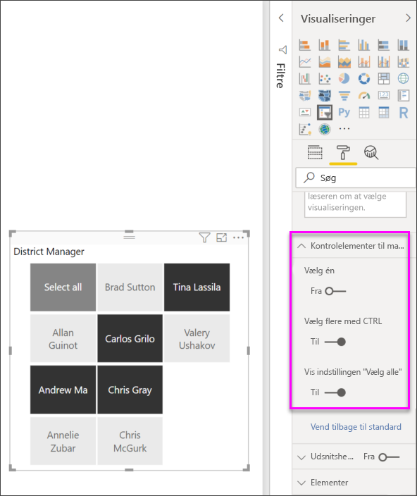
    
1. Slå **Vælg én** **fra** for at gøre det muligt at vælge flere elementer uden at skulle holde **Ctrl** nede. 

    **Vælg én** er som standard slået **til**. Når du markerer et element, vælges det, og hvis du holder **Ctrl** nede, vælges der flere elementer. Når du vælger et element igen, fravælger du det.

### Titelindstillinger
**Titel** er som standard slået **til**. Dette valg viser datafeltets navn øverst i udsnittet. 
- I dette selvstudium skal du formatere titelteksten på følgende måde: 
   - **Skriftfarve**: rød
   - **Tekststørrelse**: **14 pt**
   - **Justering**: **Centrer**
   - **Skrifttypefamilie**: **Arial Black**

### Indstillinger for elementer (kun listeudsnit)
1. I dette selvstudium skal du formatere indstillingerne for **Elementer** på følgende måde:
    - **Skriftfarve**: sort
    - **Baggrund**: lys rød
    - **Tekststørrelse**: **10 pt**
    - **Skrifttypefamilie**: **Arial**
 
1. Vælg **Ramme** under **Kontur** for at tegne en kant omkring hvert element med den størrelse og farve, som du har angivet under **Generelle indstillinger**. 
    
    
    
    >[!TIP]
    >- Når **Generelt** > **Retning** > **Vandret** er valgt, vises den valgte tekst og de valgte baggrundsfarver for fravalgte elementer, mens systemstandarderne bruges for valgte elementer, hvilket normalt er sort baggrund med hvid tekst.
    >- Når **Generelt** > **Retning > Lodret** er valgt, vises de valgte farver altid for elementerne, og afkrydsningsfelterne er altid sorte, når de er markeret. 

### Dato/numerisk input og indstillinger for skyder (kun for udsnit med intervalskyder)
- For listeudsnit er indstillingerne for dato/numerisk input de samme som indstillingerne for **Element**, men der er ingen indstillinger for kontur eller understregning.
- Med indstillingerne for **skyderen** kan du angive farven på intervalskyderen, eller du kan slå skyderen **fra** og kun bruge numerisk input.

### Andre formateringsindstillinger
De andre formateringsindstillinger er som standard slået **fra**. Slå disse indstillinger **til** for at styre dem: 
- **Baggrund**: Føj en baggrundsfarve til udsnittet, og angiv gennemsigtigheden.
- **Lås højde-bredde-forhold**: Bevarer formen af udsnittet, hvis størrelsen tilpasses.
- **Kant**: Tilføjer en kant rundt om udsnittet og angiver farven på den. Denne udsnitskant er særskilt og ikke påvirket af indstillingerne under **Generelt**. 

## Næste trin
Du kan få flere oplysninger i følgende artikler:

- [Visualiseringstyper i Power BI](power-bi-visualization-types-for-reports-and-q-and-a.md)

- [Tabeller i Power BI](power-bi-visualization-tables.md)

