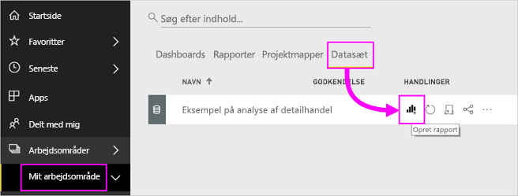

# Tabeller i Power BI-rapporter og -dashboards

En tabel er et gitter, der indeholder relaterede data i logiske serier af rækker og kolonner. Den kan også indeholde overskrifter og en række til totaler. Tabeller fungerer godt med kvantitative sammenligninger, hvor du får vist mange værdier for en enkelt kategori. I denne tabel vises f.eks. fem forskellige målinger for **Kategori**.

Opret tabeller i rapporter, og udfør tværgående fremhævning af elementer i tabellen med andre visualiseringer på samme rapportside. Du kan vælge rækker, kolonner og endda individuelle celler og tværgående fremhævning. Du kan også kopiere og indsætte de enkelte celler og markeringer med flere celler i andre programmer.

## Du skal bruge en tabel, til at

Tabeller er et godt valg til at:

* se og sammenligne detaljerede data og nøjagtige værdier (i stedet for visuelle repræsentationer).

* se data i tabelformat.

* se numeriske data efter kategori.

## Forudsætninger

* Power BI-tjenesten eller Power BI Desktop

* Rapporten Retail Analysis Sample

## Hent rapporten Retail Analysis Sample

I denne vejledning bruges Retail Analysis Sample (Eksempel på detailhandelsanalyse). Oprettelse af en visualisering kræver redigeringsrettigheder til datasættet og rapporten. Heldigvis kan alle Power BI-eksemplerne redigeres. Hvis en person deler en rapport med dig, kan du ikke oprette visualiseringer i rapporter. Hvis du vil følge med, skal du hente [rapporten Retail Analysis Sample](../sample-datasets.md).

Når du har hentet datasættet for **Retail Analysis Sample**, kan du komme i gang.

## Opret en tabel

Du opretter den tabel, der vises i starten af artiklen, for at få vist salgsværdierne efter varekategori.

1. Vælg **Datasæt** > **Opret en rapport** fra **Mit arbejdsområde**.

    

1. Vælg **Element** > **Kategori** i ruden **Felter**.

    Power BI opretter automatisk en tabel over alle kategorierne.

    

1. Vælg **Sales > Average Unit Price** og **Sales > Last Year Sales**

1. Vælg derefter **Sales > This Year Sales**, og vælg alle tre indstillinger: **Værdi**, **Mål** og **Status**.

1. Find **Værdier** i ruden **Visualiseringer**, og træk værdierne, indtil rækkefølgen af diagramkolonnerne stemmer overens med det første billede på denne side. Du kan nu se følgende under **Værdier**:

    

1. Fastgør tabellen til dashboardet ved at vælge ikonet med tavlenålen  i øverste højre hjørne af visualiseringen.

## Formatér tabellen

Du kan formatere en tabel på mange måder. Kun et par af dem beskrives her. Hvis du vil vide mere om andre formateringsindstillinger, kan du åbne ruden **Formatér** (ikonet med malerrullen ) og prøve dig frem.

* Prøv at formatere tabelgitteret. Her tilføjer du et blåt lodret gitter, du tilføjer mellemrum mellem rækkerne og forstørrer kanten og tekststørrelsen en smule.

    

    

* I kolonneoverskrifterne skal du ændre baggrundsfarven, tilføje en kant og øge skriftstørrelsen.

    

    

* Du kan også formatere enkelte kolonner og kolonneoverskrifter. Start ved at udvide **feltformateringen**, og vælg den kolonne, der skal formateres, på rullelisten. Afhængigt af kolonneværdierne kan du bruge **feltformatering** til at angive oplysninger som: visningsenheder, skriftfarve, antal decimaler, baggrund, justering med mere. Når du har valgt de ønskede indstillinger, kan du beslutte, om du også vil anvende disse indstillinger til sidehovedet og rækken Totaler.

    

    

* Efter lidt yderligere formatering ser den endelige tabel sådan ud.

    

### Betinget formatering

*Betinget formatering* er en type formatering. Power BI anvender betinget formatering på felter i området **Værdier** i ruden **Visualiseringer**.

Med betinget formatering af tabeller kan du angive brugerdefinerede baggrundsfarver og skriftfarver for celler baseret på celleværdier, bl.a. ved hjælp af gradueringsfarver.

1. Vælg ikonet **Felter**  i ruden **Visualiseringer**.

1. Vælg pil ned ud for den værdi under **Værdier**, du vil formatere (eller højreklik på feltet).

    > [!NOTE]
    > Du kan kun administrere betinget formatering for felter i området **Værdier** under **Felter**.

    

1. Vælg **Baggrundsfarve**.

1. Du kan konfigurere farven og **Minimum**-værdien og **Maksimum**-værdien i den dialogboks, der vises. Hvis du vælger indstillingen **Divergerende**, kan du også konfigurere en valgfri værdi af typen **Centreret**.

    

    Jeg vil prøve at anvende brugerdefineret formatering til Average Unit Price-værdierne. Vælg **Divergerende**, tilføj nogle farver, og vælg **OK**.

    
1. Tilføj et nyt felt i tabellen, der har både positive og negative værdier. Vælg **Sales > Total Sales Variance**.

    

1. Tilføj betinget formatering for datalinjen ved at vælge den nedadvendte pil ud for **Total Sales Variance** og vælge **Betinget formatering > Datalinjer**.

    

1. I den viste dialogboks kan du angive farver for **Positiv streg** og **Negativ streg**, markere afkrydsningsfeltet **Vis kun streg** og foretage eventuelle andre ændringer.

    

1. Vælg **OK**.

    Datalinjerne erstatter de numeriske værdier i tabellen, så det er nemmere at skimme den.

    

Hvis du vil fjerne betinget formatering fra en visualisering, skal du højreklikke på feltet igen og vælge **Fjern betinget formatering**.

> [!TIP]
> Du kan også angive betinget formatering i ruden **Formatér**. Vælg den værdi, du vil formatere, og angiv derefter **Farveskalaer** eller **Datalinjer** til **Til** for at anvende standardindstillingerne. Hvis du vil tilpasse indstillingerne, skal du vælge **Avancerede kontrolelementer**.

## Kopiér værdier fra Power BI-tabeller til brug i andre programmer

Din tabel eller matrix kan have indhold, som du ønsker at bruge i andre programmer, f.eks. Dynamics CRM, Excel og endda andre Power BI-rapporter. Når du højreklikker i en celle i Power BI, kan du kopiere dataene i en enkelt celle eller en markering med flere celler til udklipsholder og indsætte dem i det andet program.

Sådan kopierer du værdien af en enkelt celle:

1. Markér den celle, du vil kopiere.

1. Højreklik i cellen.

1. Vælg **Kopiér** > **Kopiér værdi**.

    

    Den ikke-formaterede celleværdi er nu i din udklipsholder, og du kan indsætte den i et andet program.

Sådan kopierer du mere end en enkelt celle:

1. Markér et celleområde, eller brug **Ctrl** til at markere en eller flere celler.

1. Højreklik i en af de celler, du har markeret.

1. Vælg **Kopiér** > **Kopiér markering**.

    

    Kopien inkluderer kolonne- og rækkeoverskrifterne.

    

## Tilpas kolonnebredden i en tabel

Nogle gange kan Power BI afskære en kolonneoverskrift i en rapport og på et dashboard. Hvis du vil kunne se hele kolonnenavnet, skal du pege på mellemrummet til højre for overskriften for at få vist dobbeltpilene og klikke og trække.

## Overvejelser og fejlfinding

Når du anvender kolonneformatering, kan du kun vælge én indstilling for justering pr. kolonne: **Automatisk**, **Venstre**, **Centreret**, **Højre**. En kolonne indeholder som regel enten tekst eller tal og ikke en blanding. Hvis en kolonne indeholder både tal og tekst, vil indstillingen **Automatisk** venstrejustere tekst og højrejustere tal. Denne funktionalitet understøtter de sprog, der læses fra venstre mod højre.

## Næste trin

* [Trækort i Power BI](power-bi-visualization-treemaps.md)

* [Visualiseringstyper i Power BI](power-bi-visualization-types-for-reports-and-q-and-a.md)
