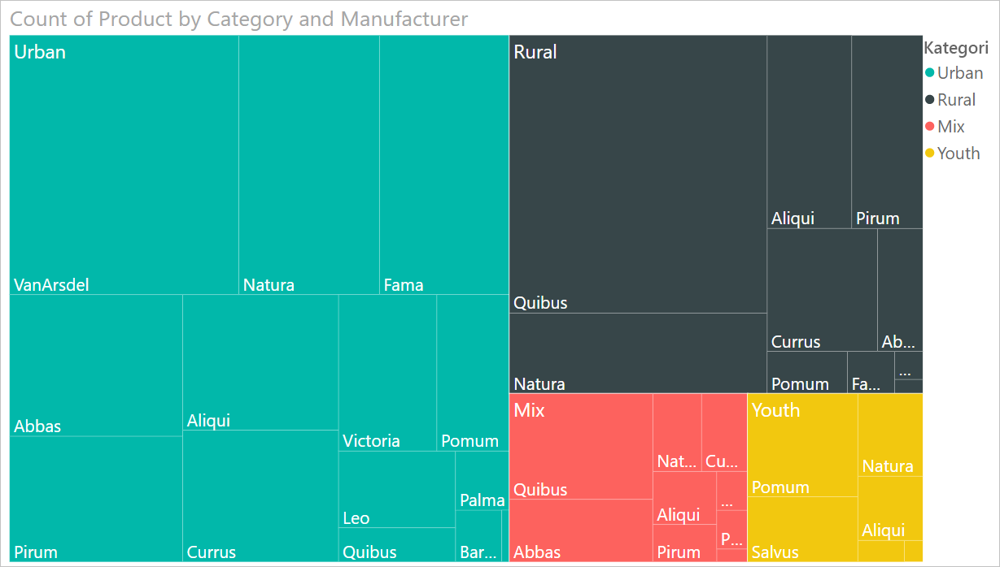
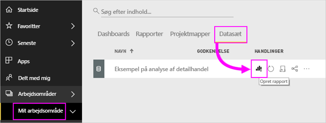
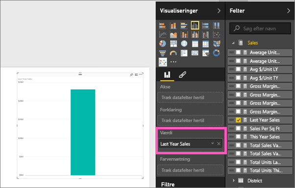
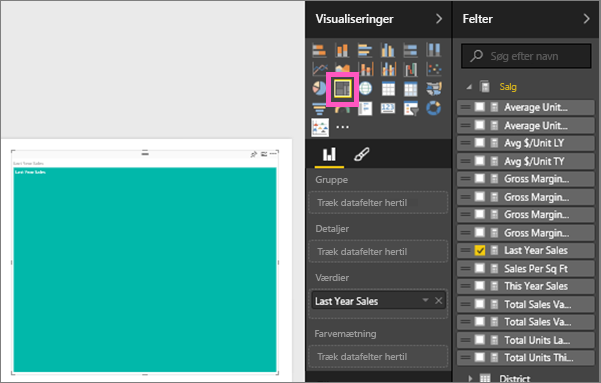
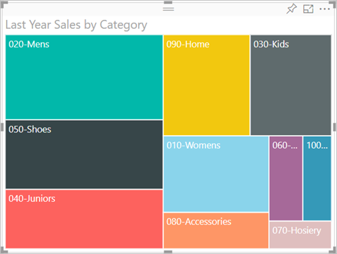
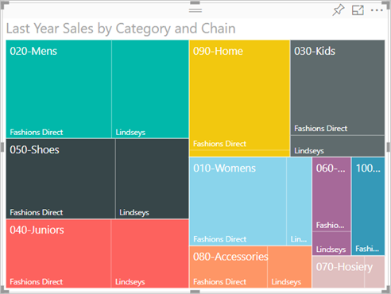
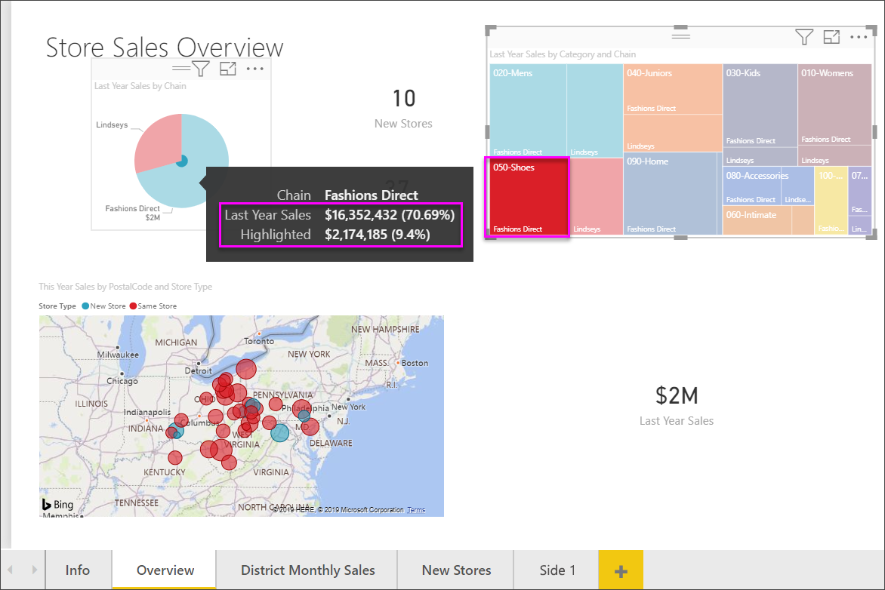

# Trækort i Power BI

Træstrukturer viser hierarkiske data som et sæt af indlejrede rektangler. Hvert niveau i hierarkiet er repræsenteret af et farvet rektangel (gren), der indeholder mindre rektangler (blade). Power BI baserer størrelsen på pladsen inden i de enkelte rektangler på den målte værdi. Rektanglerne er arrangeret efter størrelse fra øverst til venstre (størst) til nederst til højre (mindst).

Hvis du f.eks. analyserer dit salg, har du muligvis grene på øverste niveau for tøjkategorierne: **Urban**, **Rural**, **Youth** og **Mix**. Power BI opdeler dine kategorirektangler i blade for tøjproducenterne inden for den pågældende kategori. Disse blades størrelse tilpasses, og de får skygger ud fra antal solgte styk.

I grenen **Urban** ovenfor blev der solgt meget tøj af mærket **VanArsdel**. Der blev solgt mindre af **Natura** og **Fama**. Der blev kun solgt meget lidt af **Leo**. Så grenen **Urban** i træstrukturen har:

* det største rektangel for **VanArsdel** i øverste venstre hjørne.

* lidt mindre rektangler for **Natura** og **Fama**.

* mange andre rektangler for alle andre solgte tøjgenstande.

* et lille rektangel for **Leo**.

Du kan sammenligne antallet af varer, der er solgt på tværs af de andre tøjkategorier, ved at sammenligne størrelse og skygge på hver bladnode – større og mørkere rektangler betyder højere værdi.

Vil du gerne se en anden oprette en træstruktur først? Gå til 2:10 i denne video for at se Amanda oprette en træstruktur.

<iframe width="560" height="315" src="https://www.youtube.com/embed/IkJda4O7oGs" frameborder="0" allowfullscreen></iframe>

## Hvornår bruger man en træstruktur?

Træstrukturer er et godt valg:

* til at vise store mængder hierarkiske data

* når et liggende søjlediagram ikke kan håndtere det store antal værdier effektivt

* til at vise proportionerne mellem de enkelte dele og en helhed

* til at vise fordelingsmønsteret for målingen på tværs af hvert niveau af kategorier i hierarkiet

* til at vise attributter ved hjælp af størrelse og farvekodning

* til at identificere mønstre, udenforliggende værdier, de vigtigste bidragydere samt undtagelser.

## Forudsætninger

* Power BI-tjenesten eller Power BI Desktop

* Rapporten Retail Analysis Sample

## Hent rapporten Retail Analysis Sample

I denne vejledning bruges Retail Analysis Sample (Eksempel på detailhandelsanalyse). Oprettelse af en visualisering kræver redigeringsrettigheder til datasættet og rapporten. Heldigvis kan alle Power BI-eksemplerne redigeres. Hvis en person deler en rapport med dig, kan du ikke oprette visualiseringer i rapporter. Hvis du vil følge med, skal du hente [rapporten Retail Analysis Sample](../sample-datasets.md).

Når du har hentet datasættet for **Retail Analysis Sample**, kan du komme i gang.

## Opret en grundlæggende træstruktur

Du opretter en rapport og tilføjer en grundlæggende træstruktur.

1. Vælg **Datasæt** > **Opret en rapport** fra **Mit arbejdsområde**.

    

1. I ruden **Felter** skal du vælge målingen **Sales** > **Last Year Sales**.

   

1. Vælg ikonet for træstruktur  for at konvertere diagrammet til en træstruktur.

   

1. Træk **Item** > **Category** til feltet **Group**.

    I Power BI oprettes en træstruktur, hvor størrelsen af rektanglerne er baseret på det samlede salg, og farven repræsenterer kategorien. Egentlig har du oprettet et hierarki, som visuelt beskriver den relative størrelse af det samlede salg efter kategori. Kategorien **Men's** har det højeste salg, og kategorien **Hosiery** har det laveste.

    

1. Træk **Store** > **Chain** til feltet **Detaljer** for at fuldende din træstruktur. Nu kan du sammenligne sidste års salg efter kategori og kæde.

   

   > [!NOTE]
   > Farvemætning og Detaljer kan ikke bruges samtidig.

1. Hold markøren over **Chain** for at få vist værktøjstippet til den del af **Category**.

    Når du f.eks. fører musen hen over **Fashions Direct** i rektanglet **090-Home**, vises værktøjstippet for Fashion Directs del af kategorien Home.

   

1. Tilføj træstrukturen som et [dashboardfelt (fastgør din visualisering)](../service-dashboard-tiles.md).

1. Gem [rapporten](../service-report-save.md).

## Fremhævning og krydsfiltrering

Du kan få mere at vide om brug af ruden **Filtre** under [Føj et filter til en rapport](../power-bi-report-add-filter.md).

Hvis du fremhæver **Kategori** eller **Detaljer** i en træstruktur, krydsfremhæves og krydsfiltreres de andre visualiseringer på rapportsiden og omvendt. For at følge med skal du enten tilføje nogle visualiseringer på denne rapportside eller kopiere træstrukturen til en af de andre sider i denne rapport.

1. Vælg enten **Kategori** eller **Kæde** i en **Kategori** i træstrukturen. Derved krydsfremhæves de andre visualiseringer på siden. Hvis du f.eks. vælger **050 Shoes**, kan du se, at sidste års salg af sko var **3.640.471 USD**, hvoraf **2.174.185 USD** af dette salg kom fra **Fashions Direct**.

   

1. I cirkeldiagrammet **Sidste års salg efter kæde** krydsfiltreres træstrukturen, når du vælger udsnittet **Fashions Direct**.
   

1. Hvis du vil administrere, hvordan diagrammer krydsfremhæver og krydsfiltrerer hinanden, skal du se [Skift, hvordan visualiseringer interagerer i en Power BI-rapport](../service-reports-visual-interactions.md).

## Næste trin

* [Vandfaldsdiagrammer i Power BI](power-bi-visualization-waterfall-charts.md)

* [Visualiseringstyper i Power BI](power-bi-visualization-types-for-reports-and-q-and-a.md)
