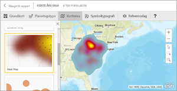
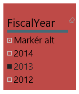
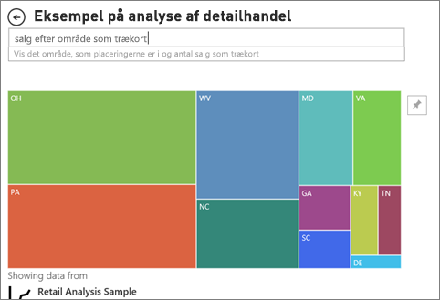

# Visualiseringstyper i Power BI
## Visualiseringer i Power BI
Vi tilføjer løbende nye visualiseringer, så hold dig orienteret her.

Og besøg [Office AppSource](https://appsource.microsoft.com/marketplace/apps?product=power-bi-visuals), hvor du finder en stadigt større liste over [brugerdefinerede visuals](../power-bi-custom-visuals.md), du kan downloade og bruge i dine egne dashboards og rapporter. Er du i det kreative hjørne? [Få mere at vide om, hvordan du opretter og føjer dine egne visuals til dette communitywebsted](../developer/office-store.md).  

## Liste over de visualiseringer, der er tilgængelige i Power BI
Du kan bruge alle disse visualiseringer i Power BI-rapporter, de kan specificeres under Spørgsmål og svar, og du kan fastgøre dem til dashboards.

### Områdediagrammer: Grundlæggende (lagdelte) og stablede

>[!TIP]
>Det grundlæggende områdediagram er baseret på kurvediagrammet med et område mellem aksen og kurven, der er udfyldt.

Du kan finde flere oplysninger under [Selvstudium: Grundlæggende områdediagram](power-bi-visualization-basic-area-chart.md).

### Liggende søjlediagrammer og søjlediagrammer
 

 

>[!TIP]
>Liggende søjlediagrammer er standarden for at finde en specifik værdi på tværs af en række kategorier.

### Kort: flere rækker

### Kort: enkelt tal

Du kan finde flere oplysninger under [Opret et kort (med et felt med et stort tal)](power-bi-visualization-card.md).

### Kombinationsdiagrammer

>[!TIP]
>Et kombinationsdiagram kombinerer et søjlediagram og et kurvediagram. Vælg mellem *Kurvediagram og stablet søjlediagram* og *Kurvediagram og grupperet søjlediagram*.

Du kan finde flere oplysninger under [Selvstudium: Kombinationsdiagrammer i Power BI](power-bi-visualization-combo-chart.md).

### Kransediagrammer

>[!TIP]
>Kransediagrammer ligner cirkeldiagrammer.  De viser relationen mellem dele og en helhed.

Du kan finde flere oplysninger under [Selvstudium: Kransediagrammer i Power BI](power-bi-visualization-doughnut-charts.md).

### Tragtformede diagrammer

>[!TIP]
>Tragtformede diagrammer er praktiske til at visualisere en proces med faser og elementer, der flyder sekventielt fra den ene fase til den næste.  Brug et tragtformet diagram, når der er et sekventielt flow mellem faser, for eksempel en salgsproces, der starter med kundeemner og slutter med et køb.

Du kan finde flere oplysninger under [Selvstudium: Tragtformede diagrammer i Power BI](power-bi-visualization-funnel-charts.md).

### Målerdiagrammer

>[!TIP]
>Viser den aktuelle status i forhold til et mål.

Du kan finde flere oplysninger under [Selvstudium: Målerdiagrammer i Power BI](power-bi-visualization-radial-gauge-charts.md).

### KPI'er

>[!TIP]
>Viser statussen i forhold til et målbart mål.

Du kan finde flere oplysninger under [Selvstudium: KPI'er i Power BI](power-bi-visualization-kpi.md).

### Kurvediagrammer

>[!TIP]
>Fremhæver en overordnet form af en hel serie af værdier – som regel over tid.

### Kort: grundlæggende kort

>[!TIP]
>Bruges til at knytte både kategoriinddelte og kvantitative oplysninger til rumlige lokationer.

Du kan finde flere oplysninger under [Tip og tricks til kortvisualiseringer](power-bi-map-tips-and-tricks.md).

### Kort: ArcGIS-kort

Du kan finde flere oplysninger under [Selvstudium: ArcGIS-kort i Power BI](../power-bi-visualization-arcgis.md).

### Kort: kartogrammer (Choropleth)

>[!TIP]
>Jo stærkere farven er, jo større er værdien.

Du kan finde flere oplysninger under [Selvstudium: Kartogrammer i Power BI](power-bi-visualization-filled-maps-choropleths.md).

### Matrix

### Cirkeldiagrammer

### Punkt- og boblediagrammer

>[!TIP]
>Viser relationen mellem 2 (punkt) eller 3 (boble) kvantitative målinger – er eller ikke er, i hvilken rækkefølge osv.

Du kan finde flere oplysninger under [Selvstudium: Punktdiagrammer i Power BI](power-bi-visualization-scatter.md).

### Udsnit

Du kan finde flere oplysninger under [Selvstudium: Udsnit i Power BI](power-bi-visualization-slicers.md).

### Separate billeder

Du kan finde flere oplysninger under [Tilføj en billedwidget i et dashboard](../service-dashboard-add-widget.md).

### Tabeller

>[!TIP]
>Er praktiske med kvantitative sammenligninger af elementer, hvor der er mange kategorier.

Du kan finde flere oplysninger under [Arbejd med tabeller i Power BI](power-bi-visualization-tables.md).

### Trækort

Du kan finde flere oplysninger under [Selvstudium: Trækort i Power BI](power-bi-visualization-treemaps.md).

>[!TIP]
>Dette er diagrammer med farvede rektangler, hvor størrelsen repræsenterer værdien.  De kan være hierarkiske, hvor rektangler er indlejret i de primære rektangler.

### Vandfaldsdiagrammer

>[!TIP]
>Vandfaldsdiagrammer viser en løbende total af værdier, der adderes eller subtraheres.

Du kan finde flere oplysninger under [Selvstudium: Vandfaldsdiagrammer i Power BI](power-bi-visualization-waterfall-charts.md).

## Fortæl Spørgsmål og svar, hvilken visualisering der skal bruges
Når du skriver forespørgsler i naturligt sprog med Spørgsmål og svar i Power BI, kan du angive visualiseringstypen i din forespørgsel.  Eksempel:

"***salg efter område som trækort***"

## Næste trin
[Visualiseringer i Power BI-rapporter](power-bi-report-visualizations.md)    
[Den rette visuelle reference fra sqlbi.com](http://www.sqlbi.com/wp-content/uploads/videotrainings/dashboarddesign/visuals-reference-may2017-A3.pdf)

[Rapporter i Power BI](../consumer/end-user-reports.md)

[Power BI – Grundlæggende begreber](../consumer/end-user-basic-concepts.md)

Har du flere spørgsmål? [Prøv at spørge Power BI-community'et](http://community.powerbi.com/)

