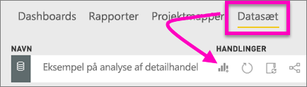
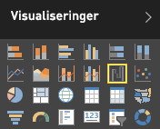

# Vandfaldsdiagrammer i Power BI
Et vandfaldsdiagram viser en løbende total som værdier, der tilføjes eller trækkes fra. Det er nyttigt for at forstå, hvordan en indledende værdi (f.eks, årets resultat) påvirkes af en række positive og negative ændringer.

Kolonnerne er farvekodet, så du hurtigt kan se stigninger og fald. Kolonnerne med den indledende og endelige værdi [starter ofte på den vandrette akse](https://support.office.com/article/Create-a-waterfall-chart-in-Office-2016-for-Windows-8de1ece4-ff21-4d37-acd7-546f5527f185#BKMK_Float "start på den vandrette akse"), mens de mellemliggende værdier er flydende kolonner. Vandfaldsdiagrammer kaldes også brodiagrammer på grund af deres "udseende".

<iframe width="560" height="315" src="https://www.youtube.com/embed/qKRZPBnaUXM" frameborder="0" allow="autoplay; encrypted-media" allowfullscreen></iframe>

## Hvornår skal du bruge et vandfaldsdiagram?
Vandfaldsdiagrammer er et godt valg:

* når du har ændringer til målingen på tværs af tidsserier eller forskellige kategorier
* til overvågning af overordnede ændringer, der bidrager til den samlede værdi
* til afbildning af årets resultatet for virksomhed vha. visning af flere omsætningskilder og opnåelse af det samlede resultat.
* til illustration af antal medarbejdere ved årets start og slutning
* til visualisering af, hvor mange penge du tjener og bruger hver måned, samt den løbende kontobalance. 

## Opret et vandfaldsdiagram
Vi opretter et vandfaldsdiagram, der viser afvigelsen i salg (anslået salg i forhold til faktisk salg) pr. måned. Hvis du selv vil følge med i trinnene i dette selvstudium, skal du logge på Power BI og vælge **Hent data \> Eksempler > \>Eksempel på detailhandelsanalyse**. 

1. Vælg fanen **Datasæt**, og rul ned til det nye datasæt "Eksempel på detailhandelsanalyse".  Vælg ikonet **Opret rapport** for at åbne datasættet i redigeringstilstand for rapporten. 
   
    
2. I ruden **Felter** skal du markere **Salg\> Total salgsafvigelse**. 
3. Konvertér diagrammet til et **vandfaldsdiagram**. Hvis **Total salgsafvigelse** ikke findes på **Y-aksen**, skal du trække den derhen.
   
    
4. Vælg **Tid** \> **Regnskabsmåned** for at føje det til beholderen **Kategori**. 
   
    
5. Sortér vandfaldsdiagrammet kronologisk. I øverste højre hjørne skal du vælge ellipsen (...) og vælge **Regnskabsmåned**.
   
    
   
    
6. Se lidt nærmere på, hvad der bidrager mest til ændringerne måned for måned. Træk **Butiks** > **området** til beholderen **Opdeling**.
   
    
7. Som standard tilføjes de øverste 5 bidragsydere for stigninger eller fald pr. måned i Power BI. Vi er dog kun interesseret i de øverste 2 bidragsydere.  I ruden Formatering skal du vælge **Opdeling** og angive **Maksimum** til 2.
   
    
   
    En hurtig gennemgang viser, at områderne Ohio og Pennsylvania er de største bidragsydere til bevægelser, negative og positive, i vandfaldsdiagrammet. 
   
    
8. Det er et interessant resultat. Har Ohio og Pennsylvania en væsentlig indvirkning, fordi salg i disse 2 områder er meget større end de andre områder?  Det kan vi kontrollere. Opret et kort, som ser nærmere på salgsværdien i år og sidste år efter distrikt.  
   
    
   
    Kortet understøtter vores teori.  Det viser, at disse 2 områder havde den højeste salgsværdi sidste år (boblestørrelse) og i år (bobleskygge).

## Fremhævning og krydsfiltrering
Du kan få mere at vide om brug af ruden Filtre under [Føj et filter til en rapport](../power-bi-report-add-filter.md).

Fremhævning af en kolonne i et vandfaldsdiagram krydsfiltrerer andre visualiseringer på rapportsiden ... og omvendt. Kolonnen Total udløser dog ikke fremhævning eller reagerer på krydsfiltrering.

## Næste trin

[Interaktioner mellem visualiseringer](../service-reports-visual-interactions.md)

[Visualiseringstyper i Power BI](power-bi-visualization-types-for-reports-and-q-and-a.md)