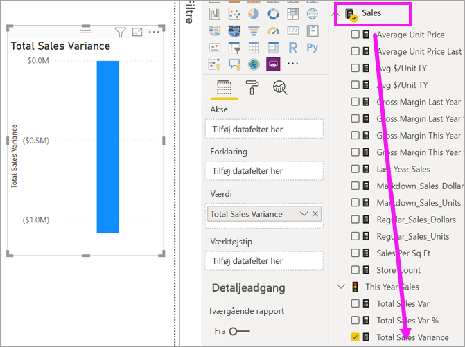
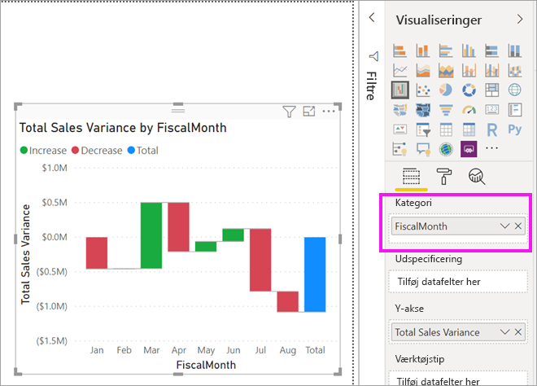
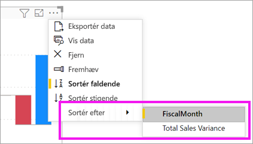
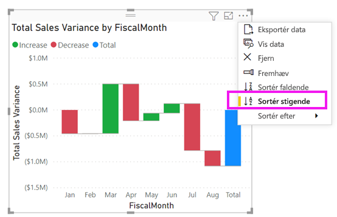
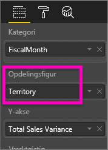
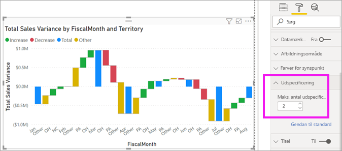

# Vandfaldsdiagrammer i Power BI

[!INCLUDE [power-bi-visuals-desktop-banner](../includes/power-bi-visuals-desktop-banner.md)]

Vandfaldsdiagrammer viser en løbende total, efterhånden som Power BI lægger værdier til eller trækker dem fra. Det er nyttigt at forstå dem for at se, hvordan en indledende værdi (f.eks. årets resultat) påvirkes af en række positive og negative ændringer.

Kolonnerne er farvekodet, så du hurtigt kan se stigninger og fald. Kolonnerne med den indledende og endelige værdi [starter ofte på den vandrette akse](https://support.office.com/article/Create-a-waterfall-chart-in-Office-2016-for-Windows-8de1ece4-ff21-4d37-acd7-546f5527f185#BKMK_Float "start på den vandrette akse"), mens de mellemliggende værdier er flydende kolonner. Vandfaldsdiagrammer kaldes også brodiagrammer på grund af deres format.

   > [!NOTE]
   > I denne video bruges en ældre version af Power BI Desktop.
   > 
   > 

<iframe width="560" height="315" src="https://www.youtube.com/embed/qKRZPBnaUXM" frameborder="0" allow="autoplay; encrypted-media" allowfullscreen></iframe>

## Hvornår skal du bruge et vandfaldsdiagram?

Vandfaldsdiagrammer er et godt valg:

* Når der er ændringer af målingen på tværs af tid, en serie eller forskellige kategorier.

* Til overvågning af overordnede ændringer, der bidrager til den samlede værdi.

* Til afbildning af virksomhedens årsresultatet ved at vise flere omsætningskilder og opnå det samlede resultat.

* Til illustration af antal medarbejdere ved årets start og slutning.

* Til visualisering af, hvor mange penge du tjener og bruger hver måned, samt den løbende kontosaldo.

## Forudsætning

I dette selvstudium bruges [PBIX-filen med eksemplet Detailhandelsanalyse](https://download.microsoft.com/download/9/6/D/96DDC2FF-2568-491D-AAFA-AFDD6F763AE3/Retail%20Analysis%20Sample%20PBIX.pbix).

1. Vælg **Fil** > **Åbn** i øverste venstre afsnit af menulinjen
   
2. Find din kopi af **PBIX-filen med eksemplet Detailhandelsanalyse**

1. Åbn **PBIX-filen med eksemplet Detailhandelsanalyse** i rapportvisning .

1. Vælg  for at tilføje en ny side.

## Opret et vandfaldsdiagram

Du opretter et vandfaldsdiagram, der viser afvigelsen i salg (anslået salg i forhold til faktisk salg) pr. måned.

### Byg vandfaldsdiagrammet

1. I ruden **Felter** skal du markere **Sales** > **Total Sales Variance**.

   

1. Vælg ikonet for vandfaldsdiagram 

    

1. Vælg **Tid** > **Regnskabsmåned** for at føje det til beholderen **Kategori**.

    

### Sortér vandfaldsdiagrammet

1. Kontrollér, at Power BI har sorteret vandfaldsdiagrammet kronologisk efter måned. Vælg **Flere indstillinger** (...) i øverste højre hjørne af diagrammet.

    I dette eksempel skal du vælge **Sortér efter** og **FiscalMonth**. En gul indikator ud for dit valg angiver, hvornår valgindstillingen anvendes.

    
    
    Hvis du vil have vist måneder i kronologisk rækkefølge, skal du vælge **Sortér stigende**. Kontrollér, som i det foregående trin, at der er en gul indikator til venstre for **Sortér stigende**. Dette angiver, at din valgte indstilling anvendes.

    

    

    Bemærk, at dit diagram er sorteret fra januar til august for FiscalMonth.  

### Udforsk vandfaldsdiagrammet

Se lidt nærmere på, hvad der bidrager mest til ændringerne måned for måned.

1.  Vælg **Butik** > **Område**, hvorved **Område** føjes til bucket'en **Opdeling**.

    

    Power BI bruger værdien i **Opdeling** til at føje yderligere data til visualiseringen. De fem største bidragydere føjes til stigninger eller fald for hver regnskabsmåned. Det betyder f. eks., at der nu er seks datapunkter i stedet for kun én i februar.  

    

    Lad os antage, at du kun er interesseret i de to største bidragydere.

1. I ruden **Formatér** skal du vælge **Breakdown** og angive **Max breakdowns** til **2**.

    

    En hurtig gennemgang viser, at områderne Ohio og Pennsylvania er de største bidragydere til bevægelser, både negative og positive, i vandfaldsdiagrammet.

    

## De næste trin

* [Rediger, hvordan visualiseringer interagerer i en Power BI-rapport](../service-reports-visual-interactions.md)

* [Typer af visualiseringer i Power BI](power-bi-visualization-types-for-reports-and-q-and-a.md)
