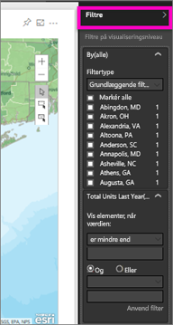
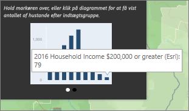
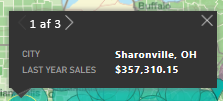

# Interaktion med ArcGIS-kort i Power BI
Dette emne skrives fra en persons synspunkt, hvor vedkommende *bruger* et ArcGIS-kort i Power BI-tjenesten, på Desktop eller på mobil. Når en forfatter deler et ArcGIS-kort med dig, kan du interagere med kortet på mange måder.  Hvis du vil vide mere om oprettelse af et ArcGIS-kort, kan du se [ArcGIS-kort efter Esri-selvstudium](../visuals/power-bi-visualization-arcgis.md).

Kombinationen af ArcGIS-kort og Power BI tager kort til et helt nyt niveau, som involverer mere end præsentation af punkter på et kort. De tilgængelige indstillinger til grundlæggende kort, placeringstyper, temaer, symboltypografier og referencelag opretter fantastiske informative kortvisualiseringer. Kombinationen af autoritative datalag på et kort (f.eks. census-data) med rumlige analyser giver en bedre forståelse af dataene i visualiseringen.

> [!TIP]
> GIS står for Geographic Information System.
> 

I det anvendte eksempel ser vi nærmere på sidste års salg efter by og bruger et vejkort, boblesymboler, der repræsenterer størrelse, og et referencelag til gennemsnitlig husstandsindtægt. Kortet indeholder 3 nåle og én radius for køretid (i mørklilla).

> [!TIP]
> Besøg [Esris side på Power BI](https://www.esri.com/powerbi) for at se de mange eksempler og læse anbefalinger. Og se derefter Esris [side med introduktion til ArcGIS Maps for Power BI](https://doc.arcgis.com/en/maps-for-powerbi/get-started/about-maps-for-power-bi.htm).
> 
> 

 

## Brugerens samtykke
Første gang en kollega deler et ArcGIS-kort med dig, viser Power BI en prompt. ArcGIS Maps for Power BI er leveret af Esri (www.esri.com), og din brug af ArcGIS Maps for Power BI er omfattet af Esris vilkår og politik for beskyttelse af personlige oplysninger. Power BI-brugere, der gerne vil bruge ArcGIS-kort til visuelle elementer i Power BI, skal acceptere i dialogboksen til samtykke.

## Markeringsværktøjer
ArcGIS Maps for Power BI har tre markeringstilstande. Du kan maksimalt vælge 250 datapunkter ad gangen.

 Vælg individuelle datapunkter.

 Tegner et rektangel på kortet og markerer de indeholdte datapunkter. Du kan bruge CTRL til at vælge mere end ét rektangulært område.

 Muliggør, at grænser eller polygoner i referencelag kan bruges til at vælge indeholdte datapunkter.

 

## Interaktion med et ArcGIS-kort
De funktioner, der er tilgængelige for dig, afhænger af om du er *forfatter* (den person, der har udarbejdet kortet) eller *forbruger* (en, som deler et ArcGIS-kort). Hvis du interagerer med et ArcGIS-kort som forbruger (dvs. [Læsevisning](../consumer/end-user-reading-view.md)), har du mulighed for at benytte følgende handlinger.

* Hvis du forbruger Premium med *visnings*tilladelser, kan du [få vist de data, der bruges til at oprette visualiseringen](../consumer/end-user-show-data.md), [abonnere](../consumer/end-user-subscribe.md), se kortet i [fokustilstand og fuldskærmsvisning](../consumer/end-user-focus.md), [få vist relateret indhold](../consumer/end-user-related.md), [arbejde med de filtre](../consumer/end-user-report-filter.md), der er angivet af *rapportopretteren*, [dele rapporten](../service-share-reports.md) og meget mere.

* Som med andre visualiseringstyper kan forbrugere af Power BI **Pro** gøre alt det, som Premium-forbrugeren kan gøre, og derudover [eksportere de underliggende data](../visuals/power-bi-visualization-export-data.md), [få forbrugsdata](../service-usage-metrics.md), gemme en kopi, [publicere på internettet](../service-publish-to-web.md) og meget mere.

    
* Udvid ruden **Filtre** for at udforske kortet ved hjælp af filtre.   
      
* Hvis kortet har et referencelag, kan du vælge steder, hvor der skal vises detaljer i et værktøjstip. Her har vi markeret Adams County, og vi kan se data fra referencelaget vedrørende den gennemsnitlige husstandsindtægt, som forfatteren har føjet til kortet.
  
      
  
    I dette tilfælde får vi også et diagram. Vælg en søjle i diagrammet for at gå dybere ned i dataene. Her kan vi se, at 79 familier i Adams County tjener USD 200.000 eller derover.
  
    
  
    Klik på pilen for at få vist eventuelle yderligere diagrammer.
* Peg på placeringen af symboler på grundkortet for at få vist detaljer i et værktøjstip.     
  
  
  > [!TIP]
  > Du skal muligvis zoome ind for at vælge en bestemt placering.  Hvis der er overlappende placeringer, kan Power BI vise dig mere end ét 1 værktøjstip ad gangen. Klik på pilen for at flytte mellem værktøjstippene
  > 
  > 
  > 
  > 
* Hvis forfatteren har føjet et lag med infografik til ArcGIS-kortet, får du vist yderligere data i øverste højre hjørne af kortet.  Her har forfatteren af kortet f.eks. tilføjet "Børn under 14".
  
    

## Overvejelser og begrænsninger
ArcGIS-kort til Power BI er tilgængeligt i følgende tjenester og programmer:

<table>
<tr><th>Tjeneste/app</th><th>Tilgængelighed</th></tr>
<tr>
<td>Power BI Desktop</td>
<td>Ja</td>
</tr>
<tr>
<td>Power BI-tjenesten (app.powerbi.com)</td>
<td>Ja</td>
</tr>
<tr>
<td>Power BI-mobilapps</td>
<td>Ja</td>
</tr>
<tr>
<td>Power BI publiceret til internettet</td>
<td>Nej</td>
</tr>
<tr>
<td>Power BI Embedded</td>
<td>Nej</td>
</tr>
<tr>
<td>Integration af Power BI-tjenesten (PowerBI.com)</td>
<td>Nej</td>
</tr>
</table>

**Hvordan fungerer ArcGIS Maps til Power BI?**
ArcGIS Maps til Power BI leveres af Esri (www.esri.com). Din brug af ArcGIS Maps til Power BI er omfattet af Esris [vilkår](https://go.microsoft.com/fwlink/?LinkID=8263222) og [politik om beskyttelse af personlige oplysninger](https://go.microsoft.com/fwlink/?LinkID=826323). Power BI-brugere, der gerne vil bruge ArcGIS-kort til visuelle elementer i Power BI, skal acceptere i dialogboksen til samtykke (se under Brugersamtykke for at få flere oplysninger).  Brug af Esris ArcGIS Maps til Power BI er underlagt Esris Vilkår og Politik om beskyttelse af personlige oplysninger, der også er linket til i dialogboksen til samtykke. Hver enkelt bruger skal samtykke, før de kan bruge ArcGIS Maps til Power BI første gang. Når brugeren accepterer samtykket, sendes data, der er bundet til visualiseringen til Esris tjenester i hvert fald i forbindelse med geo-kodning. Det vil sige, at placeringsoplysninger transformeres til oplysninger om længdegrad og breddegrad, der kan vises på et kort. Du skal antage, at alle data, der er bundet til datavisualiseringen kan sendes til Esris tjenester. Esri leverer tjenester, såsom kort, afstandsanalyse, geo-kodning osv. ArcGIS Maps til Power BI-visualiseringen interagerer med disse tjenester vha. en SSL-forbindelse, der beskyttes af et certifikat, som leveres og vedligeholdes af Esri. Du kan få flere oplysninger om ArcGIS Maps til Power BI på Esris [produktside for ArcGIS Maps til Power BI](https://www.esri.com/powerbi).

**Power BI Plus**    

Når en bruger tilmelder sig et Plus-abonnement, der tilbydes af Esri, via ArcGIS Maps til Power BI, indgår vedkommende i en direkte relation med Esri. Power BI sender ikke personlige oplysninger om brugeren til Esri. Brugeren logger på og angiver, at vedkommende har tillid til et AAD-program, der leveres af Esri, vha. sit eget AAS-id. På denne måde deler brugeren sine personlige oplysninger direkte med Esri. Når brugeren føjer Plus-indhold til en ArcGIS Maps til Power BI-visualisering, skal andre Power BI-brugere også have et Plus-abonnement fra Esri for at kunne se eller redigere det pågældende indhold. 

Hvis du har tekniske spørgsmål om, hvordan Esris ArcGIS Maps til Power BI fungerer, skal du kontakte Esri via deres supportwebsted.

**ArcGIS-kortet vises ikke**    
I tjenester eller programmer, hvor ArcGIS Maps for Power BI ikke er tilgængelig, vises visualiseringen som en tom visualisering med Power BI-logoet.

**Jeg kan ikke se alle mine oplysninger på kortet**    
Når du udfører geokodning af breddegrad/længdegrad på kortet, vises der op til 30.000 datapunkter. Når du udfører geokodning af datapunkter, f.eks. postnumre eller postadresser, er det kun de første 15.000 datapunkter, der geokodes. Geokodning af stednavne eller lande er ikke underlagt grænsen på 1500 adresser.

**Er der omkostninger forbundet med brugen af ArcGIS Maps for Power BI?**

ArcGIS Maps for Power BI er tilgængelig for alle Power BI-brugere uden meromkostninger. Det er en komponent, der leveres af **Esri**, og din brug er underlagt **Esris** vilkår og beskyttelse af personlige oplysninger, som nævnt tidligere i denne artikel. Hvis du abonnerer på ArcGIS **Plus**, skal du betale et gebyr.

**Jeg får vist en fejlmeddelelse om, at min cache er fuld**

Dette er en fejl, der er ved at blive behandlet.  Vælg i mellemtiden det link, der vises i fejlmeddelelsen, for at få vejledning til, hvordan du rydder Power BI-cachen.

**Kan jeg få vist mine ArcGIS-kort offline?**

Nej, Power BI skal bruge en netværksforbindelse for at vise kortene.

## Næste trin
Få hjælp: **Esri** leverer [omfattende dokumentation](https://go.microsoft.com/fwlink/?LinkID=828772) om funktionssættet i **ArcGIS Maps for Power BI**.

Du kan stille spørgsmål, finde de seneste oplysninger, rapportere problemer og finde svar i Power BI [community'ets tråd om **ArcGIS Maps for Power BI**](https://go.microsoft.com/fwlink/?LinkID=828771).

[Produktsiden med ArcGIS Maps for Power BI](https://www.esri.com/powerbi)
