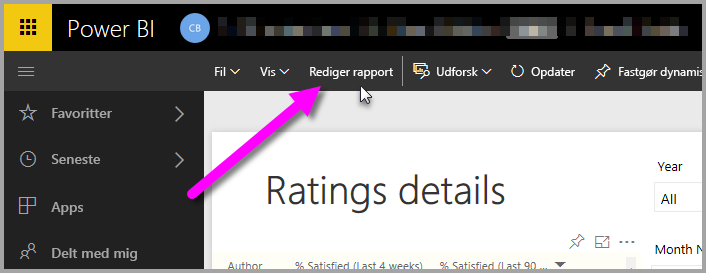
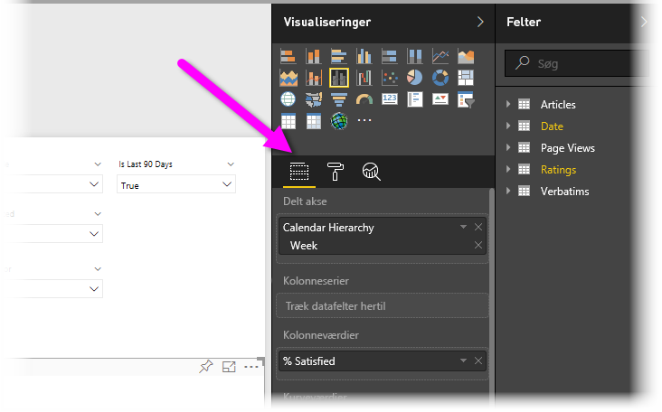
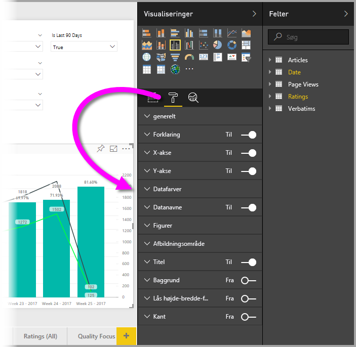
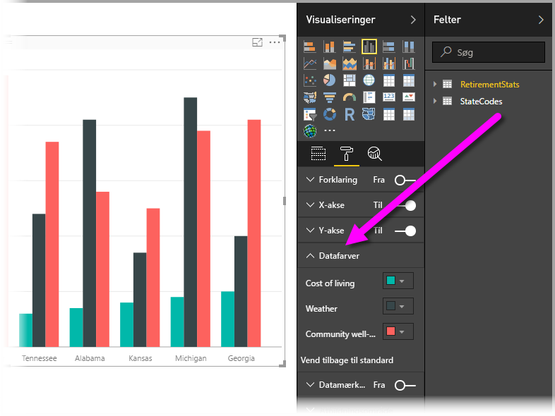
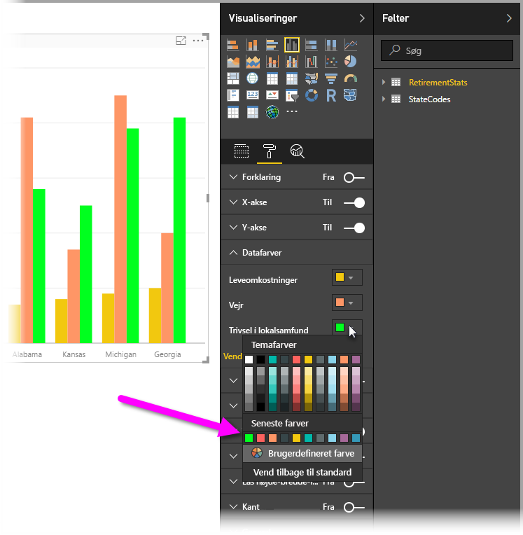
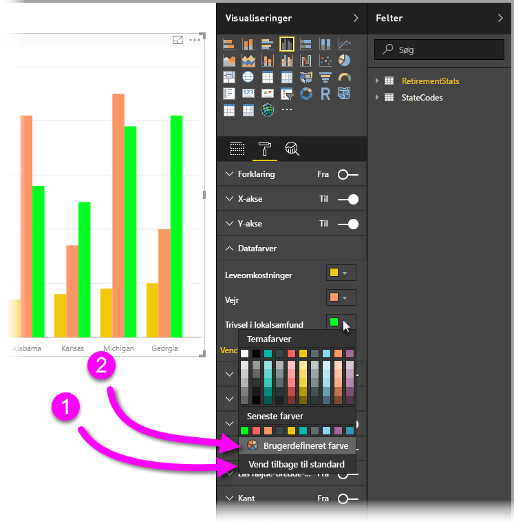
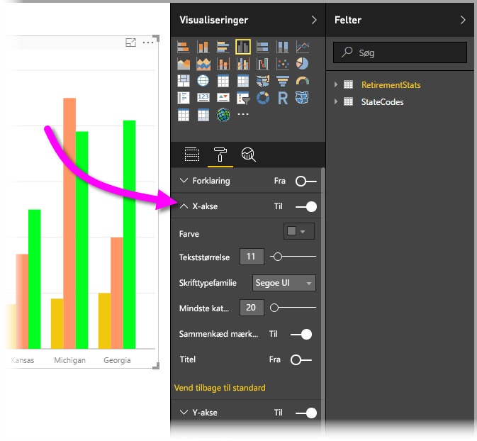

# Introduktion til farveformatering og akseegenskaber
I **Power BI** kan du ændre farven på dataserier, datapunkter og endda baggrunden til visualiseringer. Du kan også ændre, hvordan x- og y-aksen vises, så du har fuld kontrol over, hvordan dine dashboards og rapporter vises.

For at komme i gang skal du vælge en **rapport** i ruden **Mit arbejdsområde**. Vælg **Rediger rapport** i det øverste menuområde.  

Når du er ved at redigere en rapport, og du har valgt en visualisering, åbnes ruden **Visualiseringer**, hvor du kan tilføje eller ændre visualiseringer. Direkte under de tilgængelige visualiseringer er der tre ikoner: ikonet **Felter** (en stak søjler), ikonet **Formatér** (en malerrulle) og ikonet **Analytics** (et forstørrelsesglas). På billedet herunder er ikonet **Felter** valgt, hvilket er angivet med en gul linje under ikonet.

Når du vælger **Formatér**, viser området under ikonet de farve- og aksetilpasninger, som er tilgængelige for den visualisering, der er valgt i øjeblikket.  

Du kan tilpasse mange elementer i hver visualisering:

* Forklaring
* X-akse
* Y-akse
* Datafarver
* Datanavne
* Figurer
* Afbildningsområde
* Titel
* Baggrund
* Lås højde-bredde-forhold
* Kant

> [!NOTE]
>  
> Du kan ikke se alle disse elementer med hver enkelt visualiseringstype. Den visualisering, du vælger, vil påvirke, hvilke tilpasninger der er tilgængelige. Du kan f.eks. ikke se en x-akse, hvis du har et cirkeldiagram valgt, fordi cirkeldiagrammer ikke har en x-akse.

Vær endvidere opmærksom på, at hvis du ikke har nogen visualisering valgt, vises **Filtre** i stedet for ikoner, hvilket gør det muligt at anvende filtre på alle visualiseringer på siden.

Lad os se et par eksempler: det ene med farver, det andet med ændring af en akses egenskaber. Herfra bør du være klar til at tilpasse farver, akser og etiketter hele dagen lang.

## Arbejd med farver

Lad os gennemgå de trin, der er nødvendige for at tilpasse farver i et diagram.

1. Jeg vælger et **grupperet søjlediagram** på rapportcanvasset.
2. Derefter vælger jeg ikonet **Formatér** for at få vist de tilgængelige tilpasninger.
3. Jeg vælger så den lille pil ned til venstre for tilpasningen **Datafarver**. Det viser, hvordan kan jeg tilpasse datafarverne med indstillinger, som er specifikke for den visualisering, jeg har valgt.
4. **Datafarver** udvides nedad og viser de tilgængelige tilpasninger.  
   

Lad os foretage nogle ændringer. Jeg kan vælge pil ned ud for farven for at foretage ændringer på hver tilgængelig dataserie. Jeg vil ændre **Cost of living** til gul, **Weather** til orange, og **Community well-being** gør jeg grøn. Følgende skærm viser mig ved det sidste trin, hvor jeg ændrer **Cost of living**.  

Ændringerne vises på billedet nedenfor. Det er godt nok et lyst diagram. Her er nogle nyttige punkter, der er værd at bemærke om arbejde med farver. Tallene på følgende liste vises også på følgende skærmbillede og angiver, hvor disse nyttige elementer kan åbnes eller ændres.

1. Kan du ikke lide farverne? Det er ikke noget problem, du skal bare vælge **Vend tilbage til standard**, og dit valg vender tilbage til standardindstillingerne. Du kan gøre det for én farve eller for hele visualiseringen.
2. Vil du have en farve, der ikke vises på paletten? Bare vælg **Brugerdefineret farve**, og vælg i spektret.  
   

Er du ikke helt glad for den ændring, du netop har foretaget? Brug **CTRL + Z** for at fortryde, som du er vant til at gøre.

## Rediger akseegenskaber

Det er ofte nyttigt at ændre x-aksen eller y-aksen. På samme måde som at arbejde med farver kan du ændre en akse ved at vælge ikonet for pil ned til venstre for den akse, du vil ændre, som det vises på følgende billede.  

Hvis du vil skjule indstillingerne for **X-akse**, skal du blot vælge ikonet for pil op ud for **X-akse**.

Du kan fjerne etiketterne på x-aksen helt ved at slå alternativknappen ud for **X-akse** til og fra. Du kan også vælge, om aksetitler skal slås til eller fra, ved at markere alternativknappen ud for **Titel**.  

Der er alle mulige forskellige farver at vælge mellem og mange flere tilpasninger, som du kan anvende på dine Power BI-rapporter og -dashboards.

> [!NOTE]
>  
> Disse farve-, akse- og relaterede tilpasninger, der er tilgængelige, når ikonet **Formatér** er valgt, er også tilgængelige i Power BI Desktop.

## Indstil farve fra tekstværdier

Fra og med august 2018-opdateringen til **Power BI Desktop** kan du indstille farver med en tekstværdi eller heksadecimal værdi for et rapportelement. Du kan finde flere oplysninger under [betinget formatering i tabeller](../desktop-conditional-table-formatting.md).

## Næste trin
Du kan få flere oplysninger i følgende artikel:  

* [Tip og tricks til farveformatering i Power BI](service-tips-and-tricks-for-color-formatting.md)  
* [Betinget formatering af tabeller](../desktop-conditional-table-formatting.md)

