# Introduktion til formateringsruden
Hvis du har redigeringstilladelser til en rapport, er der mange tilgængelige formateringsindstillinger. I Power BI-rapporter kan du ændre farven på dataserier, datapunkter og endda baggrunden i visualiseringer. Du kan ændre, hvordan x-aksen og y-aksen vises. Du kan også formatere skrifttypeegenskaber for visualiseringer, figurer og titler. Power BI giver dig fuld kontrol over, hvordan dine rapporter vises.

Start med at åbne en rapport i Power BI Desktop eller Power BI-tjenesten. De har begge næsten identiske formateringsindstillinger. Når du åbner en rapport i Power BI-tjenesten, skal du sørge for at vælge **Rediger** fra menulinjen. 

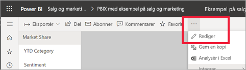

Når du er ved at redigere en rapport, og du har valgt en visualisering, åbnes ruden **Visualiseringer**. Brug denne rude til at ændre visualiseringer. Direkte under ruden **Visualiseringer** er der tre ikoner: ikonet **Felter** (stablede søjler), ikonet **Formatér** (en malerrulle) og ikonet **Analytics** (et forstørrelsesglas). På billedet herunder er ikonet **Felter** valgt, hvilket er angivet med en gul linje under ikonet.

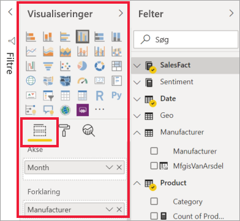

Når du vælger **Formatér**, vises de tilpasninger, som er tilgængelige for den visualisering, der er valgt i øjeblikket, i området under ikonet.  

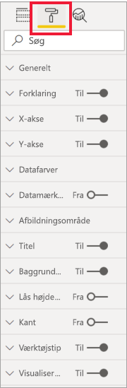

Du kan tilpasse mange elementer i hver visualisering. De tilgængelige indstillinger afhænger af den valgte visual. Nogle af disse indstillinger er:

* Forklaring
* X-akse
* Y-akse
* Datafarver
* Datamærkater
* Figurer
* Afbildningsområde
* Titel
* Baggrund
* Lås højde-bredde-forhold
* Kant
* Værktøjstip
* Visualheadere
* Figurer
* Placering    
og meget mere.

> [!NOTE]
>  
> Du kan ikke se alle disse elementer med hver enkelt visualiseringstype. Den visualisering, du vælger, vil påvirke, hvilke tilpasninger der er tilgængelige. Du kan f.eks. ikke se en x-akse, hvis du har et cirkeldiagram valgt, fordi cirkeldiagrammer ikke har en x-akse.

Vær endvidere opmærksom på, at hvis du ikke har nogen visualisering valgt, vises **Filtre** i stedet for ikoner, hvilket gør det muligt at anvende filtre på alle visualiseringer på siden.

Den bedste måde at få mere at vide om, hvordan du bruger formateringsindstillingerne, er at prøve dem. Du kan altid fortryde dine ændringer eller vende tilbage til standard. Der er en utrolig mængde tilgængelige muligheder, og der tilføjes hele tiden nye. Det er ikke muligt at beskrive alle formateringsindstillinger i én artikel. Men vi gennemgår vi et par af dem sammen, så du kan komme i gang. 

1. Skift farver, der bruges i visual'et   
2. Anvend en typografi    
3. Skift egenskaber for akse    
4. Tilføj datamærkater    

## Arbejd med farver

Lad os gennemgå de trin, der er nødvendige for at tilpasse farver i en visualisering.

1. Vælg en visualisering for at aktivere den.

2. Vælg ikonet med malerullen for at åbne fanen Formatering. Under fanen Formatering vises alle de formateringselementer, der er tilgængelige for det valgte visual.

    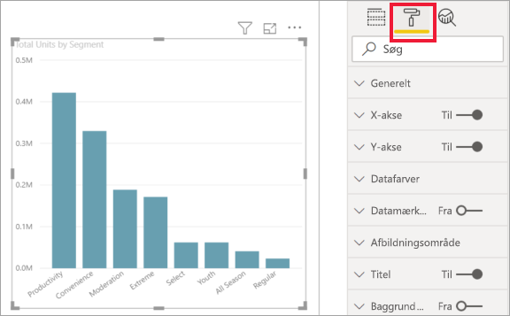

3. Vælg **Datafarver** for at udvide de tilgængelige tilpasninger.  

    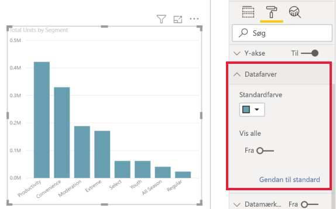

4. Angiv **Vis alle** til Til, og vælg forskellige farver til kolonner.

    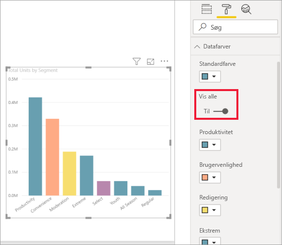

Her er nogle nyttige tip til arbejde med farver. Tallene på følgende liste vises også på følgende skærmbillede og angiver, hvor disse nyttige elementer kan åbnes eller ændres.

1. Kan du ikke lide farven? Det er ikke noget problem. Du skal bare vælge **Vend tilbage til standard**, og dit valg vender tilbage til standardindstillingerne. 

2. Kan du ikke lide nogen af farveændringerne? Vælg **Vend tilbage til standard** nederst i afsnittet **Datafarve**, og farverne vender tilbage til standardindstillingerne. 

3. Vil du have en farve, der ikke vises på paletten? Bare vælg **Brugerdefineret farve**, og vælg i spektret.  

   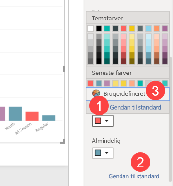

Er du ikke helt glad for den ændring, du netop har foretaget? Brug **CTRL + Z** for at fortryde, som du er vant til at gøre.

## Anvendelse af en typografi på en tabel
Nogle Power BI-visualiseringer omfatter indstillingen **Typografi**. Med ét klik kan du anvende et komplet sæt formateringsindstillinger på hele din visualisering. 

1. Vælg en tabel eller matrix for at gøre den aktiv.   
1. Åbn fanen Formatering, og vælg **Typografi**.

   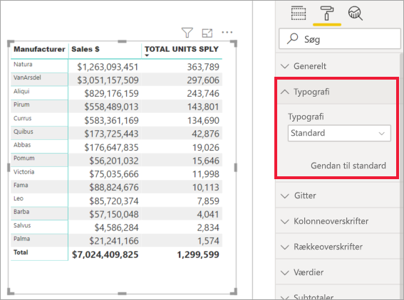

1. Vælg en typografi på rullelisten. 

   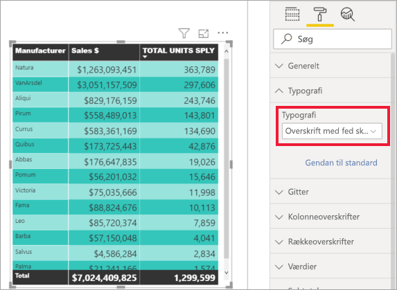

Selv efter at du har anvendt en typografi, kan du fortsætte med at formatere egenskaber, herunder farve, for den pågældende visualisering.

## Rediger akseegenskaber

Det er ofte nyttigt at ændre x-aksen eller y-aksen. På samme måde som at arbejde med farver kan du ændre en akse ved at vælge ikonet for pil ned til venstre for den akse, du vil ændre, som det vises på følgende billede.  
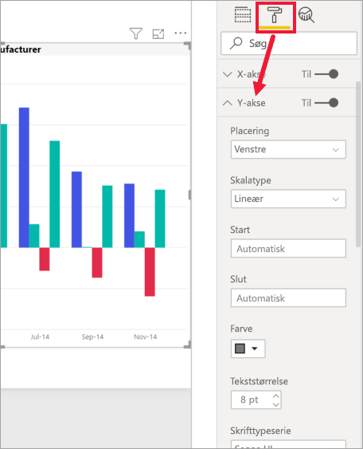

I eksemplet nedenfor har vi formateret Y-aksen ved at:
- flytte mærkaterne til højre side af visualiseringen

- ændre startværdien til nul.

- ændre mærkatskrifttypens farve til sort

- øge mærkatskrifttypens størrelse til 12

- tilføje en Y-aksetitel

    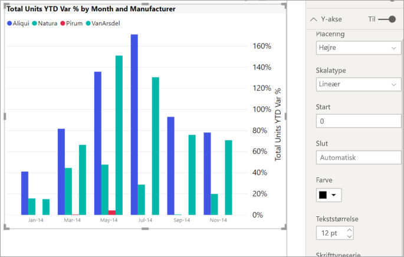

Du kan fjerne mærkaterne på x-aksen helt ved at slå alternativknappen ud for **X-akse** eller **Y-akse** til og fra. Du kan også vælge, om aksetitler skal slås til eller fra, ved at markere alternativknappen ud for **Titel**.  

## Tilføjelse af datamærkater    

Et sidste formateringseksempel før du selv går i gang med udforskningen.  Lad os føje datamærkater til et områdediagram. 

Her er *før*-billedet. 

Og her er *efter*-billedet.

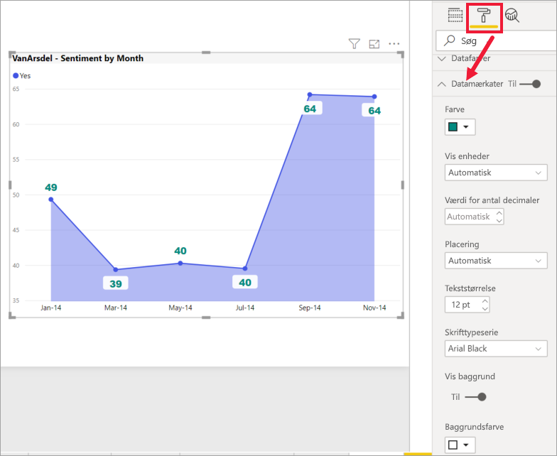

Vi har valgt visualiseringen for at gøre den aktiv og åbne fanen Formatering.  Vi har valgt **Datamærkater** og slået dem til. Vi har derefter øget skrifttypen til 12, ændret skrifttypefamilien til Arial Black, slået **Vis baggrund** til og angivet baggrundsfarven til hvid med en gennemsigtighed på 5%.

Det er blot nogle få af de mulige formateringsopgaver. Åbn en rapport i redigeringstilstand, og hav det sjovt med at udforske ruden Formatering, der gør det muligt at oprette smukke og informative visualiseringer.

## Næste trin
Du kan få flere oplysninger i følgende artikel:  

* [Tip og tricks til farveformatering i Power BI](service-tips-and-tricks-for-color-formatting.md)  
* [Betinget formatering af tabeller](../desktop-conditional-table-formatting.md)

