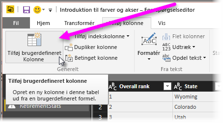

# Histogrammer
Der er flere måder at bygge histogrammer på i Power BI. Vi starter med den nemmeste og fortsætter herfra.

## Enkle histogrammer
Find først ud af, hvilken forespørgsel der har det felt, du vil oprette et histogram ud fra.  Brug indstillingen *Reference* for forespørgslen til at oprette en ny forespørgsel, og kald den *FieldName Histogram*. Brug indstillingen **Gruppér efter** på båndet **Transformering**, og vælg aggregeringen **Antal rækker**. Kontrollér, at datatypen er et tal i den resulterende aggregeringskolonne. Du kan derefter visualisere disse data på rapportsiden. Det er hurtigt og nemt at oprette, men virker ikke godt, hvis du har mange datapunkter, og det giver ikke mulighed for at børste på tværs af visuelle elementer.

## Definer buckets for at oprette et histogram
Find ud af, hvilken forespørgsel der har det felt, du vil oprette et histogram ud fra. Brug indstillingen *Reference* for forespørgslen til at oprette en ny forespørgsel, og kald den *FieldName*.  Definer nu dine buckets med en regel. Brug indstillingen **Tilføj brugerdefineret kolonne** på båndet **Tilføj kolonne**, og opret en brugerdefineret regel.

Kontrollér, at datatypen er et tal i den resulterende aggregeringskolonne. Du kan nu bruge gruppér efter-metoden, der er beskrevet under **Enkle histogrammer** (tidligere i denne artikel), for at få det ønskede histogram. Denne indstilling håndterer flere datapunkter, men hjælper stadig ikke med børstning.

## Definer et histogram, der understøtter børstning
Børstning betyder, at visuelle elementer er kædet sammen, så når en bruger vælger et datapunkt i ét visuelt element, fremhæver eller filtrerer andre visuelle elementer datapunkter, der er relateret til det valgte datapunkt.  Da vi manipulerer data på forespørgselstidspunktet, skal vi oprette en relation mellem tabeller og sikre os, at vi ved, hvilket detaljeelement der er relateret til bucket'en i histogrammet og omvendt.

Start processen ved hjælp af indstillingen *Reference* i forespørgslen med det felt, du vil oprette et histogram ud fra.  Kald den nye forespørgsel *Buckets*.  I dette eksempel kan vi kalde den oprindelige forespørgsel *Detaljer*.  Flyt derefter alle kolonner undtagen den kolonne, du vil bruge som bucket for histogrammet.  Nu kan du bruge funktionen *Fjern dubletter* i forespørgslen (den er i genvejsmenuen, når du vælger kolonnen), så de resterende værdier bliver entydige værdier i kolonnen. Hvis du har decimaler, kan du først bruge tippet, der bruges til at definere buckets til oprettelse af et histogram, til at få et sæt buckets, der kan administreres.  Nu skal du kontrollere dataene, der vises i forespørgselseksemplet. Hvis du kan se tomme værdier eller null-værdier, skal du rette dette, før du opretter en relation. Se "Opret en relation, hvis mine data har null-værdier eller tomme værdier". Det kan være problematisk at bruge denne fremgangsmåde, da det er nødvendigt at sortere. For at få buckets til at sortere korrekt kan du gå til "Sorteringsrækkefølge: Få vist kategorier i den ønskede rækkefølge". 

> [!NOTE]
> Det er en god ide at tænke over sorteringsrækkefølgen, før du opretter visuelle elementer.   
> 
> 

Næste trin i processen er at definere en relation mellem forespørgslerne *Buckets* og *Detaljer* i bucketkolonnen.  I *Power BI Desktop* skal du vælge *Administrer relationer* på båndet.  Opret en relation, hvor *Buckets* er i den venstre tabel, og *Detaljer* er i den højre tabel, og vælg det felt, du bruger til histogrammet. 

Sidste trin er oprettelse af histogrammet. Træk feltet Bucket fra tabellen *Buckets*. Fjern standardfeltet fra det søjlediagram, der oprettes.  Nu skal du trække histogramfeltet fra tabellen *Detaljer* til det samme visuelle element. I feltoversigten skal du ændre standardaggregeringen til Antal. Resultatet er histogrammet. Hvis du opretter endnu et visuelt element, f.eks. en trævisning ud fra tabellen Detaljer, skal du vælge et datapunkt i trævisningen for at se fremhævningen i histogrammet og vise histogrammet for det valgte datapunkt i forhold til tendensen for hele datasættet.

