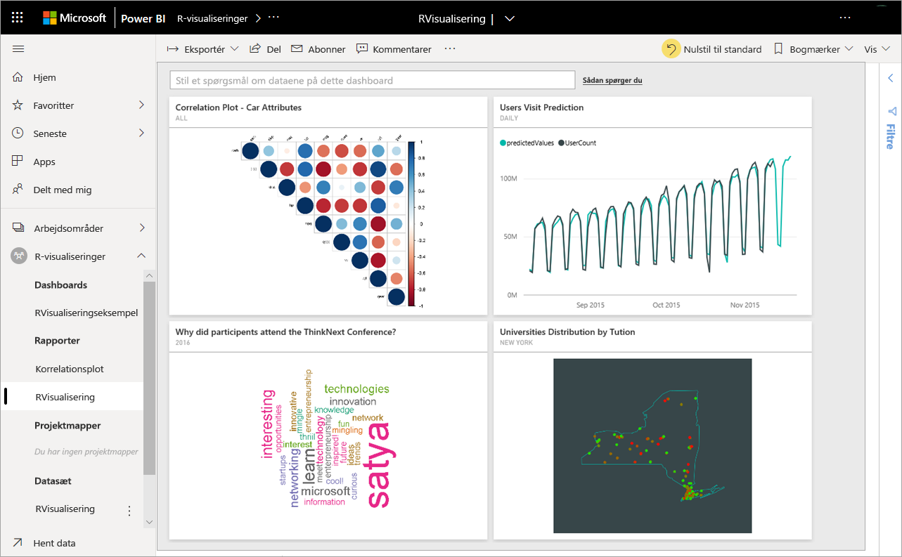
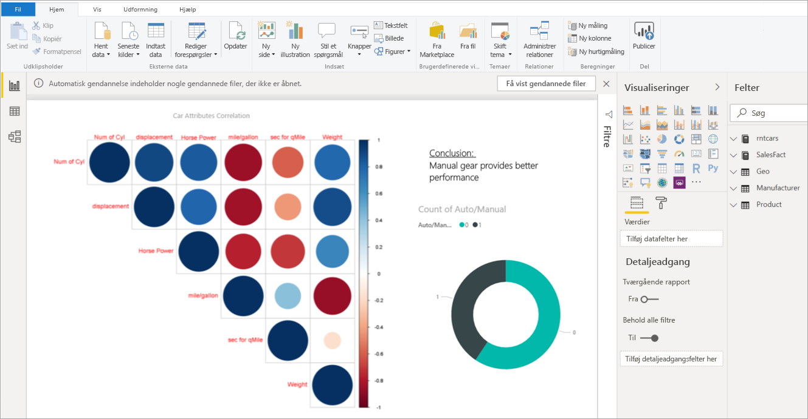
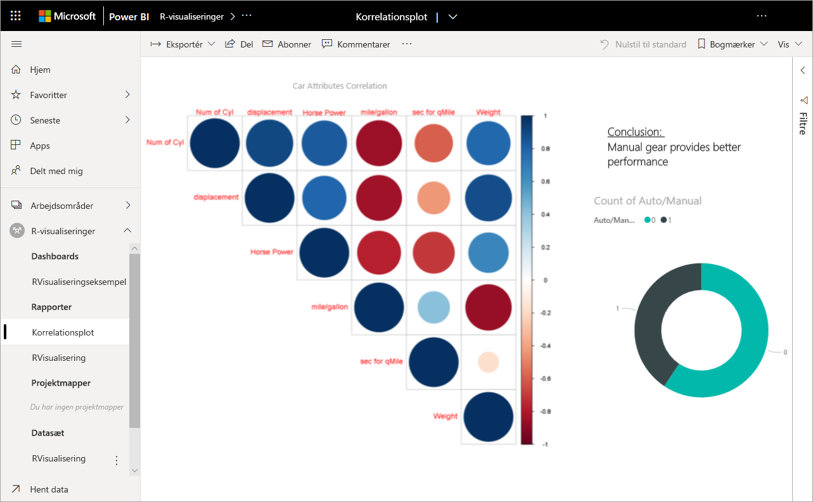
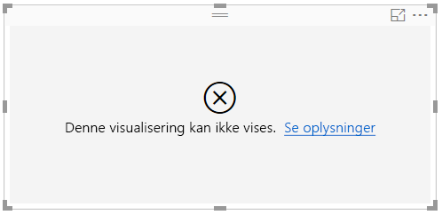
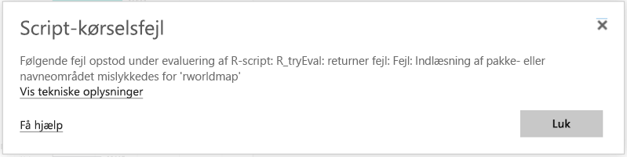

# Opret og brug R-visuals i Power BI
Visuelle R-elementer kan i øjeblikket kun oprettes i **Power BI Desktop** og derefter publiceres på Power BI-tjenesten. Du kan finde flere oplysninger om oprettelse af R-visuals under [Opret i Power BI-visuals ved hjælp af R](../desktop-r-visuals.md).

## Opret R-visuals i Power BI-tjenesten
Power BI-tjenesten understøtter visning og interaktion med visuelle elementer, der er oprettet med R-scripts. Visuelle elementer, der er oprettet med R-scripts, også kaldet *R-visuals*, kan vise avanceret dataformatering og analyse, f.eks. prognoser, ved hjælp af styrken i R's omfattende analyse- og visualiseringsfunktioner.

> [!NOTE]
> [R-programmeringssproget](https://www.r-project.org/) er blandt de mest anvendte programmeringssprog af statistikere, dataloger og erhvervsanalytikere. R-sproget har et community med åben kildekode, der indeholder mere end 7.000 tilføjelsespakker, samt gængse R-brugergrupper. Den version af R, som er installeret i Power BI-tjenesten, er *Microsoft R 3.4.4.*
> 
> 

Det følgende billede viser et Power BI-dashboard med en samling af visuelle R-elementer, der bruges til avancerede analyser.

Visuelle R-elementer oprettes i en [Power BI Desktop-rapport](../desktop-get-the-desktop.md), som rapporten vist på følgende billede.

Når rapporten er oprettet i **Power BI Desktop**, kan du udgive rapporten på Power BI-tjenesten med et eller flere visuelle R-elementer. 

 Ikke alle R-pakkerne understøttes i tjenesten. Se de understøttede pakker sidst i denne artikel for at få vist listen over pakker, der understøttes i øjeblikket på Power BI-tjenesten.

Du kan downloade denne [Power BI Desktop-eksempelfil](https://download.microsoft.com/download/D/9/A/D9A65269-D1FC-49F8-8EC3-1217E3A4390F/RVisual_correlation_plot_sample%20SL.pbix) (.pbix-fil), der indeholder nogle visuelle R-elementer, for at se, hvordan det fungerer, og for at eksperimentere.

Visuelle R-elementer, der er oprettet i **Power BI Desktop**, og derefter publiceres på Power BI-tjenesten, fungerer i de fleste tilfælde som andre visuelle elementer på Power BI-tjenesten. Du kan arbejde med, filtrere, oprette udsnit af og fastgøre dem til et dashboard eller dele dem med andre. Du kan finde flere oplysninger om at dele dashboards og visuelle elementer under [Del et dashboard med kolleger og andre](../service-share-dashboards.md). Én forskel fra andre visuelle elementer er, at visuelle R-elementer ikke kan vise værktøjstip og ikke kan bruges til at filtrere andre visuelle elementer.

Som du kan se på billedet nedenfor, vises og fungerer visuelle R-elementer på Power BI-tjenesten, enten i dashboards eller rapporter, stort set som et hvilken som helst andet visuelt element, og brugerne behøver ikke at være opmærksomme på det underliggende R-script, der oprettede det visuelle element.

## Sikkerhed for R-scripts
Visuelle R-elementer oprettes ud fra R-scripts, som kan indeholde kode med risici for sikkerhed eller personlige oplysninger.

Disse risici findes hovedsageligt i oprettelsesfasen, når scriptets forfatter afvikler scriptet på sin egen computer.

Power BI-tjenesten anvender en *sandkasseteknologi* til at beskytte brugere og tjenesten mod sikkerhedsrisici.

Denne *sandkassemetode* lægger nogle begrænsninger på de scripts, der kører i Power BI-tjenesten, f.eks. adgang til internettet eller adgang til andre ressourcer, der ikke er påkrævet for at oprette det visuelle R-element.

## Ved fejl i R-scripts
Når et R-script støder på en fejl, afbildes det visuelle R-element ikke, og der vises en fejlmeddelelse. Du kan få flere oplysninger om fejlen ved at vælge **Se detaljer** i fejlmeddelelsen på canvasset, som det vises på følgende billede.

Som et andet eksempel viser følgende billede den fejlmeddelelse, der vises, når et R-script ikke blev kørt korrekt på grund af en manglende R-pakke i Azure.

## Licensering
R-visuals kræver en [Power BI Pro](../service-self-service-signup-for-power-bi.md)-licens for at kunne gengives i rapporter, opdateres, filtreres og filtreres i tværgående retning. Du kan finde flere oplysninger om Power BI Pro-licenser, og hvordan de adskiller sig fra gratis licenser, under [Power BI Pro-indhold – Hvad er det?](../service-admin-purchasing-power-bi-pro.md)

Gratis brugere af Power BI kan kun anvende felter, der deles med dem i Premium-arbejdsområder. Du kan få mere at vide under [Køb af Power BI Pro](../service-admin-purchasing-power-bi-pro.md).

I nedenstående tabel beskrives visuelle R-elementers funktioner baseret på licenser.

|  |Forfatter til R-visualiseringer i Power BI Desktop  | Opret PBI-servicerapporter med R-visualiseringer |Vis visuelle R-elementer i rapporter  | Vis R-felter i dashboards |
|---------|---------|---------|---------|--------|
|**Gæst** (Power BI Embedded)     |  Understøttet|  Ikke understøttet      | Kun understøttet i Premium/Azure-kapacitet  | Kun understøttet i Premium/Azure-kapacitet |
|**Ikke-administreret lejer** (domæne er ikke bekræftet) | Understøttet | Ikke understøttet |  Ikke understøttet |Understøttet (B2B-scenarie) |
|**Administreret lejer** med gratis licens    |  Understøttet       |  Ikke understøttet       |    Kun understøttet i Premium-kapacitet    | Understøttet |
**Administreret lejer** med Pro-licens     |   Understøttet      | Understøttet      | Understøttet    |Understøttet|

## Kendte begrænsninger
Visuelle R-elementer i Power BI-tjenesten har nogle få begrænsninger:

* Understøttelse af R-visuals er begrænset til de pakker, der er identificeret [i Få mere at vide om, hvilke R-pakker der understøttes](../service-r-packages-support.md). Der er i øjeblikket ingen understøttelse af brugerdefinerede pakker.
* Begrænsninger for datastørrelse – data, der bruges af det visuelle R-element til afbildning, er begrænset til 150.000 rækker. Hvis der er valgt flere end 150.000 rækker, bruges kun de øverste 150.000 rækker, og der vises en meddelelse på billedet.
* Opløsning – alle R-visuals vises ved 72 DPI.
* Begrænsning af beregningstid – hvis en beregning af et visuelt R-element overskrider 60 sekunder, får scriptet timeout, hvilket medfører en fejl.
* Visuelle R-elementer opdateres ved dataopdateringer, filtrering og fremhævning. Selve billedet er imidlertid ikke interaktivt og understøtter ikke værktøjstip.
* Visuelle R-elementer reagerer på fremhævning af andre elementer, men du kan ikke klikke på elementer i det visuelle R-element for at filtrere andre elementer i tværgående retning.
* Visuelle R-elementer understøttes ikke i øjeblikket for datatypen *Tid*. Brug dato/klokkeslæt i stedet.
* Visuelle R-elementer vises ikke, når du bruger **Publicer på internettet**.
* Visuelle R-elementer udskrives i øjeblikket ikke sammen med dashboard- og rapportudskrivning
* Visuelle R-elementer understøttes ikke i øjeblikket i DirectQuery-tilstand for Analysis Services
* Visuelle R-elementer indeholder muligheden for at konvertere tekstmærkater til grafiske elementer. Det kræver følgende ekstra trin at gøre det i Power BI-tjenesten:
  
  * Tilføj derefter følgende linje i begyndelsen af R-scriptet:
    
        powerbi_rEnableShowText =  1
* Kinesiske, japanske og koreanske skrifttyper kræver, at alle yderligere følgende trin fungerer korrekt i Power BI-tjenesten:
  
  * Først skal du installere R-pakken *showtext* og alle dens afhængigheder. Du kan gøre det ved at køre følgende script:
    
        *install.packages("showtext")*
  * Tilføj derefter følgende linje i begyndelsen af R-scriptet:
    
        powerbi_rEnableShowTextForCJKLanguages =  1

## Oversigt over R-pakker
R-pakker er samlinger af R-funktioner, data og kompileret kode, der er samlet i et veldefineret format. Når R er installeret, indeholder den et standardsæt af pakker, og andre pakkerne er tilgængelige til download og installation. Når en R-pakke er installeret, skal den indlæses i sessionen for at kunne bruges. Den primære datakilde for gratis R-pakker er CRAN – [Comprehensive R Archive Network](https://cran.r-project.org/web/packages/available_packages_by_name.html).

**Power BI Desktop** kan bruge enhver type R-pakke uden begrænsninger. Du kan selv installere R-pakker til brug i **Power BI Desktop** (for eksempel ved hjælp af [RStudio IDE](https://www.rstudio.com/)).

Visuelle R-elementer i **Power BI-tjenesten** understøttes af de pakker, der findes i afsnittet med **Understøttede pakker** i [denne artikel](../service-r-packages-support.md). Hvis du ikke kan finde en pakke, du er interesseret i, på listen med understøttede pakker, kan du anmode om support til pakken. Se [R-pakker i Power BI-tjenesten](../service-r-packages-support.md) for at få oplysninger om, hvordan du anmoder om support.

### Krav og begrænsninger for R-pakker
Der er en række krav og begrænsninger for R-pakker:

* Power BI-tjenesten understøtter i de fleste tilfælde R-pakker med gratis og open source-softwarelicenser, f.eks. GPL-2, GPL-3, MIT+ osv.
* Power BI-tjenesten understøtter pakker, der er publiceret i CRAN. Tjenesten understøtter ikke private eller brugerdefinerede R-pakker. Vi anbefaler, at brugere gør deres private pakker tilgængelige på CRAN, før de anmoder om, at pakken gøres tilgængelig i Power BI-tjenesten.
* For **Power BI Desktop** er der to variationer for R-pakker:
  
  * For R-visuals kan du installere en vilkårlig pakke, herunder brugerdefinerede R-pakker
  * For brugerdefinerede R-visuals understøttes kun offentlige CRAN-pakker til automatisk installation af pakkerne.
* Af hensyn til sikkerhed og beskyttelse af personlige oplysninger understøtter vi i øjeblikket ikke R-pakker, der leverer klient-/serverforespørgsler via internettet (f.eks. RgoogleMaps) i tjenesten. Brug af netværk er blokeret for denne type forsøg. Se [R-pakker i Power BI-tjenesten](../service-r-packages-support.md) for at få en liste over R-pakker, der understøttes og ikke understøttes.
* Godkendelsesprocessen for at medtage en ny R-pakke har et træ af afhængigheder. Nogle afhængigheder, der skal være installeret i tjenesten, kan ikke understøttes.

### Understøttede pakker:
Du finder en lang liste over understøttede R-pakker (og den korte liste over pakker, der ikke understøttes) i følgende artikel:

* [R-pakker i Power BI-tjenesten](../service-r-packages-support.md)

