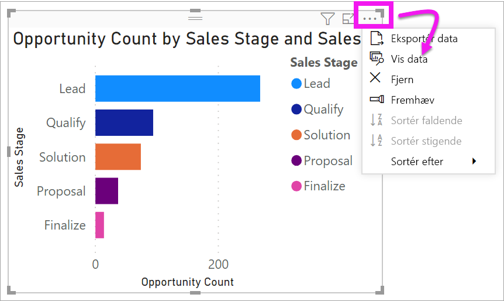
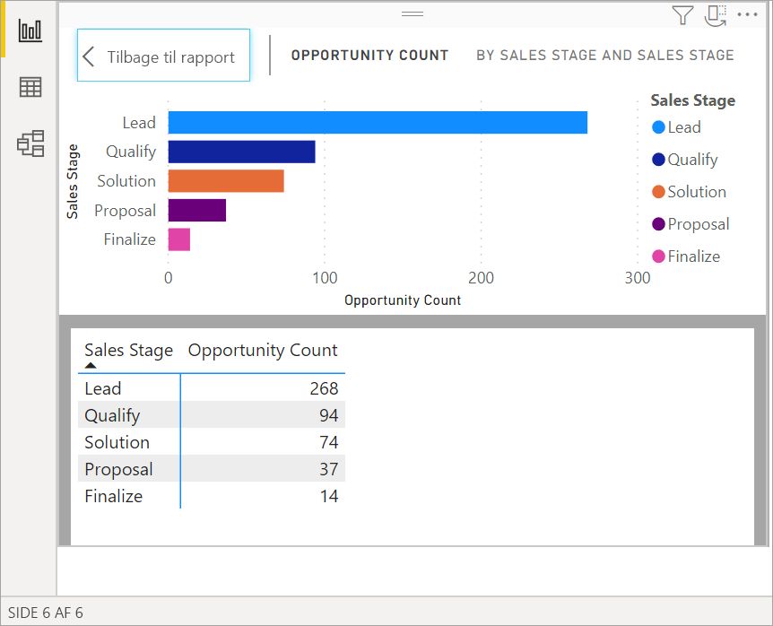
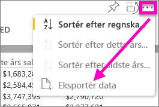
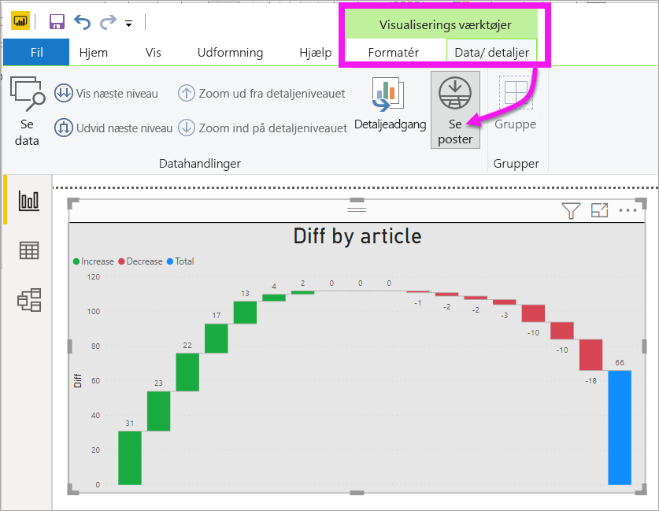
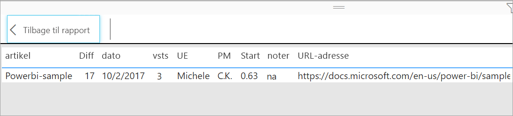

# Vis en visualiserings underliggende data

[!INCLUDE[consumer-appliesto-yyyn](../includes/consumer-appliesto-nyyn.md)]    

## Vis data
En Power BI-visualisering er oprettet vha. data fra dine datasæt. Hvis du vil se bag kulisserne, kan du i Power BI *få vist* de data, der bruges til at oprette visualiseringen. Når du vælger **Vis data**, vises dataene under (eller ud for) visualiseringen i Power BI.

Du kan også eksportere de data, der bruges til at oprette visualiseringen som en .xlsx- eller .csv-fil og få den vist i Excel. Du kan finde flere oplysninger under [Eksportér data fra Power BI-visualiseringer](power-bi-visualization-export-data.md).

> [!NOTE]
> Både *Vis data* og *Eksportér data* er tilgængelige i Power BI-tjenesten og Power BI Desktop. Power BI Desktop indeholder dog et ekstra lag detaljer, og [*Vis poster* viser de faktiske rækker fra datasættet](../create-reports/desktop-see-data-see-records.md).
> 
> 

## Brug af *Vis data* 
1. Vælg en visualisering i Power BI Desktop for at aktivere den.

2. Vælg **Flere handlinger** (...), og vælg **Vis data**. 
    

3. Som standard vises dataene under visualiseringen.
   
   

4. Hvis du vil ændre retningen, skal du vælge lodret layout  i øverste højre hjørne af visualiseringen.
   
   
5. Hvis du vil eksportere dataene til en .csv-fil, skal du vælge ellipsen og vælge **Eksportér data**.
   
    
   
    Du kan finde flere oplysninger om eksport af data til Excel under [Eksportér data fra Power BI-visualiseringer](power-bi-visualization-export-data.md).
6. Hvis du vil skjule dataene, skal du fjerne markeringen af **Udforsk** > **Få vist data**.

## Brug af Vis poster
Du kan også fokusere på ét dataelement i en visualisering og analysere de underliggende data. 

1. Hvis du vil bruge **Se poster**, skal du vælge en visualisering for at aktivere den. 

2. På Desktop-båndet skal du vælge fanen for **Visualiseringsværktøjer** > **Data/detailudledning** > **Se poster**. 

    

3. Vælg et datapunkt eller en række i visualiseringen. I dette eksempel har vi valgt den fjerde kolonne fra venstre. Power BI viser os datasætposten for dette datapunkt.

    

4. Vælg **Tilbage til rapport** for at vende tilbage til Desktop-rapportlærredet. 

## Overvejelser og fejlfinding

- Hvis knappen **Se poster** på båndet er deaktiveret og nedtonet, betyder det, at den valgte visualisering ikke understøtter Se poster.
- Du kan ikke ændre dataene i visningen Se poster og gemme dem i rapporten igen.
- Du kan ikke bruge Se poster, når der benyttes en beregnet måling i en flerdimensionel model.
- Du kan ikke bruge Se poster, når du har oprettet forbindelse til en live flerdimensionel model.  

## Næste trin
[Eksportér data fra Power BI-visualiseringer](power-bi-visualization-export-data.md)    

Har du flere spørgsmål? [Prøv at spørge Power BI-community'et](https://community.powerbi.com/)

