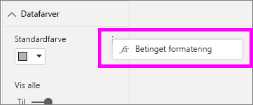
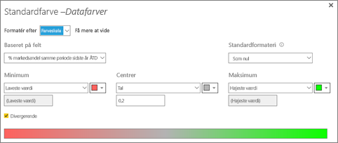

# Tip og tricks til farveformatering i Power BI
Power BI indeholder mange forskellige måder at tilpasse dine dashboards og rapporter på. Denne artikel indeholder en samling af tip, som kan gøre dine Power BI-visualiseringer mere overbevisende, interessante og tilpasset efter dine behov.

Der findes følgende tip. Har du et andet fantastiske tip? Fantastisk! Send det til os, og vi finder ud af, om det skal føjes til listen.

* Skift farve på et enkelt datapunkt
* Basér farverne i et diagram på en numerisk værdi
* Basér farven på datapunkter på en feltværdi
* Tilpas farver, der bruges i farveskalaen
* Brug divergerende farveskalaer
* Sådan fortryder du i Power BI

Hvis du vil foretage ændringer, skal du redigere en rapport. Åbn rapporten, og vælg **Rediger rapport** i det øverste menuområde, som vist på følgende billede.

Når ruderne **Filtre** og **Visualiseringer** vises langs højre side af rapportcanvasset, er du klar til at starte tilpasningen. Hvis ruden ikke vises, skal du vælge pilen i øverste højre hjørne for at åbne ruden.

## Skift farve på et enkelt datapunkt
Nogle gange kan du få brug for at fremhæve ét bestemt datapunkt. Måske er det salgstal for lanceringen af et nyt produkt eller højere kvalitetsbedømmelser efter lancering af et nyt program. Med Power BI kan du fremhæve et bestemt datapunkt ved at ændre dets farve.

Følgende visualisering rangordner solgte enheder efter produktsegment. 

Forestil dig nu, at du vil fremhæve segmentet **Convenience** for at vise, hvor godt dette nye segment præsterer, ved hjælp af farve. Her er trinnene:

Udvid afsnittet **Datafarver**, og slå skyderen til **Vis alle**. Farverne vises nu for hvert dataelement i visualiseringen. Når du peger på datapunkterne, aktiveres rulning, så du kan ændre datapunkterne.

Angiv **Convenience** til orange. 

Når du har foretaget et valg, får datapunktet **Convenience** en pæn orange nuance, der helt sikkert skiller sig ud.

Selvom du ændrer visualiseringstyper og derefter vender tilbage, kan Power BI huske valget, og **Convenience** er stadig orange.

Du kan ændre farven på et datapunkt for én, flere eller alle dataelementer i visualiseringen. Måske vil du gerne have, at din visual får virksomhedens farver. 

Der er forskellige ting, du kan gøre med farver. I det næste afsnit kigger vi på farveforløb.

## Basér farverne i et diagram på en numerisk værdi
Diagrammer nyder ofte godt af dynamisk indstilling af farve baseret på den numeriske værdi i et felt. Ved at gøre dette kan du vise en anden værdi end normalt for størrelsen på en søjle og vise to værdier på en enkelt graf. Eller du kan bruge det til at fremhæve datapunkter over (eller under) en bestemt værdi – måske fremhæve områder med lav rentabilitet.

Følgende afsnit viser forskellige metoder til at basere farve på en numerisk værdi.

## Basér farven på datapunkter på en værdi
Hvis du vil ændre farve på baggrund af en værdi, skal du åbne ruden Formatering og vælge indstillingen **Betinget formatering**.  

Brug rullemenuerne til at identificere de felter, der skal bruges til betinget formatering, i ruden Standardfarver. I dette eksempel har vi valgt feltet **Salgsfakta** > **Enheder i alt** og valgt lyseblå for den **laveste værdi** og mørkeblå for den **højeste værdi**. 

Du kan også formatere farven på visualiseringen ved hjælp af et felt, der ikke er en del af visualiseringen. På følgende billede benyttes **Procentvis markedsandel SPLY ÅTD**. 

Det fremgår, at selvom vi har solgt flere enheder af både **Produktivitet** og **Ekstrem** (deres kolonner er højere), har **Moderation** en større **Procentvis markedsandel SPLY ÅTD** (kolonnen indeholder en mere mættet farve).

## Tilpas de farver, der bruges i farveskalaen
Du kan også ændre den måde, som værdierne knyttes til disse farver på. På det følgende billede er farverne for **Minimum** og **Maksimum** indstillet til henholdsvis orange og grøn.

Læg mærke til på dette første billede, hvordan søjlerne i diagrammet afspejler det farveforløb, der vises i bjælken. Den højeste værdi er grøn, den laveste er orange, og hver søjle mellem er farvet med en nuance af spektret mellem grøn og orange.

Lad os nu se, hvad sker der, hvis vi angiver numeriske værdier i værdifelterne **Minimum** og **Maksimum**. Lad os angive **Minimum** til 3.500 og **Maksimum** til 6.000.

Ved at angive disse værdier anvendes farveforløb ikke længere på værdierne i diagrammet, der er under **Minimum** eller over **Maksimum**. En søjle med en værdi over værdien **Maksimum** har farven grøn, og en søjle med en værdi under værdien **Minimum** har farven rød.

## Brug divergerende farveskalaer
Dine data kan nogle gange have en naturligt divergerende skala. Et tempereret område har for eksempel et naturligt centrum ved frysepunktet, og en rentabilitetsbedømmelse har et naturligt midtpunkt (nul).

Hvis du vil bruge divergerende farveskalaer, skal du vælge indstillingen **Divergerende**. Når **Divergerende** er slået til, vises en yderligere farvevælger, der kaldes **Centrum**, som vist på følgende billede.

Når skyderen **Divergerende** er slået til, kan du angive farverne for **Minimum**, **Maksimum** og **Centrum** separat. På det følgende billede er **Centrum** indstillet til .2 for **Procentvis markedsandel SPLY ÅTD**, hvorfor søjler med værdier over .2 er en gradueret nuance af grøn, og søjler under en er nuancer af rød.

## Sådan fortryder du i Power BI
Som mange andre Microsoft-tjenester og -software giver Power BI en nem måde at fortryde den seneste kommando på. Lad os for eksempel antage, at du ændrer farven på et datapunkt eller en serie af datapunkter, og du ikke kan lide farven, når den vises i visualiseringen. Du kan ikke huske præcis, hvilken farve det havde før, men du ved, du vil farven tilbage!

Hvis du vil **fortryde** din sidste handling, eller de sidste par handlinger, skal du bare gøre følgende:

- Tryk på CTRL + Z

## Feedback
Har du et tip, du vil dele? Send det til os, og vi finder ud af, om det skal medtages her.

>[!NOTE]
>Disse farve-, akse- og relaterede tilpasninger, der er tilgængelige, når ikonet **Formatér** er valgt, er også tilgængelige i Power BI Desktop.

## Næste trin
[Introduktion til farveformatering og akseegenskaber](service-getting-started-with-color-formatting-and-axis-properties.md)

