# Tip og tricks til farveformatering i Power BI

[!INCLUDE[consumer-appliesto-nyyn](../includes/consumer-appliesto-nyyn.md)]    

Power BI indeholder mange forskellige måder at tilpasse dine dashboards og rapporter på. Denne artikel indeholder en samling af tip, som kan gøre dine Power BI-visualiseringer mere overbevisende, interessante og tilpasset efter dine behov.

Der findes følgende tip. Har du et andet fantastiske tip? Fantastisk! Send det til os, og vi finder ud af, om det skal føjes til listen.

* Anvend et tema på hele rapporten
* Skift farve på et enkelt datapunkt
* Betinget formatering
* Basér farverne i et diagram på en numerisk værdi
* Basér farven på datapunkter på en feltværdi
* Tilpas farver, der bruges i farveskalaen
* Brug divergerende farveskalaer
* Føj farve til tabelrækker
* Sådan fortryder du i Power BI

Hvis du vil foretage ændringer, skal du have redigeringstilladelser til rapporten. Åbn rapporten i **Rapportvisning** i Power BI Desktop. I Power BI-tjenesten betyder det, at du skal åbne rapporten og vælge **Rediger** på menulinjen, som vist på følgende billede.

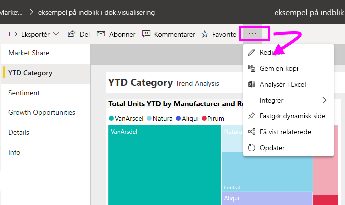

Når ruderne **Filtre** og **Visualiseringer** vises langs højre side af rapportcanvasset, er du klar til at starte tilpasningen. Hvis ruderne ikke vises, skal du vælge pilen i øverste højre hjørne for at åbne dem.

## Anvend et tema
Med rapporttemaer kan du anvende designændringer på hele rapporten, f.eks. bruge virksomhedsfarver, ændre ikonsæt eller anvende ny visualstandardformatering. Når du anvender et rapporttema, anvendes farver og formatering fra det valgte tema på alle visuals i rapporten. Du kan få mere at vide under [Brug rapporttemaer](../create-reports/desktop-report-themes.md)

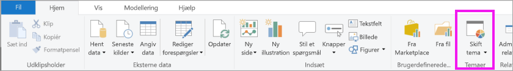

Her har vi anvendt temaet **Innovativt** på rapporten Salg og marketing.

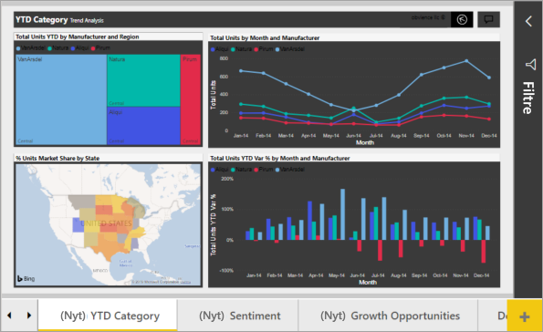

## Skift farve på et enkelt datapunkt
Nogle gange kan du få brug for at fremhæve ét bestemt datapunkt. Måske er det et salgstal for lanceringen af et nyt produkt eller højere kvalitetsbedømmelser efter lancering af et nyt program. Med Power BI kan du fremhæve et bestemt datapunkt ved at ændre dets farve.

Følgende visualisering rangordner solgte enheder efter produktsegment. 

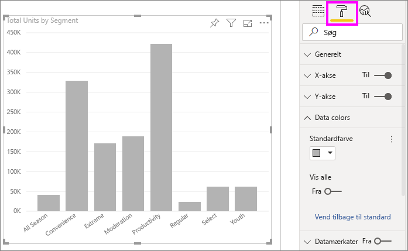

Forestil dig nu, at du vil fremhæve segmentet **Convenience** for at vise, hvor godt dette nye segment præsterer, ved hjælp af farve. Her er trinnene:

Udvid kortet **Datafarver**, og slå skyderen Til for **Vis alle**. Farverne vises nu for hvert dataelement i visualiseringen. Du kan nu redigere et hvilket som helst datapunkt.

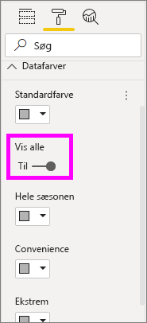

Angiv **Convenience** til orange. 

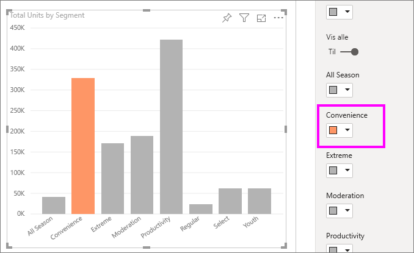

Når du har foretaget et valg, får datapunktet **Convenience** en pæn orange nuance, der helt sikkert skiller sig ud.

Selvom du ændrer visualiseringstyper og derefter vender tilbage, kan Power BI huske valget, og **Convenience** er stadig orange.

Du kan ændre farven på et datapunkt for én, flere eller alle dataelementer i visualiseringen. Måske vil du gerne have, at dit visual får virksomhedens gule, grønne og blå farver. 

Der er forskellige ting, du kan gøre med farver. I det næste afsnit kigger vi på betinget formatering.

## Betinget formatering af visualiseringer
Visualiseringer drager ofte fordel af en dynamisk farveindstilling baseret på den numeriske værdi i et felt. Ved at gøre dette kan du få vist en anden værdi end normalt for størrelsen på en søjle og få vist to værdier på en enkelt graf. Eller du kan bruge det til at fremhæve datapunkter over (eller under) en bestemt værdi – måske fremhæve områder med lav rentabilitet.

Følgende afsnit viser forskellige metoder til at basere farve på en numerisk værdi.

### Basér farven på datapunkter på en værdi
Hvis du vil ændre farven på basis af en værdi, skal du vælge en visualisering for at aktivere den. Åbn ruden Formatering ved at vælge ikonet med malerullen, og åbn derefter kortet **Datafarver**. Hold markøren over kortet, klik på de tre lodrette prikker, der vises, og vælg **Betinget formatering**.  

Brug rullemenuerne i ruden **Standardfarve** til at identificere de felter, der skal bruges til betinget formatering. I dette eksempel har vi valgt feltet **Salgsfakta** > **Enheder i alt** og valgt lyseblå for den **laveste værdi** og mørkeblå for den **højeste værdi**. 

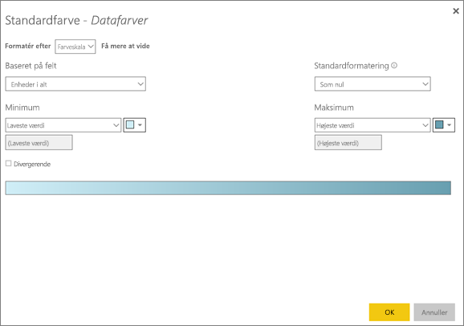

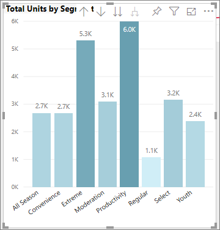

Du kan også formatere farven på visualiseringen ved hjælp af et felt, der ikke er en del af visualiseringen. På følgende billede benyttes **Procentvis markedsandel SPLY ÅTD**. 

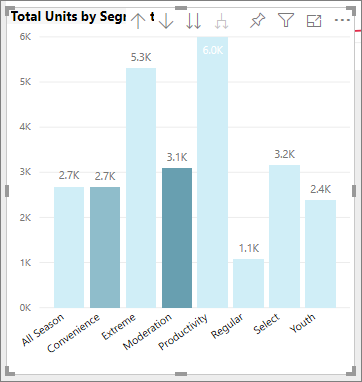

Du kan se, at selvom vi har solgt flere enheder af både **Produktivitet** og **Ekstrem** (deres kolonner er højere), har **Moderation** en større **Procentvis markedsandel SPLY ÅTD** (kolonnen indeholder en mere mættet farve).

### Tilpas de farver, der bruges i farveskalaen
Du kan også ændre den måde, som værdierne knyttes til disse farver på. På det følgende billede er farverne for **Minimum** og **Maksimum** indstillet til henholdsvis orange og grøn.

Læg mærke til på dette første billede, hvordan søjlerne i diagrammet afspejler det farveforløb, der vises i bjælken. Den højeste værdi er grøn, den laveste er orange, og hver søjle mellem er farvet med en nuance af spektret mellem grøn og orange.

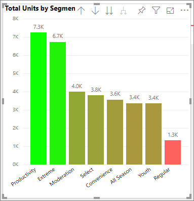

Lad os nu se, hvad sker der, hvis vi angiver numeriske værdier i værdifelterne **Minimum** og **Maksimum**. Vælg **Brugerdefineret** på rullelisterne for både **Minimum** og **Maksimum**, angiv **Minimum** til 3.500, og angiv **Maksimum** til 6.000.

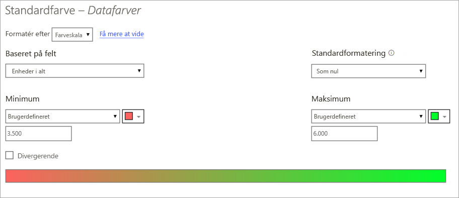

Ved at angive disse værdier anvendes farveforløb ikke længere på værdierne i diagrammet, der er under **Minimum** eller over **Maksimum**. En søjle med en værdi over værdien **Maksimum** har farven grøn, og en søjle med en værdi under værdien **Minimum** har farven rød.

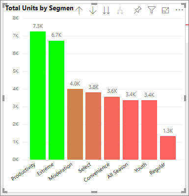

### Brug divergerende farveskalaer
Dine data kan nogle gange have en naturligt divergerende skala. Et tempereret område har for eksempel et naturligt centrum ved frysepunktet, og en rentabilitetsbedømmelse har et naturligt midtpunkt (nul).

Hvis du vil bruge divergerende farveskalaer, skal du markere afkrydsningsfeltet for **Divergerende**. Når **Divergerende** er slået til, vises en yderligere farvevælger, der kaldes **Centrum**, som vist på følgende billede.

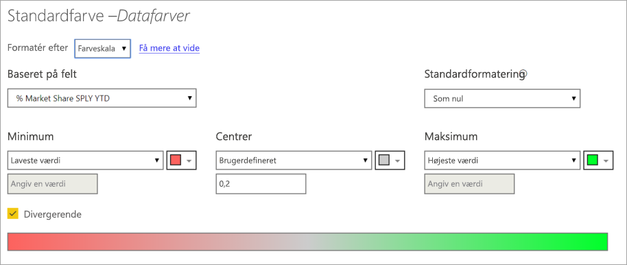

Når skyderen **Divergerende** er slået til, kan du angive farverne for **Minimum**, **Maksimum** og **Centrum** separat. På det følgende billede er **Centrum** indstillet til .2 for **Procentvis markedsandel SPLY ÅTD**, hvorfor søjler med værdier over .2 er en gradueret nuance af grøn, og søjler under en er nuancer af rød.

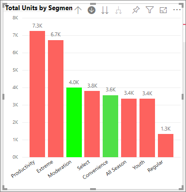

## Føj farve til tabelrækker
Tabeller og matrixer indeholder mange muligheder for farveformatering. 

En af de hurtigste måder at anvende farver på i en tabel eller matrix er at åbne fanen Formatering og vælge **Typografi**.  På billedet nedenfor har vi valgt **Overskrift med fed skrift og blinkende rækker**.

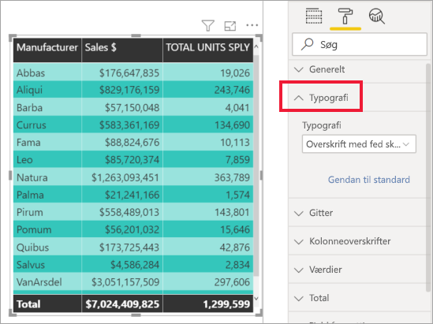

Eksperimentér med andre indstillinger for farveformatering. På dette billede har vi ændret baggrundsfarven under **Kolonneoverskrifter** og ændret både **baggrundsfarven** og **den alternative baggrundsfarve** for **Værdier** (rækker).

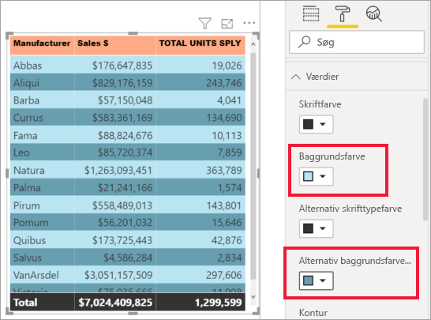

## Sådan fortryder du i Power BI
Som mange andre Microsoft-tjenester og -software giver Power BI en nem måde at fortryde den seneste kommando på. Lad os for eksempel antage, at du ændrer farven på et datapunkt eller en serie af datapunkter, og du ikke kan lide farven, når den vises i visualiseringen. Du kan ikke huske præcis, hvilken farve det havde før, men du ved, du vil farven tilbage!

Hvis du vil **fortryde** din sidste handling, eller de sidste par handlinger, skal du blot trykke på CTRL+Z.

Hvis du vil kassere alle de ændringer, du har foretaget på kortet Formatering, skal du vælge **Gendan standardindstillingerne**.

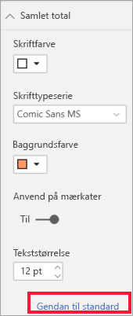

## Feedback
Har du et tip, du vil dele? Send det til os, og vi finder ud af, om det skal medtages her.

## Næste trin
[Introduktion til farveformatering og akseegenskaber](service-getting-started-with-color-formatting-and-axis-properties.md)

[Deling af rapporter](../collaborate-share/service-share-reports.md).

