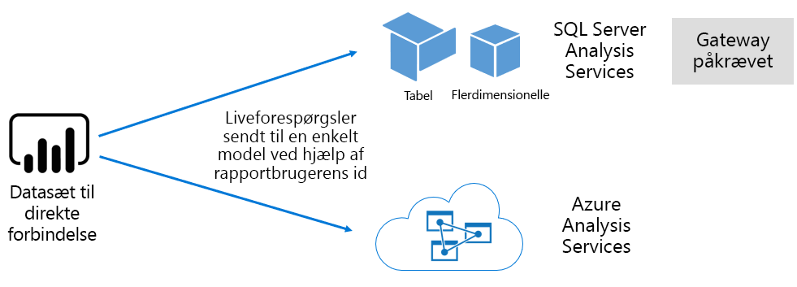
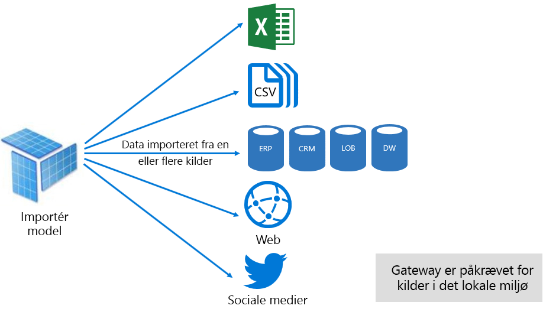
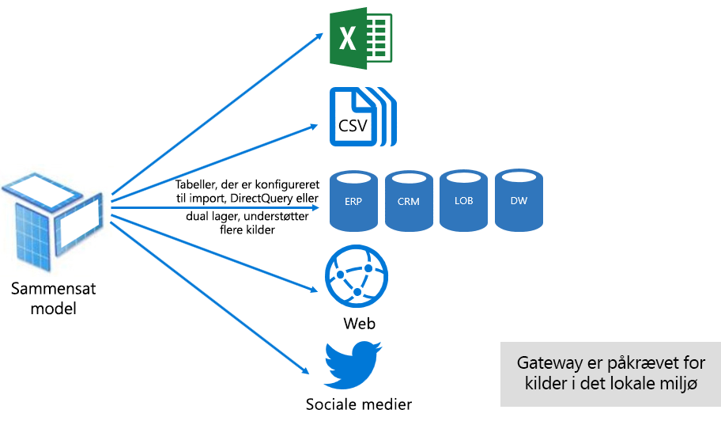
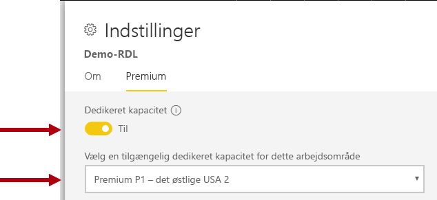
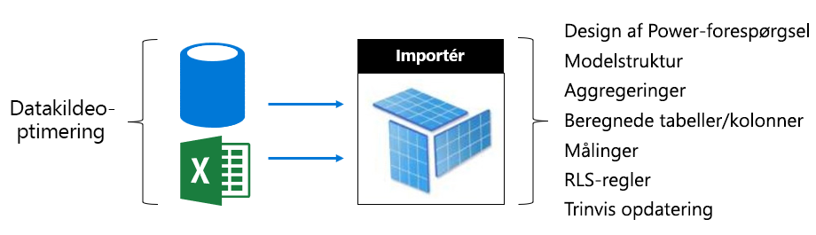
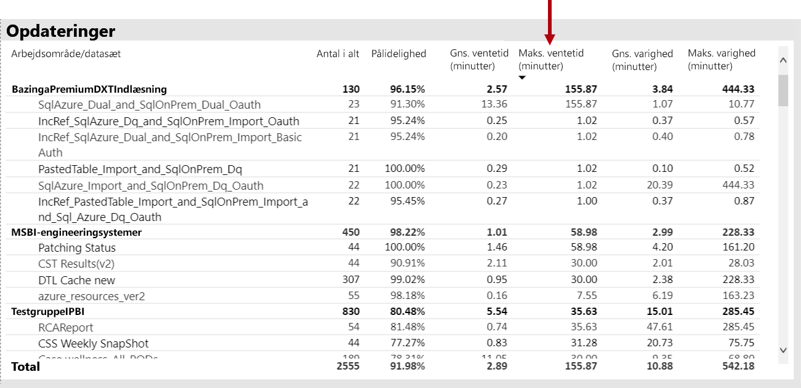
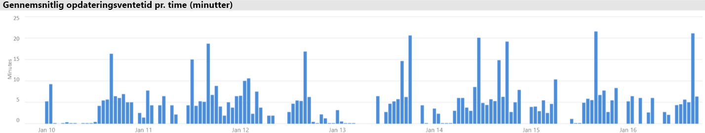
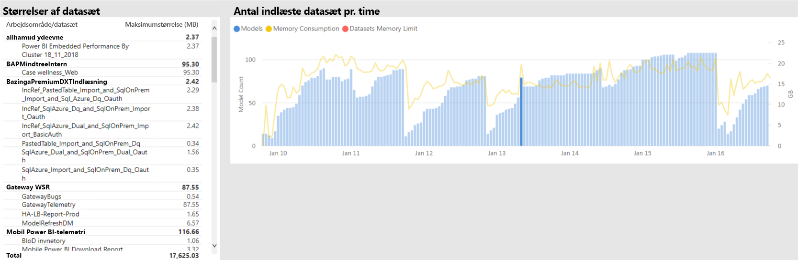
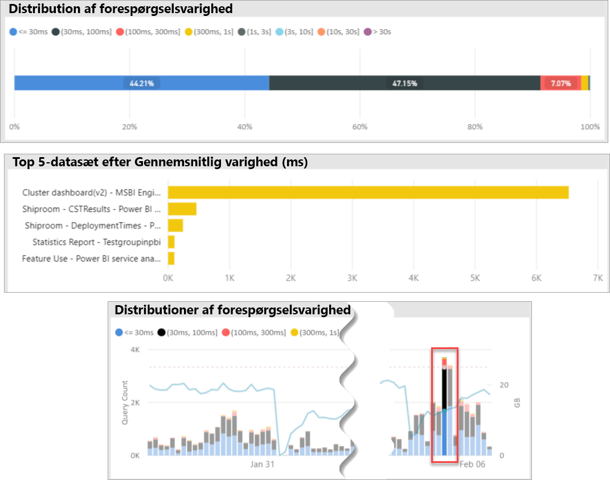
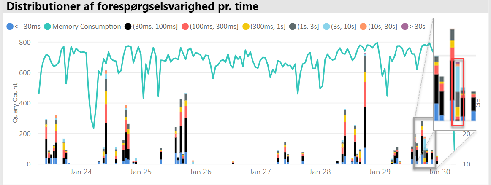

# Udrulning og administration af Premium-kapaciteter i Power BI

**Resumé:** Power BI Premium giver dig en mere konsistent ydeevne, understøttelse af større datamængder og fleksibiliteten fra en samlet professionel BI-selvbetjeningsplatform til alle i din organisation. Dette tekniske whitepaper på level 300 henvender sig især til Power BI-administratorer og indholdsforfattere og -udgivere. Det kan hjælpe dem med at forstå potentialet i Power BI Premium og få mere at vide om, hvordan man designer, installerer, overvåger og lokaliserer fejl i forbindelse med skalerbare løsninger.

**Forfatter:** [Peter Myers](https://www.linkedin.com/in/peterjsmyers) (Data Platform MVP og uafhængig BI-ekspert med Bitwise Solutions)

**Tekniske korrekturlæsere:** Adam Saxton, Akshai Mirchandani, Bhavik Merchant, David Magar, Josh Caplan, Michael Blythe, Nimrod Shalit, Olivier Matrat, Swati Gupta

**Gælder for:** Power BI-tjeneste, Power BI Premium og Azure Power BI Embedded-kapaciteter

> [!NOTE]
> Du kan gemme eller udskrive denne whitepaper ved at vælge **Udskriv** i din browser og derefter vælge **Gem som PDF**.

## Introduktion til Power BI

Power BI er en tjeneste til forretningsanalyser, der er designet til at give indsigt, som gør det muligt at træffe hurtige og velfunderede beslutninger. Siden udgivelsen i 2015 er det hurtigt blevet en populær løsning, der bruges til at levere løsninger til både små og store virksomheder.

Tjenesten er tilgængelig på to måder: Som en cloudtjeneste og som en rapporteringsløsning i det lokale miljø med navnet **Power BI-rapportserver**. \[[1](#endnote-01)\]

Power BI som cloudtjeneste er SaaS (software som en service) \[[2](#endnote-02)\]. Det repræsenterer et sæt tjenester og programmer, der giver organisationer mulighed for at udvikle, udrulle, administrere og dele løsninger for at overvåge deres forretning.

Hensigten med dette whitepaper er ikke at give en omfattende beskrivelse af Power BI-tjenesten. I stedet fokuseres på emner, der er relevante for Power BI Premium. Generelle oplysninger om Power BI fås i den omfattende [dokumentation til Power BI](service-admin-premium-multi-geo.md). Hvis du vil have en mere detaljeret beskrivelse af Power BI-tjenesten med fokus på at opnå en velkørende virksomhedsudrulning, kan du se whitepaperet [Planlægning af en Power BI Enterprise-udrulning](https://aka.ms/pbienterprisedeploy).

I dette afsnit, der ligger inden for emnet i dette whitepaper, introduceres og beskrives kapaciteter, Power BI-indholdstyper, modellagringstilstande og licenser. En forståelse af disse emner er afgørende for korrekt udrulning og administration af Power BI Premium.

### Kapaciteter

**Kapaciteter** er et kernekoncept i Power BI ogrepræsenterer et sæt ressourcer (lager, processor og hukommelse), der bruges til at hoste og levere Power BI-indhold. Kapaciteter er enten delte eller dedikerede. En **delt kapacitet** er delt med andre Microsoft-kunder, mens en **dedikeret kapacitet** kun er beregnet til en enkelt kunde. Dedikerede kapaciteter introduceres i emnet [Premium-kapaciteter](#premium-capacities).

I en delt kapacitet kører dine arbejdsbelastninger på databehandlingsressourcer, der deles med andre kunder. Eftersom kapaciteten skal dele ressourcerne, pålægges begrænsninger for at sikre "fair play", f.eks. den maksimale modelstørrelse (1 GB) og den maksimale daglige opdateringshyppighed (otte gange pr. dag).

### Arbejdsområder

Power BI-arbejdsområder er placeret i kapaciteter, og de repræsenterer sikkerheds-, samarbejde- og udrulningsobjektbeholdere. Hver bruger af Power BI har et personligt arbejdsområde, der er kendt som **Mit arbejdsområde**. Flere arbejdsområder kan oprettes for at muliggøre samarbejde og udrulning, og disse kaldes **Apparbejdsområder**. Arbejdsområder – herunder personlige arbejdsområder –oprettes som standard i den delte kapacitet.

### Power BI-indholdstyper

Det er vigtigt at starte med en grundig gennemgang af Power BI-arkitekturen, herunder grundlæggende indholdstyper, når man præsenterer Power BI Premium-emner.

Alt Power BI-indhold gemmes og administreres i arbejdsområder, som er objektbeholdere for Power BI-indhold. De enkelte Power BI-brugere har deres egne personlige arbejdsområde, men den bedste fremgangsmåde generelt er at oprette apparbejdsområder. Apparbejdsområder gør det muligt at eje indhold i fællesskab og samarbejde om det. De indeholder også muligheden for at forberede og distribuere indhold til et bredt publikum som apps.

Følgende Power BI-indhold er gemt i arbejdsområder:

- Dataflow
- Datasæt
- Projektmapper
- Rapporter
- Dashboards

#### Dataflow

Power BI-dataflows hjælper organisationer med at samle data fra forskellige kilder. De kan blive betragtet som data, der er forberedt og midlertidigt gemt til brug i modeller, men de ikke kan bruges direkte som en kilde til rapportering. De kan udnytte den omfattende samling dataforbindelser til Microsoft for at muliggøre indtagelse af data fra det lokale miljø og cloudbaserede datakilder.

Dataflows kan kun oprettes og administreres i apparbejdsområder, og de gemmes som enheder i CDM (Common Data Model) i Azure Data Lake Storage Gen2. Der er typisk planlagt opdatering på jævnlig basis for at sikre, at de gemte data er opdaterede.

Du kan få flere oplysninger i dokumentet [Selvbetjent dataforberedelse i Power BI (prøveversion)](service-dataflows-overview.md).

#### Datasæt

Power BI-datasæt repræsenterer en kilde til de data, der er klar til rapportering og visualisering. Der er mange typer datasæt, der er oprettet ved at:

- Oprette forbindelse til en eksisterende datamodel, der ikke er hostet i en Power BI-kapacitet.
- Overføre en Power BI Desktop-fil, der indeholder en model.
- Overføre en Excel-projektmappe (der indeholder en eller flere tabeller i Excel og/eller en projektmappedatamodel) eller overføre en CSV-fil (kommasepareret).
- Benytte Power BI-tjenesten til at oprette et push-, streaming eller hybridstreamingdatasæt.

Med undtagelse af streamingdatasæt \[ [3](#endnote-03)\] repræsenterer datasættet en datamodel, der udnytter teknologierne til fintudviklet modellering i Analysis Services.

Bemærk, at terminologierne datasæt og modeller nogle gange benyttes synonymt i dokumentationen. Fra Power BI-tjenestens perspektiv kaldes det som hovedregel et **datasæt**, og fra et udviklingsmæssigt perspektiv en **model**. I forbindelse med dette whitepaper betyder de meget det samme.

##### Eksternt hostede modeller

Oprette af forbindelse til en model, der hostes eksternt, omfatter installation af [en datagateway i det lokale miljø](service-gateway-onprem.md) til at oprette forbindelse til SQL Server Analysis Services, uanset om det er i det lokale miljø eller VM-hostet IaaS (Infrastruktur som en service). Azure Analysis Services kræver ikke en gateway. Dette scenarie giver ofte mening, når der findes eksisterende modelinvesteringer, der typisk udgør en del af EDW (Enterprise Data Warehouse). Det gør det muligt for BI at udføre en **direkte forbindelse** til Analysis Services ved at gennemtvinge tilladelser til data ved hjælp af Power BI-rapportbrugerens identitet. I forbindelse med SQL Server Analysis Services understøttes både flerdimensionelle modeller (kuber) og tabelmodeller. Som vist på følgende billede, overfører et datasæt med direkte forbindelse forespørgsler til eksternt hostede modeller.

##### Udviklede modeller i Power BI Desktop

Power BI Desktop – et klientprogram, der er beregnet til Power BI-udvikling – kan bruges til at udvikle en model, der er en Analysis Services-tabelmodel i praksis. Modeller kan udvikles ved at importere data fra dataflows, som derefter kan integreres med andre datakilder. Selvom selve modelleringen er uden for dette whitepapers område, er det vigtigt at forstå, at der er tre forskellige typer – eller tilstande – af modeller, der kan udvikles ved hjælp af Power BI Desktop. Disse tilstande afgør, om data importeres til modellen, eller om de forbliver i datakilden. De tre tilstande er: Import, DirectQuery og Sammensat. En komplet beskrivelse af hver tilstand gennemgås i emnet [Modellagertilstande](#model-storage-modes).

Modeller, der hostes eksternt, og modeller, der er udviklet i Power BI Desktop kan gennemtvinge sikkerhed på rækkeniveau (RLS) for at begrænse de data, der kan hentes, for en bestemt bruger. Brugere, der er tildelt til sikkerhedsgruppen Sælgere, kan f.eks. kun få vist rapportdata for det eller de salgsområder, vedkommende er blevet tildelt til. RLS-rollerne kan være dynamiske eller statiske. **Dynamiske roller** filtrerer efter rapportbrugeren, mens **statiske roller** anvender de samme filtre for alle de brugere, der er tildelt til rollen.

##### Excel-projektmappemodeller

Oprettelse af datasæt, der er baseret på Excel-projektmapper eller CSV-filer, resulterer automatisk i oprettelsen af en model. Excel-tabeller og CSV-data importeres for at oprette tabeller i modellen, mens en datamodel i Excel-projektmappen transponeres for at oprette en Power BI-model. I alle tilfælde importeres fildata til en model.

Man kan derefter skelne mellem de Power BI-datasæt, der repræsenterer modeller:

- De er enten hostet i Power BI-tjenesten eller hostes eksternt af Analysis Services
- De kan gemme importerede data, eller de kan sende passthrough-forespørgselsanmodninger til underliggende datakilder eller en blanding af begge

Her er en oversigt over vigtige fakta om Power BI-datasæt, der repræsenterer modeller:

- Modeller, der hostes af SQL Server Analysis Services, kræver en gateway til at udføre LC-forespørgsler
- Power BI-hostede modeller, der importerer data
  - Skal være fuldt indlæst i hukommelsen, så de kan forespørges
  - Kræver opdatering for at holde dataene aktuelle og skal omfatte gateways, når kildedataene ikke er tilgængelig direkte via internettet
- Power BI-hostede modeller, der bruger DQ-lagringstilstand (DirectQuery) kræver forbindelse til kildedataene. Når modellen forespørges, udsteder Power BI forespørgsler til kildedataen for at hente aktuelle data. Denne tilstand skal omfatte gateways, når kildedataene ikke er tilgængelig direkte via internettet.
- Modeller kan gennemtvinge RLS-regler, der benytter filtre for at begrænse adgang til data for bestemte brugere

Det er vigtigt at forstå, hvor modellerne hostes, deres lagringstilstand, eventuelle afhængigheder af gateways, størrelsen af de importerede data samt opdateringstype og -frekvens for at kunne udrulle og administrere Power BI Premium på effektiv vis. De kan alle har en væsentlig indvirkning på Power BI Premium-ressourcerne. Derudover bør selve modeldesignet, herunder forespørgsler til dataforberedelse og beregninger, også indgå i overvejelserne.

Det er også vigtigt at forstå, at Power BI-hostede import modeller kan opdateres i overensstemmelse med en tidsplan eller udløses efter behov af en bruger i Power BI-tjenesten.

Design af optimerede modeller beskrives senere i dette tekniske dokument i emnet [Optimering af modeller](#optimizing-models).

#### Projektmapper

Power BI-projektmapper er en type Power BI-indhold \[[4](#endnote-04)\]. De er Excel-projektmapper, der er overført til Power BI-tjenesten, og bør ikke forveksles med overførte Excel-projektmapper, der opretter datasæt (modeller). Projektmappeindholdstypen repræsenterer en forbindelse til en projektmappe, som enten kan overføres til Power BI-tjenesten eller forblive i cloudlageret på OneDrive eller SharePoint Online.

Det er vigtigt at forstå, at denne indholdstype ikke er tilgængelig som en datakilde til Power BI-datavisualiseringer. Den kan i stedet åbnes som en projektmappe i Power BI-tjenesten ved at bruge Excel Online. Den primære hensigt med denne indholdstype er at gøre ældre Excel-projektmapperapporter tilgængelige iPower BI-tjenesten og sikre, at dens datavisualiseringer kan fastgøres til Power BI-dashboards.

Du kan finde flere oplysninger i dokumentet [Hent data fra Excel-projektmappefiler](service-excel-workbook-files.md).

#### Rapporter

Der er to typer rapporter: Power BI-rapporter og sideinddelte rapporter.

**Power BI-rapporter** leverer en interaktiv datavisualiseringoplevelse, som kun er forbundet med et enkelt datasæt. Rapporter er ofte designet, så de fremmer brugerdeltagelse, og brugerne kan interagere med et ekstraordinært udvalg af funktioner, herunder filtrering, udsnit, tværgående filtrering og fremhævning, visning af færre detaljer, visning af flere detaljer, detaljeret adgang, Spørgsmål og svar i et naturligt sprog, fokusering, sidenavigation, spotlight, visning af bogmærker med mere.

I forbindelse med dette whitepaper er det vigtigt at forstå, hvordan Power BI-arkitektur, Powerbi-rapportdesign og brugerinteraktioner alle kan have indflydelse på Power BI-tjenestens ressourcer:

- Hvis du skal indlæse og interagere med rapporter, der er baseret på importerede modeller, skal modellen være fuldt indlæst i hukommelsen (uanset om den er placeret i Power BI-tjenesten eller hostes eksternt).
- Hver enkelt rapportvisualisering udsteder en forespørgsel for at hente data ved at forespørge modellen.
- Filtrerings- og udsnitsinteraktioner involverer som regel, at modellen forespørges. Ændring af et udsnit kræver f.eks. genindlæsning af hver visualisering på siden som standard \[ [5](#endnote-05)\]
- Power BI-rapporter garanterer ikke visning af aktuelle data og kan kræve, at brugeren opdaterer rapporten for at genindlæse rapportsiden og dens visualiseringer
- Brugere kan benytte funktionen Spørgsmål og svar på naturligt sprog for at stille spørgsmål, hvis Power BI-rapportdesignet tillader det, og datasættet repræsenterer en Power BI-hostet dataimportmodel eller et LC-datasæt, der er konfigureret til at aktivere Spørgsmål og svar.

**Sideinddelte rapporter**, der gør det muligt at publicere og gengive SSRS-rapporter (SQL Server Reporting Services) (\*.rdl-format). Som navnet antyder, benyttes sideinddelte rapporter ofte, når der er behov for på en fast sidestørrelse, eller når der er variable lister med data, der skal udvides fuldt ud. Det kunne f.eks. være en faktura, der er designet til gengivelse på flere sider (i stedet for rulning i et visuelt element) og udskrivning.

De to understøttede rapporttyper indeholder forskellige valg for forfatterne af rapporter, så de kan vælge den type, der egner sig bedst til de pågældende krav og anvendelsesformålet. Som hovedregel er Power BI-rapporter ideelle til interaktive oplevelser, der gør det muligt for brugeren at udforske og få indsigt fra data, mens sideinddelte rapporter er mere velegnede til parameterstyrede sidelayout.

Uanset hvilken rapporttype der vælges,er det vigtigt at opnå dynamisk rapportindlæsning og dynamiske dataopdateringer (når filtre eller parametre ændres) for at levere en pålidelig og velkørende brugeroplevelse.

#### Dashboards

Power BI-dashboards er beregnet til at levere overvågning og er rent konceptuelt meget forskellige fra Power BI-rapporter. Dashboards er designet til visning på en enkelt rude for at vise værdier og datavisualiseringer i felter. Generelt tilbyder dashboards færre interaktionsmuligheder end Power BI-rapporter, og visse dashboarddesign kræver ingen form for interaktion. Det kunne f.eks. være et uovervåget dashboard på en ikke-berøringsfølsom skærm i et serverrum. En anden væsentlig forskel er, at der kan blive vist felter på dashboards med kildedata fra flere datasæt, mens en Power BI-rapport altid kun kan være baseret på et enkelt datasæt.

Det er vigtigt at forstå, at et dashboard er designet til hurtigt at blive indlæst og altid vise de mest aktuelle data (som Power BI-tjenesten er bekendt med). Det opnås ved at cachelagre resultaterne af feltforespørgsler, og det sker for hvert enkelt dashboard. Det skal faktisk gøres for hver bruger, der har adgang til et dashboard, der er baseret på modeller, der gennemtvinger dynamisk sikkerhed på rækkeniveau.

Power BI-tjenesten opdaterer automatisk cachelagre med dashboardforespørgsler, umiddelbart efter Power BI-hostede importmodeller er blevet opdateret. Hvis der er tale om LC- og DQ-modeller, har ejeren af datasættet en vis grad af kontrol over, hvor ofte Power BI-tjenesten opdaterer cachen, hvilket kan konfigureres så hyppigt som hvert 15. minut eller så sjældent som én gang om ugen. Bemærk, at opdateringer af cachen med LC-forespørgsler først forespørger modelmetadata for at bestemme, om en modelopdatering har fundet sted siden den seneste cacheopdatering, og cachen opdateres ikke, hvis der ikke har fundet en opdatering sted siden. Dette tjek er ikke muligt for DQ-modeller, hvorfor cacheopdateringer finder sted, uanset om kildedataene er blevet ændret eller ej.

Opdateringer af cachen med dashboardforespørgsler, der er baseret på DQ- og LC-modeller, kan have en markant indvirkning på både Power BI-tjenestens ressourcer og de eksterne datakilders ressourcer. Lad os tage et dashboard med 20 felter, der alle er baseret på en Azure Analysis Services-model, som håndhæver dynamisk sikkerhed på rækkeniveau, og som opdateres hver time, og at dette dashboard er delt med 100 brugere. Hvis datasættet er konfigureret til at blive opdateret hver time, ville det resultere i mindst 2000 (20 x 100) LC-forespørgsler. Dette ville belaste Power BI-tjenesten og eksterne datakilder væsentlig og også overskride grænserne for tilgængelige ressourcer. Kapacitetsressourcer og -grænser beskrives i emnet [Kapacitetsnoder](#capacity-nodes).

Brugerne kan interagere med et dashboard på forskellige måder, som kræver ressourcer af Power BI-tjenesten. De kan:

- Udløse en opdatering af dashboardfelter, hvilket kan resultere i en opdatering efter behov af alle relaterede Power BI-hostede dataimportmodeller.
- Benytte funktionen Spørgsmål og svar på naturligt sprog til at stille spørgsmål (hvis dashboarddesignet tillader det, og datasættet er en Power BI-hostet dataimportmodel eller et LC-datasæt, der er konfigureret til at aktivere Spørgsmål og svar).
- Brug funktionen Hurtig indsigt for at få Power BI til at hente indsigt fra et underliggende datasæt og svare med visualiseringer, der vise og beskriver denne indsigt (hvis feltet er baseret på et datasæt, der er en Power BI-hosted dataimportmodel).
- Konfigurere beskeder på dashboardfelter, der kræver, at Power BI-tjenesten sammenligner tærskler med feltværdier – muligvis så ofte som én gang i timen – og give brugerne besked, når tærskler er blevet overskredet (forudsat at der vises en enkelt numerisk værdi i feltet, og at feltet er baseret på en datasæt, som er en Power BI-hostet dataimportmodel).

### Modellagringstilstande

I Power BI Desktop kan du som tidligere nævnt udvikle en model i en af de tre tilstande. Det er vigtigt at forstå rationalet bag den enkelte lagringstilstand for datamodeller og den mulige indvirkning på Power BI-tjenestens ressourcer. I dette afsnit introduceres alle tre tilstande. De gennemgås mere detaljeret senere i dette whitepaper i emnet Optimering af modeller.

#### Importtilstand

Importtilstand er den mest almindelige tilstand, der bruges til at udvikle modeller på grund af den ekstremt hurtige ydeevne, der er knyttet til forespørgsler i hukommelsen, den designfleksibilitet, der er tilgængelig for modelrollen, og understøttelsen af bestemte funktioner i Power BI-tjenesten (Spørgsmål og svar, Hurtig indsigt osv.). Det er standardtilstanden, når du opretter en ny Power BI Desktop-løsning.

Det er vigtigt at forstå, at importerede data altid gemmes på disken, og at de skal være fuldt indlæst i hukommelsen for at blive forespurgt eller opdateret. Når importmodellerne er i hukommelsen, kan de opnå lynende hurtige forespørgselsresultater. Det er også vigtigt at forstå, at der ikke findes en importmodel, der indlæses delvist i hukommelsen.

Når dataene opdateres, komprimeres og optimeres de og gemmes på disken af VertiPaq-programmet. Når de indlæses fra disken i hukommelsen, kan de blive komprimeret op til 10 gange, hvorfor man med rimelighed kan forvente, at 10 GB kildedata komprimeres til ca. 1 GB. Herudover kan lagerstørrelsen på disken opnå en reduktion på 20 %. \[[6](#endnote-06)\]

Du kan opnå fleksibilitet i designet på tre forskellige måder. Datamodellører kan:

- Integrere data ved at cachelagre data fra flere datakilder – uanset datakildetype og format.
- Udnytte hele sættet af funktioner i Power Query-formelsproget (også kaldet M) til oprettelsen af forespørgsler, når du opretter forespørgsler til forberedelse af data.
- Udnytte hele sættet af DAX-funktioner (Data Analysis Expressions), når modellen forbedres med forretningslogik, hvilket opnås med beregnede kolonner, beregnede tabeller og målinger.

Som vist på følgende billede kan en importmodel integrere data fra et vilkårligt antal understøttede datakildetyper.

Selvom der er mange overbevisende fordele forbundet med importmodeller, er der dog også nogle ulemper:

- Hele modellen skal indlæses i hukommelsen, før Power BI kan forespørge modellen, hvilket kan øge presset på tilgængelige ressourcer, efterhånden som antallet af og størrelsen på modeller vokser.
- Modeldata er kun så aktuelle som den seneste opdatering, hvorfor importmodeller helst skal opdateres efter en tidsplan.
- En fuld opdatering fjerner alle data fra alle tabeller og genindlæser dem fra datakilden. Det kan være meget dyrt både med hensyn til tid og ressourcer for Power BI-tjenesten og datakilden eller -kilderne. Power BI understøtter trinvis opdatering, så det er muligt at undgå hele tabeller tømmes og indlæses igen. Dette emne gennemgås i [Optimering af Power BI-hostede modeller](#optimizing-power-bi-hosted-models).

Fra et ressourcemæssigt perspektiv i Power BI-tjenesten kræver importmodeller:

- Tilstrækkelig hukommelse til at indlæse modellen, når den forespørges eller opdateres.
- Behandling af ressourcer og yderligere hukommelsesressourcer til at opdatere data.

#### Tilstanden DirectQuery

Modeller, der er udviklet i DQ-tilstanden (DirectQuery) importerer ikke data. De består i stedet kun af metadata, som frigiver oprindelige forespørgsler til den underliggende datakilde, når de forespørges.

Der er to primære årsager til at overveje at udvikle en DQ-model. Den første årsag er, når datamængderne er for store – selv når metoder til reduktion af data er blevet anvendt – til at blive indlæst i en model eller simpelthen for store til at blive opdateret. Den anden årsag er, når rapporter og dashboards skal levere data næsteni realtid, ud over hvad der kan opnås inden for planlagte opdateringsgrænser (48 gange om dagen for en dedikeret kapacitet).

Der er flere fordele ved at bruge DQ-modeller:

- Der er ingen størrelsesgrænser for importmodeller.
- Modellerne behøver ikke at blive opdateret.
- Rapportbrugere får vist de seneste data, når de interagerer med rapportfiltre og udsnit og kan opdatere hele rapporten for at hente aktuelle data.
- Felter i dashboardet kan, når de er baseret på DQ-modeller, blive opdateret automatisk så ofte som hvert 15. minut.

Men der er dog adskillige ulemper og begrænsninger forbundet med DQ-modeller:

- Modellen skal være baseret på en enkelt understøttet datakilde, og derfor skal en dataintegration allerede finde sted i datakilden. De datakilder, der understøttes, er relations- og analysesystemer, som understøtter mange populære datalagre \[ [7](#endnote-07)\].
- Ydeevnen kan være langsom og have en negativ indvirkning på Power BI-tjenesten (forespørgsler kan være meget CPU-intensive) og på datakilden (der muligvis ikke er optimeret til analytiske forespørgsler).
- Power-forespørgsler må ikke være for komplekse og er begrænset til M-udtryk og -funktioner, der kan omdannes til oprindelige forespørgsler, der forstås af datakilden.
- DAX-funktioner er begrænset til dem, der kan omdannes til oprindelige forespørgsler, der forstås af datakilden, og der er ingen understøttelse af beregnede tabeller eller indbyggede Time Intelligence-funktioner.
- Modelforespørgsler, der kræver hentning af mere end en million rækker, mislykkes som standard.
- Rapporter og dashboards med flere visualiseringer kan vise inkonsekvente resultater, især når datakilden er svingende.
- Spørgsmål og svar og Hurtig indsigt understøttes ikke.

Fra et ressourcemæssigt perspektiv i Power BI-tjenesten kræver DQ-modeller:

- Minimal hukommelse til at indlæse modellen (kun metadata), når der sendes der en forespørgsel.
- Nogle gange betydelige processorressourcer til at generere og behandle forespørgsler, der sendes til datakilden.

Du kan få flere oplysninger i dokumentet [Brug af DirectQuery i Power BI Desktop](desktop-use-directquery.md).

#### Sammensat tilstand

Modeller, der er udviklet i sammensat tilstand, gør det muligt at konfigurere lagringstilstanden for individuelle modeltabeller. Dent understøtter derfor en blanding af import og DQ-tabeller. Den understøtter også beregnede tabeller (defineret med DAX) og flere DQ-datakilder.

Tabellagringstilstanden kan konfigureres som Import, DirectQuery eller Dobbelt. En tabel, der konfigureres som en dobbelt tabeltilstand, består både af Import og DirectQuery, og det giver Power BI-tjenesten mulighed for at bestemme, hvilken tilstand der er mest effektiv at bruge for en forespørgsel for den enkelte forespørgsel.

Sammensatte modeller har til formål at levere det bedste fra tilstandene Import og DirectQuery. Når sådanne modeller er konfigureret korrekt, kan de kombinere en høj forespørgselsydeevne for modeller i hukommelsen med muligheden for at hente data i næsten realtid fra datakilder.

Datamodellører, der udvikler sammensatte modeller, konfigurerer sandsynligvis tabeller af dimensionstypen i lagringstilstanden Import eller Dobbelt og faktatypetabeller i DirectQuery-tilstanden. Lad os f.eks. tage en model med en tabel med produktmål i tilstanden Dobbelt og en salgsfaktatabel i tilstanden DirectQuery. Produkttabellen kan forespørges hurtigt og effektivt fra hukommelsen for at gengive et rapportudsnit. Salgstabellen kan derefter forespørges i DirectQuery-tilstand, der er oprettet i forbindelse med den relaterede produkttabel. Den sidste forespørgsel kan muliggøre genereringen af en enkelt effektiv oprindelig forespørgsel for at forbinde produkt- og salgstabellerne og filtrere efter udsnitsværdierne.

Fordelene og ulemperne ved de enkelte modeltilstande kan gælde for tabellagringstilstanden i sammensatte modeller.

Du kan få flere oplysninger i dokumentet [Brug af sammensatte modeller i Power BI Desktop](desktop-composite-models.md).

### Licensering

Power BI har tre licenser:

- Power BI (gratis)
- Power BI Pro
- Power BI Premium

Licensen **Power BI (gratis)** gør det muligt for en person at logge på Power BI-tjenesten og arbejde i sit eget arbejdsområde ved at udgive modeller og rapporter. Det er vigtigt at forstå, at det ikke er muligt at dele Power BI-indhold ved hjælp af denne licens. Denne licens, er, som navnet antyder, gratis.

Licensen **Power BI Pro** giver en person mulighed for at oprette og samarbejde inden for apparbejdsområder og dele og distribuere Power BI-indhold. Det er også muligt at konfigurere opdatering af datasæt for automatisk at holde dataene aktuelle, herunder fra datakilder i det lokale miljø. Herudover er det muligt at overvåge og styre, hvordan der opnås adgang til data, og hvordan dataene bruges. Denne licens er påkrævet for at modtage indhold fra andre brugere, medmindre brugeren er knyttet til en dedikeret kapacitet i Power BI Premium.

Licensen **Power BI Premium** er en licens på lejerniveau, og den er beskrevet i afsnittet [Introduktion til Power BI Premium](#introducing-power-bi-premium).

Du kan få flere oplysninger om Power BI-licenser på siden [Priser på Power BI](https://powerbi.microsoft.com/pricing/).

## Introduktion til Power BI Premium

Power BI Premium giver dig en samlet selvbetjent og professionel BI-platform med skalerbarhed, pålidelig ydeevne og forudsigelige omkostninger. Det opnås primært ved at levere dedikerede ressourcer til at køre Power BI-tjenesten for din organisation.

Derudover leverer Power BI Premium mange virksomhedsfunktioner:

- Omkostningseffektiv distribution af indhold, der muliggør deling af Power BI-indhold til et ubegrænset antal Power BI Free-brugere, herunder eksterne brugere.
- Understøttelse af større datasætstørrelser \[[8](#endnote-08)\].
- Højere opdateringshastigheder af dataflows og datasæt (op til 48 gange pr. dag).
- Trinvis opdatering af dataflows og datasæt.
- Dataflow-tilknyttede enheder og parallel udførelse af transformeringer.
- Sideinddelte rapporter
- Rapportering i det lokale miljø med Power BI-rapportserveren
- Mulighed for at integrere indhold i apps på vegne af app-brugere (PaaS)

Mange af disse funktioner kan udnyttes til at levere effektive og skalerbare virksomhedsløsninger og er beskrevet i afsnittet [Optimering af Premium-kapaciteter](#optimizing-premium-capacities).

### Abonnementer og licenser

Power BI Premium er et Office 365-abonnement på lejerniveau, der er tilgængeligt i to SKU-serier (lagerenheder):

- **EM**-SKU'er (EM1-EM3) til integrering kræver en årlig forpligtelse og faktureres månedsvis.
- **P**-SKU'er (P1-P3) til integrering og virksomhedsfunktioner kræver en månedlig eller årlig forpligtelse, faktureres månedsvis og indeholder en licens til at installere Power BI-rapportserver i det lokale miljø

Der er en alternativ metode til at købe et Azure Power BI Embedded-abonnement, som har en enkelt SKU-familie: **A**-SKU'er (A1-A6) kun til integrerings- og kapacitetstestformål.

Alle SKU'er leverer v-kerner for at oprette kapaciteter \[[9](#endnote-09)\], men EM-SKU'erne er begrænset til integrering i mindre størrelsesorden. Selvom dette whitepaper fokuserer på P-SKU'er, er meget af det, der gennemgås, også relevant for A-SKU'er.

I modsætning til SKU'erne for Premium-abonnementet kræver Azure-SKU'er ingen tidsmæssig binding og faktureres på timebasis. De leverer fuld elasticitet, hvilket gør det muligt at skalere op og ned, afbryde midlertidigt, genoptage og slette.

Azure Power BI Embedded ligger ganske vist uden for dette whitepapers rammer, men er beskrevet i emnet Testmetoder som en praktisk og økonomisk mulighed for at teste og måle arbejdsbelastninger.

Du kan få flere oplysninger om Azure-SKU'er i [dokumentationen til Azure Power BI Embedded](/azure/power-bi-embedded/).

Power BI Premium-abonnementer købes af administratorer i Microsoft 365 Administration. Kun globale Office 365-administratorer eller faktureringsadministratorer kan købe SKU'er.

Når de er blevet købt, modtager lejeren et tilsvarende antal v-kerner til at tildele til kapaciteter – dette er kendt som **gruppering af v-kerner**. Køb af en P3-SKU giver f.eks. lejeren 32 v-kerner.

Du kan få flere oplysninger i dokumentet [Sådan køber du Power BI Premium](service-admin-premium-purchase.md).

### Premium-kapaciteter

I modsætning til en delt kapacitet, hvor arbejdsbelastninger kører på databehandlingsressourcer, der deles med andre kunder, er en **dedikeret kapacitet** til brug af en organisation alene. Den isoleres med dedikerede databehandlingsressourcer, som sikrer en pålidelig og konsekvent ydeevne for det indhold, der hostes.

I dette whitepaper fokuseres på **Premium-kapacitet**, hvilket betyder, at den er knyttet til enten EM- eller P-SKU'er.

#### Kapacitetsnoder

Som beskrevet i emnet Abonnementer og licenser er der to Power BI Premium SKU-serier: EM og P. Alle Power BI Premium-SKU'er er tilgængelige som kapacitetsnoder, som hver især repræsenterer en bestemt mængde ressourcer, der består af processor, hukommelse og lager. Ud over ressourcer har hver SKU en driftsmæssig begrænsning for antallet af DQ-forbindelser (DirectQuery) og direkte forbindelser pr. sekund og antallet af parallelle modelopdateringer.

Behandling opnås ved et angivet antal v-kerner, der er ligeligt fordelt mellem backend og frontend.

**Backend-v-kernerne** er ansvarlige for det tunge arbejde i Power BI, herunder behandling af forespørgsler, cachestyring, kørsel af R-servere, modelopdatering, behandling på naturligt sprog (Spørgsmål og svar) og gengivelse af rapporter og billeder på serversiden. Backend-v-kerner tildeles en fast mængde hukommelse, der primært bruges til at hoste modeller, som kaldes også aktive datasæt.

**Frontend-v-kernerne** er ansvarlige for webtjenesten, dashboardet og dokumentstyringen af rapporter, administration af adgangsrettigheder, planlægning, API'er, uploads og downloads og generelt alt, hvad der er relateret til brugeroplevelsen.

Lagerpladsen er angivet til 100 TB pr. kapacitetsnode.

Ressourcerne og grænserne for hver Premium-SKU (og A-SKU'er i en tilsvarende størrelse) er beskrevet i følgende tabel.

| Kapacitetsnoder | V-kerner i alt | Backend-v-kerner | RAM (GB) | Frontend-v-kerner | DQ/LC (pr. sek.) | Parallel opdatering af modeller |
| --- | --- | --- | --- | --- | --- | --- |
| EM1/A1 | 1 | 0,5 | 2.5 | 0,5 | 3,75 | 1 |
| EM2/A2 | 2 | 1 | 5 | 1 | 7,5 | 2 |
| EM3/A3 | 4 | 2 | 10 | 2 | 15 | 3 |
| P1/A4 | 8 | 4 | 25 | 4 | 30 | 6 |
| P2/A5 | 16 | 8 | 50 | 8 | 60 | 12 |
| P3/A6 | 32 | 16 | 100 | 16 | 120 | 24 |
| | | | | | | |

#### Kapacitetsarbejdsbelastninger

Kapacitetarbejdsbelastninger er tjenester, som gøres tilgængelige for brugere. Som standard understøtter Premium- og Azure-kapaciteter kun den datasætarbejdsbelastning, der er knyttet til kørende Power BI-forespørgsler, som ikke kan deaktiveres.

Yderligere arbejdsbelastninger kan aktiveres for sideinddelte rapporter, dataflows og AI. Hver ekstra arbejdsbelastning kræver, at den maksimale hukommelse (som en procentdel af den samlede tilgængelige hukommelse), der kan bruges af arbejdsbelastningen, konfigureres.

#### Sådan fungerer kapaciteter

Power BI-tjenesten bestræber sig hele tiden på at foretage den bedste udnyttelse af kapacitetsressourcerne uden at overskride de grænser, der er pålagt kapaciteten.

Kapacitetshandlinger er klassificeret som enten interaktive eller baggrundshandlinger. Interaktive handlinger omfatter gengivelse af anmodninger og svare på Brugerinteraktioner (filtrering, spørgsmål og svar-forespørgsel, osv.). Som hovedregel er importmodelforespørgsler meget krævende for hukommelsesressourcerne, mens LC/DQ modelforespørgsler er krævende for CPU'en. Handlinger i baggrunden omfatter opdateringer af dataflows og importmodeller samt cachelagring af dashboardforespørgsler.

Det er vigtigt at forstå, at interaktive handlinger altid går forud for handlinger i baggrunden for at sikre den bedst mulige brugeroplevelse. Hvis der ikke er tilstrækkelige ressourcer, føjes handlinger i baggrunden til en kø for at blive behandlet, når ressourcerne frigøres. Handlinger i baggrunden, f.eks. datasætopdateringer og AI-funktioner, kan stoppes midt i en proces af Power BI-tjenesten og føjes til en kø.

Importmodeller skal være fuldt indlæst i hukommelsen, så de kan forespørges eller opdateres. Power BI-tjenesten administrerer hukommelsesforbrug ved hjælp af avancerede algoritmer for at sikre maksimal anvendelse af den tilgængelige hukommelse og kan overallokere kapaciteten: Selvom det er muligt for en kapacitet at lagre mange importmodeller (op til 100 TB pr. Premium-kapacitet), når deres kombinerede disklager overskrider den understøttede hukommelse (og ekstra hukommelse er påkrævet til forespørgsler og opdateringer), kan de ikke alle indlæses i hukommelsen på samme tid.

Importmodeller indlæses derfor i – og fjernes fra – hukommelseb i henhold til forbrug. En importmodel indlæses, når den forespørges (interaktiv handling) og endnu ikke er i hukommelsen, eller når den skal opdateres (handling i baggrunden).

**Fjernelsen** af en model fra hukommelsen er en handling, som Power BI kan udføre hurtigt, afhængigt af størrelsen på modellerne. Hvis kapaciteten ikke oplever noget pres på hukommelsen, indlæses modellerne i hukommelsen og forbliver der. \[[10](#endnote-10) \] Hvis der til gengæld ikke er tilstrækkelig hukommelse til at indlæse en model, skal Power BI-tjenesten først frigøre hukommelse. Den frigør hukommelse ved at registrere modeller, der er blevet inaktive, ved at søge efter modeller, som ikke har været anvendt i de sidste tre minutter \[[11](#endnote-11)\], og fjerner dem derefter. Hvis der ikke er nogen inaktive modeller at fjerne, forsøger Power BI-tjenesten at fjerne modeller, der er indlæst til handlinger i baggrunden. Det kan omfatte fjernelse af arbejdsbelastninger i baggrunden som f.eks. AI-arbejdsbelastningen. En sidste udvej efter 30 sekunder med mislykkede forsøg \[[11](#endnote-11)\] er at afbryde den interaktive handling. I dette tilfælde får rapportbrugeren besked om fejlen med et forslag til at prøve igen om et øjeblik.

Det er vigtigt at understrege, at fjernelse af datasæt er en normal og forventet funktionsmåde. Den har til formål at maksimere forbruget af hukommelse ved at indlæse og fjerne modeller, hvis størrelse tilsammen kan overskride den tilgængelige hukommelse. Dette er tilsigtet og helt åbenlyst for rapportbrugerne. Høje fjernelsesrater betyder ikke nødvendigvis, at kapaciteten har fået tildelt utilstrækkelige ressourcer. De kan dog blive et problem, hvis svartiden for forespørgsler eller opdateringer bliver påvirket af de høje fjernelsesrater.

Opdateringer af importmodeller er altid hukommelseskrævende, da modeller skal indlæses i hukommelsen, og der kræves ekstra hukommelse til behandlingen. En fuld opdatering kan bruge ca. dobbelt så meget hukommelse, der kræves af modellen. Dette sikrer, at modellen kan forespørges, selv når den behandles (forespørgsler sendes til den eksisterende model, indtil opdateringen er fuldført, og de nye modeldata er tilgængelige). Bemærk, at en trinvis opdatering kræver mindre hukommelse og kan fuldføres hurtigere og kan derfor i høj grad reducere belastningen af kapacitetsressourcer. Opdateringer kan også være CPU-krævende for modeller, især dem med komplekse Power-transformationer eller beregnede tabeller/kolonner, som er komplekse eller baseret på store tabeller.

Opdateringer som f.eks. forespørgsler kræver, at modellen indlæses i hukommelsen. Hvis der ikke er tilstrækkelig hukommelse, vil Power BI-tjenesten forsøge at udsætte inaktive modeller, og hvis det ikke er muligt (da alle modeller er aktive), sættes opdateringsjobbet i kø. Opdateringer er typisk meget CPU-krævende, endda endnu mere krævende end forespørgsler. Der er derfor kapacitetsbegrænsninger for antallet af samtidige opdateringer, der er angivet til 1,5 gange antallet af backend-v-kerner, rundet op. Hvis der er for mange samtidige opdateringer, sættes en planlagt opdatering i kø. Når disse situationer opstår, tager det længere tid at fuldføre opdateringen. Bemærk, at on demand-opdateringer (udløst af en brugeranmodning eller et API-kald) vil prøve igen tre gange \[[11](#endnote-11)\], og derefter mislykkes, hvis der stadig ikke er tilstrækkelige ressourcer.

## Administration af Power BI Premium

Administration af Power BI Premium omfatter køb af abonnementer og oprettelse, administration og overvågning af Premium-kapaciteter.

### Oprettelse og administration af kapaciteter

På siden **Kapacitetsindstillinger** i portalen **Power BI Administration** vises antallet af v-kerner, der er købt og tilgængelige (dvs. der endnu ikke er tildelt en kapacitet), samt en liste over Premium-kapaciteter. Siden giver globale Office 365-administratorer eller administratorer af Power BI-tjenesten mulighed for at oprette Premium-kapaciteter fra tilgængelige v-kerner eller redigere eksisterende Premium-kapaciteter.

Når en Premium-kapacitet oprettes, skal administratoren definere:

- Kapacitetsnavn (entydigt i lejeren)
- Kapacitetsadministrator/-administratorer
- Kapacitetsstørrelse
- Område for dataopbevaring \[[12](#endnote-12)\]

Der skal være udpeget mindst én kapacitetsadministrator. Brugere, der er udpeget som kapacitetsadministratorer, kan:

- Tildele arbejdsområder til kapaciteten.
- Administrere brugertilladelser for at tilføje flere kapacitetsadministratorer eller brugere med tildelingstilladelser (så de kan tildele arbejdsområder til kapaciteten).
- Administrere arbejdsbelastninger for at konfigurere det maksimale hukommelsesforbrug for sideinddelte rapporter og arbejdsbelastninger i dataflows.
- Genstarte kapaciteten for at nulstille alle handlinger i tilfælde af, at systemet overbelastes \[[13](#endnote-13)\]

Kapacitetsadministratorer har ikke adgang til indhold i arbejdsområdet (medmindre vedkommende udtrykkeligt har fået tildelt tilladelser til et arbejdsområde), og de har ikke adgang til alle områder i Power BI Administration (medmindre det udtrykkeligt er blevet tildelt) som f.eks forbrugsdata, overvågningslogge eller lejerindstillinger. Kapacitetsadministratorer har heller ikke tilladelse til at konfigurere nye kapaciteter eller skalere eksisterende kapaciteter. De bliver også udpeget pr. kapacitet, hvilket sikrer, at de kun kan få vist og administrere de kapaciteter, som de er blevet tildelt.

Kapacitetsstørrelsen skal vælges på en tilgængelig liste over SKU-muligheder, som er begrænset af antallet af tilgængelige v-kerner i puljen. Det er muligt at oprette flere kapaciteter fra gruppen, som kan købes fra en eller flere købte SKU'er. En P3-SKU (32 v-kerner) kan f.eks. bruges til at oprette tre kapaciteter: én P2 (16 v-kerner) og to P1 (2 x 8 v-kerner). Der kan opnås forbedret ydeevne og skalering ved at oprette mindre kapaciteter, og dette emne er beskrevet i afsnittet [Optimering af Premium-kapaciteter](#optimizing-premium-capacities). På følgende billede vises et eksempel på opsætning for den fiktive virksomhed Contoso bestående af fem Premium-kapaciteter (3 x P1 og 2 x P3), som hver især indeholder apparbejdsområder og flere arbejdsområder i en delt kapacitet.

En Premium-kapacitet kan tildeles til et andet område end Power BI-lejerens lokale område, hvilket giver administrativ kontrol over, hvilke datacentre (inden for definerede geografiske områder) Power BI-indhold er placeret i. \[[12](#endnote-12)\]

Administratorer af Power BI-tjenesten og globale Office 365-administratorer kan redigere Premium-kapaciteter. De kan:

- Ændre kapacitetsstørrelsen for at skalere op eller ned for ressourcer. Det er dog ikke muligt at nedgradere en P SKU til en EM-SKU eller opgradere med omvendt fortegn.
- Tilføje eller fjerne kapacitetsadministratorer.
- Tilføje eller fjerne brugere, der har tildelingstilladelser.
- Tilføje eller fjerne ekstra arbejdsbelastninger.
- Skifte område.

Tildelingstilladelser er påkrævede for at kunne tildele et arbejdsområde til en bestemt Premium-kapacitet. Tilladelserne kan tildeles til hele organisationen, bestemte brugere eller grupper.

Premium-kapaciteter understøtter som standard kun de arbejdsbelastninger, der er tilknyttet kørende Power BI-forespørgsler. Den understøtter også tre yderligere arbejdsbelastninger: **Sideinddelte rapporter**, **dataflows** og **AI**. Hver arbejdsbelastning kræver, at den maksimale hukommelse (som en procentdel af den samlede tilgængelige hukommelse), der kan bruges af arbejdsbelastningen, konfigureres. Det er vigtigt at forstå, at forøgelse af de maksimale hukommelsesallokeringer kan påvirke antallet af aktive modeller, der kan hostes og gennemløbet af opdateringer.

Hukommelse allokeres dynamisk til dataflow, men den allokeres statisk til sideinddelte rapporter. Årsagen til statisk allokering af den maksimale hukommelse er, at sideinddelte rapporter kører i et sikret område i kapaciteten. Man bør konfigurere hukommelse til sideinddelte rapporter med omhu, da det reducerer den tilgængelige hukommelse til indlæsning af modeller.

|                     | EM3                      | P1                       | P2                      | P3                       |
|---------------------|--------------------------|--------------------------|-------------------------|--------------------------|
| Sideinddelte rapporter | I/T | 20 % som standard, minimum 10 % | 20 % som standard, minimum 5 % | 20 % som standard, minimum 2,5 % |
| Dataflow | 20 % som standard, minimum 8 %  | 20 % som standard, minimum 4 %  | 20 % som standard, minimum 2 % | 20 % som standard, minimum 1 %  |
| AI | I/T | 20 % som standard, minimum 20 %  | 20 % som standard, minimum 10 % | 20 % som standard, minimum 5 %  |
| | | | | |

Det er muligt at slette en Premium-kapacitet, og det medfører ikke sletning af de tilhørende arbejdsområder og indhold. I stedet flyttes tildelte arbejdsområder til en delt kapacitet. Når Premium-kapacitet oprettes i et andet område, flyttes arbejdsområdet til en delt kapacitet i det lokale område.

### Tildeling af arbejdsområder til kapaciteter

Arbejdsområder kan tildeles til en Premium-kapacitet i **Portalen** **Power BI Administration** eller i ruden **Arbejdsområde** for et apparbejdsområde.

Kapacitetsadministratorer samt globale Office 365-administratorer eller administratorer af Power BI-tjenesten kan massetildele arbejdsområder i **Portalen** **Power BI Administration**. Massetildelingen kan gælde for:

- **Arbejdsområder efter brugere**: Alle arbejdsområder, der ejes af disse brugere, herunder personlige arbejdsområder, tildeles til Premium-kapaciteten. Dette omfatter tildeling påny af arbejdsområder, når de er allerede er tildelt til en anden Premium-kapacitet. Herudover tildeles brugerne også tilladelser til arbejdsområdetildelinger.

- **Specifikke arbejdsområder**
- **Hele organisationens arbejdsområder**: Alle arbejdsområder, herunder personlige arbejdsområder, tildeles til Premium-kapaciteten. Herudover tildeles alle aktuelle og fremtidige brugere også tilladelser til arbejdsområdetildelinger. \[[14](#endnote-14)\]

Et arbejdsområde kan føjes til en Premium-kapacitet ved hjælp af ruden **Arbejdsområde**, hvis brugeren både er arbejdsområdeadministrator og har tildelingstilladelser.

Arbejdsområdeadministratorer kan fjerne et arbejdsområde fra en kapacitet (til delt kapacitet) uden at have tildelingstilladelser. Fjernelse af arbejdsområder fra dedikerede kapaciteter flytter effektivt arbejdsområdet til en delt kapacitet. Bemærk, at det kan have negative konsekvenser at fjerne et arbejdsområde fra en Premium-kapacitet, da delt indhold f.eks. kan blive utilgængeligt for brugere med en Power BI Free-licens, eller en planlagt opdatering kan blive suspenderet, når brugerne når det tilladte forbrug, der er understøttet af delte kapaciteter.

I Power BI-tjenesten er et arbejdsområde, der er tildelt til en Premium-kapacitet, markeret med et rombeikon ud for navnet på arbejdsområdet.

### Overvågning af kapaciteter

Overvågning af Premium-kapaciteter giver administratorer en forståelse af, hvordan kapaciteterne kører. Kapaciteter kan overvåges ved hjælp af [appen Power bi Premium Capacity Metrics](service-admin-premium-monitor-capacity.md) eller [Power bi administrations portalen](service-admin-premium-monitor-portal.md).

#### Fortolkning af målepunkter

Målepunkter skal overvåges for at oprette en grundlæggende forståelse af ressourceforbruget og arbejdsbelastningsaktiviteterne. Hvis kapaciteten bliver langsom, er det vigtigt at forstå, hvilke målepunkter der skal overvåges og de konklusioner, du kan drage.

Ideelt set bør forespørgsler være fuldført inden for et sekund for at levere dynamiske oplevelser til rapportbrugerne og muliggøre et højere gennemløb af forespørgsler. Det er som regel mindre væsentligt, når processer i baggrunden – herunder opdateringer – tager længere tid at fuldføre.

Langsomme rapporter kan generelt være en indikation af en overbebyrdet kapacitet. Når rapporter ikke indlæses, er det en indikation af en overbebyrdet kapacitet. I begge situationer kan hovedårsagen henføres til flere forskellige faktorer, herunder:

- **Mislykkede forespørgsler** angiver i høj grad en belastning af hukommelsen, og at en model ikke kunne indlæses i hukommelsen. Power BI-tjenesten vil forsøge at indlæse en model i 30 sekunder, før der opstår en fejl.

- **Overdrevne ventetider for forespørgsler** kan skyldes flere forskellige årsager:
  - Behovet for, at Power BI-tjenesten først fjerner en eller flere modeller og derefter indlæser den model, der skal forespørges, igen (husk, at høje fjernelsesrater for datasæt alene ikke angiver overbelastning af kapaciteten, medmindre de ledsages af lange ventetider for forespørgsler, hvilket indikerer, at en hukommelsesudskiftning finder sted).
  - Indlæsningstider for modeller (især ventetid i forbindelse med at indlæse en stor model i hukommelsen).
  - Lange forespørgsler
  - For mange live-\DQ-forbindelser (overskrider grænserne for kapacitet).
  - CPU-mætning
  - Komplekse rapportdesign med et stort antal visualiseringer på en side (husk, at hver visualisering er en forespørgsel).
- **Lange varigheder af forespørgsler** kan indikere, at modeldesignet ikke er optimeret, især når flere datasæt er aktive i en kapacitet, og kun ét datasæt genererer lange varigheder af forespørgsler. Dette tyder på, at kapaciteten ikke har tilstrækkeligt med ressourcer, og at det pågældende datasæt ikke er optimalt eller blot langsomt. Lange forespørgsler kan være problematiske, da de kan blokere adgang til ressourcer, der kræves af andre processer.
- **Lange ventetider for opdateringer eller ventetider for AI-kald** angiver utilstrækkelig hukommelse på grund af mange aktive modeller, der bruger for meget hukommelse, eller at en problematisk opdatering blokerer for andre opdateringer (overstiger grænserne for parallelle opdateringer).

Du kan få en mere detaljeret beskrivelse af, hvordan du bruger målepunkter, i det næste afsnit [Optimering af Premium-kapaciteter](#optimizing-premium-capacities).

## Optimering af Premium-kapaciteter

Når der opstår problemer med ydeevnen i en Premium-kapacitet, er det almindeligt først at optimere eller justere allerede udrullede løsninger for at gendanne acceptable svartider. Den overordnede begrundelse er at undgå at købe ekstra Premium-kapacitet, medmindre det er berettiget.

Når der kræves ekstra Premium-kapacitet, er der to muligheder, som gennemgås senere i dette afsnit:

- Opskalering af Premium-kapaciteten
- Tilføjelse af en ny Premium-kapacitet

Til sidst i dette afsnit gennemgår vi testmetoder og tilpasning af størrelsen på Premium-kapacitet.

### Generelle bedste praksisser

Når man forsøger at opnå den bedste udnyttelse og ydeevne, er der nogle bedste fremgangsmåder, som kan betragtes som generelle anbefalinger. Disse omfatter:

- Brug af apparbejdsområder i stedet for personlige arbejdsområder
- Adskillelse af forretningskritisk og SSBI (Self-Service BI) i forskellige kapaciteter

  

- Hvis indhold kun deles med Power BI Pro-brugere, er der ingen grund til at gemme indholdet i en dedikeret kapacitet.
- Brug dedikeret kapacitet, når du ønsker at opnå et bestemt opdateringstidspunkt, eller når specifikke funktioner er påkrævet, for eksempel store datasæt eller sideinddelt rapportering.

### Svar på almindelige spørgsmål

Optimering af udrulninger af Power BI Premium er en kompliceret ting, der involverer en forståelse af arbejdsbelastningskrav, tilgængelige ressourcer og effektiv udnyttelse af disse ressourcer.

I dette emne tager vi fat på syv almindelige supportspørgsmål, der beskriver mulige problemer og forklaringer og oplysninger om, hvordan du kan identificere og løse problemerne.

#### Hvorfor er kapaciteten langsom, og hvad kan jeg gøre?

Der kan være mange årsager til en langsom Premium-kapacitet. Dette spørgsmål kræver yderligere oplysninger for at forstå, hvad der menes med langsom. Tager det for lang tid at indlæse rapporter? Eller kan de slet ikke indlæses? Tager det for lang tid at indlæse eller opdatere visualiseringerne, når brugerne interagerer med rapporten? Tager opdateringerne længere tid at fuldføre end forventet eller end tidligere?

Når du har fået en forståelse af årsagen, kan du begynde at foretage en undersøgelse. Svar på seks følgende spørgsmål kan hjælpe dig med at håndtere mere specifikke problemer.

#### Hvilket indhold bruger al kapaciteten?

Du kan bruge appen **Power BI Premium Capacity Metrics** til at filtrere efter kapacitet og gennemse metrikværdier for arbejdsområdeindholdets ydeevne. Det er muligt at gennemse målepunkterne for ydeevnen og ressourceforbruget efter time for de seneste syve dage for alt indhold, der er lagret i en Premium-kapacitet. Dette er ofte det første skridt, når du skal lokalisere fejl i forbindelse med ydeevnen for en Premium-kapacitet.

Vigtige målepunkter, der bør overvåges:

- Gennemsnitlig CPU og antal gange med høj udnyttelse
- Gennemsnitlig hukommelse og antal gange med høj udnyttelse samt hukommelsesforbrug for bestemte datasæt, dataflows og sideinddelte rapporter
- Aktive datasæt, der er indlæst i hukommelsen
- Gennemsnitlige og maksimale varigheder for forespørgsler
- Gennemsnitlige ventetider for forespørgsler
- Gennemsnitlige opdateringstider for datasæt og dataflows
- Gennemsnitlig tider for AI-kald og ventetider

I appen Power BI Premium Capacity Metrics viser den aktive hukommelse den samlede mængde hukommelse, der er allokeret til en rapport, der ikke kan fjernes, fordi den har været i brug i de sidste tre minutter. En stor stigning i ventetiden for opdateringer kan skyldes et stort/eller aktivt datasæt.

I diagrammet "Top 5 efter gennemsnitlig varighed" vises de fem datasæt, sideinddelte rapporter, dataflows og AI-kald, der forbruger flest kapacitetsressourcer. Indholdet på top fem-listerne bør undersøges og muligvis optimeres.

#### Hvorfor er rapporterne langsomme?

I følgende tabel vises mulige problemer og måder at identificere og håndtere dem på.

##### Utilstrækkelige kapacitetsressourcer

| Mulige forklaringer | Sådan identificeres problemet | Sådan løses problemet |
| --- | --- | --- |
| Højt hukommelsesforbrug i alt (model kan ikke fjernes, da den har været i brug i de sidste tre minutter)   Flere store stigninger i forespørgselsventetider   Flere store stigninger i opdateringsventetider | Overvåg målepunkter for hukommelse \[[18](#endnote-18)\] og antallet af fjernelser \[[19](#endnote-19)\] | Formindsk modelstørrelsen, eller konvertér til DirectQuery-tilstand – se emnet [Optimering af modeller](#optimizing-models) i dette afsnit   Skaler kapaciteten op   Tildel indholdet til en anden kapacitet |

##### Ineffektive rapportdesign

| Mulige forklaringer | Sådan identificeres problemet | Sådan løses problemet |
| --- | --- | --- |
| Rapportsider, der indeholder mange visualiseringer (interaktiv filtrering kan udløse mindst én forespørgsel pr. visualisering)   Visualiseringer henter flere data end nødvendigt | Gennemse rapportdesign   Interview rapportbrugere for at forstå, hvordan de interagerer med rapporterne   Overvåg målepunkter for datasætforespørgsler \[[20](#endnote-20)\] | Omdesign rapporter med færre visualiseringer pr. side. |

##### Langsomt datasæt (især når rapporter tidligere har kørt godt)

| Mulige forklaringer | Sådan identificeres problemet | Sådan løses problemet |
| --- | --- | --- |
| Stigende mængder af importdata   Kompleks eller ineffektiv beregningslogik, inklusive RLS-roller   Modellen er ikke fuldt optimeret   (DQ/live) Ventetid for gateway   Langsomme forespørgselssvartider for DQ-kilde | Gennemse modeldesign   Overvåg ydelsestællere for gateway | Se emnet [Optimering af modeller](#optimizing-models) i dette afsnit |

##### Højt samtidigt forbrug af rapporter

| Mulige forklaringer | Sådan identificeres problemet | Sådan løses problemet |
| --- | --- | --- |
| Lange forespørgselsventetider   CPU-mætning   Grænserne for DQ-/liveforbindelse er blevet overskredet | Overvåg målepunkter for CPU-forbruget \[[21](#endnote-21)\], forespørgselsventetider og udnyttelse af DQ-/liveforbindelser \[[22](#endnote-22)\] samt forespørgselsvarigheder – hvis de er svingende kan det tyde på problemer med samtidighed | Skalér kapaciteten op, eller tildel indholdet til en anden kapacitet   Omdesign rapporter med færre visualiseringer pr. side. |

#### Hvorfor indlæses rapporter ikke?

Det er en skrækscenarie, når rapporter ikke indlæses, og et sikkert tegn på, at kapaciteten ikke har tilstrækkelig hukommelse og er overbebyrdet. Dette kan ske, når alle indlæste modeller bliver forespurgt aktivt og derfor ikke kan fjernes, og hvis opdateringshandlinger er blevet sat på pause eller forsinket. Power BI-tjenesten forsøger at indlæse datasættet i 30 sekunder, og brugeren får besked om fejlen med et forslag til at prøve igen om et øjeblik.

Der er i øjeblikket ingen metrikværdier til at overvåge fejl i forbindelse med rapportindlæsninger. Du kan identificere risikoen for dette problem ved at overvåge systemhukommelsen, især den højeste udnyttelse og tidspunktet for den højeste udnyttelse. Mange fjernelser af datasæt og en lang gennemsnitlig ventetid kan tyde på, at dette problem er ved at opstå.

Hvis det sker sjældent, betragtes det muligvis ikke som en prioritet. Rapportbrugere bliver informeret om, at tjenesten er optaget, og at de skal prøve igen efter et øjeblik. Hvis det sker for ofte, kan problemet løses ved at skalere Premium-kapaciteten op eller ved at tildele indholdet til en anden kapacitet.

Kapacitetsadministratorer (og administratorer af Power BI-tjenesten) kan overvåge metrikværdien **forespørgselsfejl** for at bestemme, hvornår dette sker. De kan også genstarte kapaciteten for at nulstille alle handlinger i tilfælde af, at systemet overbelastes.

#### Hvorfor starter opdateringer ikke efter planen?

Der er ikke garanti for starttidspunkterne for planlagte opdateringer. Husk, at Power BI-tjenesten altid prioriterer interaktive handlinger over handlinger i baggrunden. Opdatering er en handling i baggrunden, der kan opstå, når to betingelser er opfyldt:

- Der er tilstrækkelig hukommelse
- Antallet af understøttede samtidige opdateringer for Premium-kapaciteten ikke er overskredet

Hvis betingelserne ikke opfydes, sættes opdateringen i kø, indtil betingelserne er opfyldt.

Husk, at der for en fuld opdatering kræves mindst det dobbelte af den aktuelle hukommelsesstørrelse for datasættet. Hvis der ikke er tilstrækkelig hukommelse tilgængelig, kan opdateringen ikke påbegyndes, før modelfjernelse frigør hukommelse – det betyder forsinkelser, indtil et eller flere datasæt bliver inaktive og kan fjernes.

Husk, at det maksimale antal samtidige opdateringer, der understøttes, er angivet til 1,5 gange backend-v-kernerne, rundet op.

En planlagt opdatering mislykkes, når den ikke kan påbegyndes, før den næste planlagte opdatering skal påbegyndes. En opdatering efter behov, der er udløst manuelt fra brugergrænsefladen, vil forsøge at køre op til tre gange, før der opstår en fejl.

Kapacitetsadministratorer (og administratorer af Power BI-tjenesten) kan overvåge metrikværdien **den gennemsnitlig opdateringsventetid (minutter)** for at bestemme den gennemsnitlige forsinkelse mellem det planlagte tidspunkt og begyndelsen af handlingen.

Selvom det normalt ikke er en administrativ prioritet, kan påvirkningen af rettidige dataopdateringer sikre, at der er tilstrækkelig tilgængelig hukommelse. Dette kan gøres ved at isolere datasæt til kapaciteter, man ved har tilstrækkeligt med ressourcer. Det er også muligt, at administratorer kan koordinere med datasætejere for at hjælpe med at forskyde eller reducere planlagte dataopdateringer og på den måde minimere antallet af kollisioner. Bemærk, at det ikke er muligt for en administrator at få vist opdateringskøen eller at hente tidsplaner for datasætopdateringer.

#### Hvorfor kører opdateringerne langsomt?

Opdateringer kan være langsomme – eller opfattes som langsomme (som de forrige almindelige spørgsmål omhandler).

Når opdateringen rent faktisk er langsom, kan det skyldes flere årsager:

- Utilstrækkelig CPU (opdateringer kan være meget CPU-krævende)
- Utilstrækkelig hukommelse, hvilket resulterer i, at opdateringen afbrydes midlertidigt (som kræver, at opdateringen starter forfra, når betingelser for at starte forfra er opfyldt)
- Årsager, der ikke har med kapaciteten at gøre, herunder svartiden for datakildesystemet, netværksventeid, ugyldige tilladelser eller gatewaygennemløb
- Datamængde – en god grund til at konfigurere trinvise opdateringer, som beskrevet nedenfor

Kapacitetsadministratorer (og administratorer af Power BI-tjenesten) kan overvåge metrikværdien **den gennemsnitlige opdateringsvarighed (minutter)** for at have en benchmark til sammenligning over tid og metrikværdien **gennemsnitlig opdateringsventetid (minutter)** for at fastsætte den gennemsnitlige mellemliggende tid mellem det planlagte tidspunkt og den faktiske start af handlingen.

Trinvise opdateringer kan reducere dataopdateringsvarigheden væsentligt, især for store modeltabeller. Der er fire fordele, der er forbundet med trinvis opdatering:

- **Opdateringerne udføres hurtigere**: Kun et undersæt af en tabel skal indlæses, hvilket nedbringer CPU- og hukommelsesforbruget, og parallelitet kan være højere ved opdatering af flere partitioner.
- **Opdateringerne sker kun, når det er påkrævet**: Politikker for trinvis opdatering kan konfigureres til kun at indlæses, når data er blevet ændret.
- **Opdateringerne er mere pålidelige**: Kortere kørende forbindelser til ustabile datakildesystemer er mindre sårbare over for afbrydelser.
- **Modellerne forbliver trimmede**: Politikker for trinvis opdatering kan konfigureres til automatisk at fjerne historik ud over et skydevindue.

Du kan få flere oplysninger i dokumentet [Trinvis opdatering i Power BI Premium](service-premium-incremental-refresh.md).

#### Hvorfor fuldføres dataopdateringer ikke?

Når dataopdateringen påbegyndes, men ikke fuldføres, kan det skyldes flere årsager:

- Utilstrækkelig hukommelse, selvom der er kun én model i Premium-kapaciteten, dvs. størrelsen på modellen er meget stor.
- Årsager, der ikke har med kapaciteten at gøre, herunder afbrydelse af forbindelsen til datakildesystemet, ugyldige tilladelser eller gatewayfejl.

Kapacitetsadministratorer (og administratorer af Power BI-tjenesten) kan overvåge metrikværdien **opdateringsfejl pga. manglende hukommelse**.

#### Hvorfor mislykkes AI-kald?

AI-kald kan mislykkes af flere årsager. Der kræves som minimum 5 GB hukommelse for at starte en AI-arbejdsbelastning, men det kan være utilstrækkeligt for visse inputdatasæt. Automatiserede maskinel indlæring kræver for eksempel mindst to og til tider flere gange datasættets størrelse. Et AI-kald afsluttes også, hvis det tager længere tid end to timer at udføre. I forbindelse med automatiserede oplæringskald for modeller til maskinel indlæring, der ikke fuldføres inden for to timer, returneres den bedste model, der blev fundet i løbet af de to timer.  AI-kald kan også blive afbrudt af interaktive anmodninger, som har forrang.

Administratorer skal overvåge AI-ventetider for tegn på andre anmodninger, der har forrang. Administratorer kan også sikre, at der er tilstrækkelig hukommelse tilgængelig for AI-arbejdsbelastningen i forhold til størrelsen på inputdata. Dette kan omfatte isolering af AI-arbejdsbelastninger til kapaciteter, der er kendt for at have tilstrækkelige ressourcer. Det er også muligt, at administratorer kan koordinere med dataflowejere for at hjælpe med at forskyde eller reducere planlagte opdateringer af dataflows og på den måde minimere antallet af kollisioner. Bemærk, at det ikke er muligt for en administrator at få vist køen for AI-kald.

### Optimering af modeller

Et optimalt modeldesign er afgørende for leveringen af en effektiv og skalerbar løsning. En komplet diskussion af dette emne er dog ikke inden for rammerne af dette whitepaper. I stedet indeholder dette afsnit vigtige områder, som bør overvejes ve doptimering f modeller.

#### Optimering af Power BI-hostede modeller

Det er muligt at optimere de modeller, der hostes i en Premium-kapacitet, i datakilden eller -kilderne og modellagene.

Overvej optimeringsmulighederne for en importmodel:

På datakildelaget:

- Relationelle datakilder kan optimeres for at sikre, den hurtigst mulige opdatering ved på forhånd at integrere data, anvende relevante indekser, definere tabelpartitioner, der er i overensstemmelse med trinvise opdateringsperioder, og oprette beregninger (i stedet for beregnede modeltabeller og kolonner) eller føje beregningslogik til visninger.
- Ikke-relationelle datakilder kan forudintegreres med relationelle lagre.
- Sørge for, at gateways har tilstrækkelige ressourcer, helst på dedikerede maskiner, med den nødvendige netværksbåndbredde og i nærheden af datakilderne.

På modellaget:

- Design af Power-forespørgsler kan minimere eller fjerne komplekse transformationer og især dem, der fletter forskellige datakilder (datalagre opnår dette i fasen Udtræk-Transformer-Indlæs). Sikring af der angives relevante niveauer for beskyttelse af personlige oplysninger for datakilder kan forhindre, at Power BI skal indlæse komplette resultater for at generere et kombineret resultatet på tværs af forespørgsler.
- Modelstrukturen bestemmer de data, der skal indlæses, og har en direkte indvirkning på modelstørrelsen. Det kan designes til at undgå at indlæse unødvendige data ved at fjerne kolonner, fjerne rækker (især historiske data) eller ved at indlæse opsummerede data (i stedet for at indlæse detaljerede data). En væsentlig reduktion af størrelsen kan opnås ved at fjerne kolonner med høj kardinalitet (især tekstkolonner), som hverken kan gemmes eller komprimeres særligt effektivt.
- Ydeevnen for modelforespørgsler kan forbedres ved at konfigurere relationer i én retning, medmindre der er en meget god grund til at tillade tovejsfiltrering. Du kan også bruge funktionen krydsfiltrering i stedet for tovejsfiltrering.
- Med akkumuleringstabeller kan du opnå hurtige forespørgsler ved at indlæse data, der er opsummerede på forhånd, men dette vil forøge størrelsen af modellen og resulterer i længere opdateringstider. Akkumuleringstabeller bør generelt benyttes til design med meget store modeller eller sammensatte modeller.
- Beregnede tabeller og kolonner forøger størrelsen på modellen og resulterer i længere opdateringstider. En mindre lagerstørrelse og en hurtigere opdateringstid kan generelt opnås, når dataene er oprettet eller beregnet i datakilden. Hvis dette ikke er muligt, kan brug af brugerdefinerede kolonner i Power-forespørglser forbedre lagerkomprimeringen.
- Det kan være muligt at optimere DAX-udtryk for målinger og RLS-regler og måske omskrive logik for at undgå dyre formler.
- Trinvis opdatering reducerer opdateringstiden væsentligt og sparer hukommelse og CPU. Den trinvise opdatering kan også være konfigureret til at fjerne historiske data ved at holde modelstørrelserne trimmede.
- En model kan ændres til to modeller, når der er forskellige og modstridende forespørgselsmønstre. Nogle rapporter rummer f.eks. aggregeringer på højt niveau over al historik og kan tolerere ventetid for 24 timer. Andre rapporter beskæftiger sig med dagens data og har brug for detaljeret adgang til individuelle transaktioner. Du kan også oprette to modeller, der er optimeret til ethvert behov, i stedet for at designe en enkelt model, der opfylder alle rapportbehov.

Overvej optimeringsmulighederne for en DirectQuery-model. Eftersom modellen udsteder forespørgselsanmodninger til den underliggende datakilde, er optimering af datakilden afgørende for leveringen af dynamiske modelforespørgsler.

 

På datakildelaget:

- Datakilden kan optimeres for at sikre den hurtigst muligt forespørgsel ved at integrere data på forhånd (hvilket ikke er muligt på modellaget), anvender relevante indekser, definere tabelpartitioner, oprette opsummerede data (med indekserede visninger) og minimere mængden af beregninger. Den bedste oplevelse opnås, når passthrough-forespørgsler kun skal filtrere og udføre indre joinforbindelser mellem indekserede tabeller eller visninger.
- Sørg for, at gateways har tilstrækkelige ressourcer, helst på dedikerede maskiner med tilstrækkelig netværksbåndbredde og tæt på datakilden.

På modellaget:

- Design af Power-forespørgsler helst skal ikke anvende transformationer – ellers skal transformationer holdes på et absolut minimum.
- Ydeevnen for modelforespørgsler kan forbedres ved at konfigurere relationer i én retning, medmindre der er en meget god grund til at tillade tovejsfiltrering. Modelrelationer skal desuden konfigureres til at antage, at referentiel integritet gennemtvinges (når det er tilfældet) og medfører, at datakildeforespørgsler bruger flere indre joinforbindelser (i stedet for ydre joinforbindelser).
- Undgå at oprette brugerdefinerede kolonner i Power-forespørgsler eller modelberegnede kolonner – de bør materialiseres i datakilden, når det er muligt
- Det kan være muligt at optimere DAX-udtryk for målinger og RLS-regler og måske omskrive logik for at undgå dyre formler.

Overvej optimeringsmulighederne for en sammensat model: Husk, at en sammensat model gør det muligt at blande import- og DirectQuery-tabeller.

- Emnerne om optimering af import- og DirectQuery-modeller gælder generelt for de sammensatte modeltabeller, der anvender disse lagertilstande.
- Du skal bestræbe dig op at opnå et balanceret design ved at konfigurere tabeller af dimensionstypen (repræsenterer forretningsobjekter) som tabeller med dobbelt lagringstilstand og tabeller af oplysningstypen (ofte store tabeller, der repræsenterer driftsmæssige fakta) som lagringstilstanden DirectQuery. Dobbelt lagringstilstand betyder både import- og DirectQuery-lagringstilstandene og gør det muligt for Power BI-tjenesten at bestemme den mest effektive lagringstilstand, der skal bruges til at generere en oprindelig forespørgsel for passthrough.
- Sørg for, at gateways har tilstrækkelige ressourcer, helst på dedikerede maskiner, med den nødvendige netværksbåndbredde og i nærheden af datakilderne.
- Akkumuleringstabeller, der er konfigureret som importlagringstilstand kan resultere i en væsentlig forbedring af forespørgselsydeevnen, når de bruges til at opsummere tabeller af faktatypen i DirectQuery-lagringstilstand. I dette tilfælde øger akkumuleringstabeller størrelsen af modellen og øger opdateringstiden, hvilket ofte er et acceptabelt kompromis for at opnå hurtigere forespørgsler.

#### Optimering af eksternt hostede modeller

Mange af de optimeringsmuligheder, der er beskrevet i emnet [Optimering af Power BI-hostede modeller](#optimizing-power-bi-hosted-models) gælder også for modeller, der er udviklet med Azure Analysis Services og SQL Server Analysis Services. Der er dog undtagelser i form af bestemt funktioner, der ikke understøttes i øjeblikket, bl.a. sammensatte modeller og akkumuleringstabeller.

I forbindelse med eksternt hostede datasæt bør du tage databasehostingen i forhold til Power BI-tjenesten med i dine overvejelser. For Azure Analysis Services betyder det, at Azure-ressourcen skal oprettes i samme område som Power BI-lejeren (det lokale område). I forbindelse med IaaS i SQL Server Analysis Services betyder det, at den virtuelle maskine skal hostes i samme område, og hvis der er tale om det lokale miljø, skal der sørges for en effektiv gatewaykonfiguration.

Det skal også nævnes, at Azure Analysis Services-databaser og SQL Server Analysis Services-tabeldatabaser kræver, at deres modeller indlæses fuldt ud i hukommelsen, og at de forbliver der hele tiden for at understøtte forespørgsler. På samme måde som Power BI-tjenesten skal der være tilstrækkelig hukommelse til opdatering, hvis modellen skal forblive online under opdateringen. I modsætning til Power BI-tjenesten er der ikke noget behov for, at modellerne tilføjes og fjernes fra hukommelsen i henhold til forbrug. Power BI Premium tilbyder derfor en mere effektiv tilgang til maksimering af modelforespørgsler med et lavere hukommelsesforbrug.

### Lapacitetsplanlægning

Størrelsen af en Premium-kapacitet bestemmer den hukommelse og de processorressourcer, der er tilgængelige, og de grænser, der er gælder for kapaciteten. Antallet af Premium-kapaciteter bør også overvejes, da oprettelsen af flere Premium kapaciteter kan hjælpe med at isolere arbejdsbelastninger fra hinanden. Bemærk, at lagring er 100 TB pr. kapacitetsnode, og at det sandsynligvis er mere end rigeligt for en hvilken som helst arbejdsbelastning.

Det kan være udfordrende at fastlægge størrelsen på og antallet af Premium-kapaciteter, især for de første kapaciteter, som du opretter. Det første trin, når du vælger kapacitetstørrelse er at forstå den gennemsnitlige arbejdsbelastning, der repræsenterer det forventede daglige forbrug. Det er vigtigt at forstå, at ikke alle arbejdsbelastninger er ens. I den ene ende af spektret kan du f.eks. have 100 samtidige brugere, der får adgang til en enkelt rapportside, der indeholder en enkelt visualisering, hvilket nemt kan opnås. I den anden ende af spektret kan du have 100 samtidige brugere, der får adgang til 100 forskellige rapporter, der hver har 100 visualiseringer på rapportsiden, hvilket belaster behovet for kapacitetsressourcer på forskellig vis.

Kapacitetsadministratorer skal derfor overveje flere forskellige faktorer, der er specifikke for jeres miljø, indhold og forventet brug. Det overordnede mål er at maksimere udnyttelsen af kapaciteter, samtidig med at der leveres ensartede forespørgselstider samt acceptable ventetider og fjernelsesrater. Følgende faktorer bør overvejes:

- **Modelstørrelse og datakarakteristika**: Importmodeller skal være fuldt indlæst i hukommelsen for at muliggøre forespørgsler eller opdateringer. Datasæt med liveforbindelse eller DQ-datasæt kan kræve betydelig processortid og muligvis også meget hukommelse for at evaluere komplekse målinger eller RLS-regler. Hukommelses- og processorstørrelse og gennemløb for forespørgsler med liveforbindelse eller DQ-forespørgsler er begrænset af kapacitetsstørrelsen.
- **Samtidige aktive modeller** : Den samtidige forespørgsel af forskellige importmodeller leverer den bedste svartid og ydeevne, når de forbliver i hukommelsen. Der skal være tilstrækkelig hukommelse til at hoste alle modeller, der forespørges meget, med ekstra hukommelse for at muliggøre opdateringen af disse modeller.
- **Opdatering af importmodel** : Opdateringstypen (fuld eller trinvis), varigheden og kompleksiteten af Power-forespørgsler og beregnet tabel-/kolonnelogik kan påvirke hukommelsesforbruget og især processorforbruget. Samtidige opdateringer er begrænset af kapacitetsstørrelsen (1,5 x backend v-kerner, rundet op).
- **Samtidige forespørgsler** : Mange samtidige forespørgsler kan resultere i rapporter, der ikke svarer, når processor eller live-/DQ-forbindelser overskrider kapacitetsgrænsen. Dette er især tilfældet for rapportsider, der indeholder mange visualiseringer.
- **Dataflows, sideinddelte rapporter og AI-funktioner**: Kapaciteten kan konfigureres for at understøtte dataflows, sideinddelte rapporter og AI-funktioner, der hver især kræver en konfigurerbar maksimal procentdel af kapacitetshukommelsen. Hukommelsen allokeres dynamisk til dataflows, men den allokeres statisk til sideinddelte rapporter og AI-arbejdsbelastninger.

Ud over disse faktorer kan kapacitetsadministratorer overveje at oprette flere kapaciteter. Flere kapaciteter gør det muligt at isolere arbejdsbelastninger og kan konfigureres til at sikre, at prioriterede arbejdsbelastninger har garanterede ressourcer. To kapaciteter kan f.eks. oprettes for at adskille forretningskritiske arbejdsbelastninger fra arbejdsbelastninger i BI-selvbetjeningsportalen (SSBI). Den forretningskritiske kapacitet kan bruges til at isolere store virksomhedsmodeller, der giver dem garanterede ressourcer, hvor det kun er it-afdelingen, der har oprettelesadgang. SSBI-kapaciteten kan bruges til at hoste et stigende antal mindre modeller, som forretningsanalytikere har adgang til. SSBI-kapaciteten kan nogle gange opleve ventetider på forespørgsler eller opdateringer, der er acceptable.

Med tiden kan kapacitetsadministratorer balancere arbejdsområder på tværs af kapaciteter ved at flytte indhold mellem arbejdsområder eller arbejdsområder mellem kapaciteter og ved at skalere kapaciteter op eller ned. Der skaleres som regel om, når man hoster store modeller, og ud i forbindelse med en høj grad af samtidighed.

Husk, at køb af en licens giver lejeren v-kerner. Køb af et **P3-** abonnement kan bruges til at oprette en eller op til fire Premium-kapaciteter, dvs. 1 x P3 eller 2 x P2 eller 4 x P1. Før du konverterer en P2-kapacitet til en P3-kapacitet, kan du også overveje at opdele v-kernerne for at oprette to P1-kapaciteter.

### Testmetoder

Når du har valgt en kapacitetsstørrelse, kan test udføres ved at oprette et kontrolleret miljø. En praktisk og økonomisk mulighed er at oprette en Azure-kapacitet (A-SKU'er), hvor en P1-kapacitet har den samme størrelse som en A4-kapacitet, og P2- og P3-kapaciteterne har den samme størrelse som henholdsvis A5- og A6-kapaciteterne. Det er hurtigt at oprette Azure-kapaciteter, og de faktureres på timebasis. Når testen er fuldført, kan de nemt slettes, så du ikke længere faktureres for disse Azure-kapaciteter.

Testindholdet kan føjes til de arbejdsområder, der er oprettet på Azure-kapaciteten, og en enkelt bruger kan derefter køre rapporter for at generere en realistisk og repræsentativ arbejdsbelastning af forespørgsler. Hvis der er importmodeller, skal der også udføres en opdatering af hver model. Overvågningsværktøjer kan derefter bruges til at gennemse alle målepunkter for at forstå ressourceudnyttelsen.

Det er vigtigt, at testene gentages: Testene skal køres flere gange, og de skal levere ca. det samme resultat hver gang. Et gennemsnit af disse resultater kan bruges til at ekstrapolere og estimere arbejdsbelastning under ægte produktionsbetingelser.

Hvis du allerede har en kapacitet og de rapporter, du vil indlæse, skal du bruge [PowerShell-værktøjet](https://aka.ms/PowerBILoadTestingTool) til indlæsning af PowerShell til hurtigt at generere en belastningstest. Værktøjet gør det muligt for dig at anslå, hvor mange instanser af hver rapport din kapacitet kan køre i en time. Du kan bruge værktøjet til at vurdere din kapacitets evne til individuel rapportgengivelse eller til at gengive flere forskellige rapporter parallelt. Du kan finde flere oplysninger i videoen [Microsoft Power bi: Premium-](https://www.youtube.com/watch?time_continue=1860&v=C6vk6wk9dcw)kapacitet.

Hvis du vil generere en mere kompleks test, skal du overveje at udvikle et program til belastningstest, der simulerer en realistisk arbejdsbelastning. Du kan finde flere oplysninger under webinar [belastningstest Power bi programmer med Visual Studio belastningstest](https://blogs.msdn.microsoft.com/charles_sterling/2018/04/04/webinar-load-testing-power-bi-applications-with-visual-studio-load-test/).

## Udforskning af virkelige scenarier

I dette afsnit opkræves gennemgås flere virkelige scenarier for at beskrive almindelige problemer eller udfordringer, hvordan de identificeres, og hvordan du løser dem:

- [Sådan holdes datasæt opdateret](#keeping-datasets-up-to-date)
- [Sådan identificeres datasæt med lange svartider](#identifying-slow-responding-datasets)
- [Sådan identificeres årsager til datasæt med sporadisk langsomme svartider](#identifying-causes-for-sporadically-slow-responding-datasets)
- [Sådan fastlægges det, om der er tilstrækkelig hukommelse](#determining-whether-there-is-enough-memory)
- [Sådan fastlægges det, om der er tilstrækkelig CPU](#determining-whether-there-is-enough-cpu)

Fremgangsmåden samt eksemplerne på diagrammer og tabeller er fra appen **Power BI Premium Capacity Metrics**, som en Power BI-administrator har adgang til.

### Sådan holdes datasæt opdateret

I dette scenarie blev en undersøgelse udløst, da brugerne klagede over, at rapportdata nogle gange forekom gamle eller "forældede".

I appen interagerer administratoren med visualiseringen **Refreshes**, der sorterer datasæt efter statistikken **Max Wait Time** i faldende rækkefølge. Dette hjælper dem med at registrere de datasæt, der har de længste ventetider, grupperet efter navn på arbejdsområde.

I visualiseringen **Hourly Average Refresh Wait Times** lægger de desuden mærke til, at opdateringsventetiderne er på deres højest omkring kl. 16.00 hver dag.

Der er flere mulige forklaringer til disse resultater:

- For mange forsøg på opdateringer kan finde sted på samme tid, hvilket overskrider de grænser, der er pålagt af kapacitetsnoden (seks samtidige opdateringer på en P1 med standardhukommelsesallokering).

- De datasæt, der skal opdateres, kan være for store til at passe til den tilgængelige hukommelse (kræver mindst 2 x den påkrævede hukommelse til en fuld opdatering)
- Ineffektiv logik i Power-forespørgslen kan resultere i en spidsbelastning af hukommelsesforbruget under opdateringen af datasæt. I en travl kapacitet kan disse forespørgsler undertiden nå deres fysiske grænse, hvorfor opdateringen mislykkes, hvilket kan påvirke andre rapportvisningshandlinger for kapaciteten.
- Datasæt, der ofte forespørges, som skal forblive i hukommelsen, kan påvirke muligheden for, at andre datasæt opdateres, som følge af begrænset tilgængelig hukommelse.

Til at undersøge dette kan Power BI-administratoren søge efter følgende ting:

- Manglende hukommelse på tidspunktet for opdateringen af data, når den tilgængelige hukommelse er mindre end 2 gange størrelsen på det datasæt, der skal opdateres.
- Datasæt, der ikke skulle opdateres, og som ikke var i hukommelsen før en opdatering, men som begyndte at vise interaktiv trafik på tidspunkter med mange opdateringer. En Power BI-administrator kan få vist, hvilke datasæt der blev indlæst i hukommelsen på et givent tidspunkt i datasætområet på fanen **Datasets** i appen og filtrere på tværs på et givent tidspunkt ved at klikke på en af søjlerne i den **Hourly Loaded Dataset Counts**. En lokal stigning (vist på billedet nedenfor) angiver en time, hvor flere datasæt blev indlæst i hukommelsen, som kan udskyde starten af planlagte opdateringer.
- Øgede datasætfjernelser, der finder sted, når dataopdateringer er planlagt til at starte, angiver, at der var et højt hukommelsesforbrug, som skyldtes for mange forskellige interaktive rapporter før tidspunktet for opdateringen. Visualiseringen **Hourly Dataset Evictions and Memory Consumption** viser tydlige stigninger i antallet af fjernelser.

På følgende billede vises en lokal stigning i indlæste datasæt, hvilket antyder, at interaktive forespørgsler forsinkede påbegyndelsen af opdateringerne. Hvis du vælger en bestemt periode i visualiseringen **Hourly Loaded Dataset Counts**, filtreres visualiseringen **Dataset Sizes** på tværs.

Power BI-administratoren kan forsøge at løse problemet ved at sikre, at tilstrækkelig hukommelse er tilgængelig for at dataopdateringerne kan starte, ved at:

- Kontakte datasætejerne og bede dem om at forskyde og lave mellemrum i tidsplanerne for opdateringer.
- Reducerer indlæsningen af datasætforespørgsler ved at fjerne unødvendige dashboards eller dashboardfelter, især dem med sikkerhed på rækkeniveau.
- Sætte fart under dataopdateringer ved at optimere Power-forespørgselslogikken, modelberegnede kolonner eller tabeller, reducere størrelserne på datasæt eller konfigurere store datasæt for at udføre trinvis opdatering.

### Sådan identificeres datasæt med lange svartider

I dette scenarie blev en undersøgelse igangsat, da brugerne klagede over, at visse rapporter tager lang tid at åbne og nogle gange hænger.

I appen kan Power BI-administratoren bruge visualiseringen **Query Durations** til at fastsætte, hvilke datasæt der har den dårligste ydeevne, ved at sortere datasættene efter **gennemsnitlig varighed**. Denne visualisering viser også antallet af datasætforespørgsler, så du kan se, hvor ofte datasættene forespørges.

Power BI-administratoren kan referere til visualiseringen **Query Duration Distribution**, der viser en overordnet fordeling af ydeevnen for bucketforespørgsler (< = 30ms, 0-100 MS osv.) for den filtrerede tidsperiode. Forespørgsler, der tager ét sekund eller mindre betragtes som dynamiske af de fleste brugere. Forespørgsler, der tager længere tid, har tendens til at blive opfattet som dårlig ydeevne.

I visualiseringen **Hourly Query Duration Distribution** kan Power BI-administratoren identificere entimes perioder, hvor kapacitetsydeevnen kan være blevet opfattet som dårlig. Jo større de søjler, der repræsenterer varigheder over ét sekund for forespørgsler, er, desto større er risikoen for, at brugerne oplever det som dårlig ydeevne.

Visualiseringen er interaktiv, og når en del af søjlen vælges, filtreres den tilsvarende tabelvisualisering **Query Durations** på rapportsiden på tværs for at vise de datasæt, den repræsenterer. Denne filtrering på tværs gør det muligt for Power BI-administratoren nemt at identificere datasæt med lange svartider.

På følgende billede vises en visualisering, der er filtreret efter **Hourly Query Duration Distributions**, og som fokuserer på datasættet med den dårligste ydeevne i buckets på én time. 

Når datasættet med dårlig ydeevne i en bestemt 1-times tidsperiode er identificeret, kan Power BI-administratoren undersøge, om den dårlige ydeevne er forårsaget af en overbelastet kapacitet eller skyldes et datasæt eller en rapport i et dårligt design. Dette gøres i visualiseringen **Query Wait Times** ved at sortere datasæt efter faldende gennemsnitlig ventetid for forespørgsler. Hvis en stor procentdel af forespørgsler venter, er en høj efterspørgsel efter datasættet sandsynligvis årsagen til de mange ventende forespørgsler. Hvis den gennemsnitlige ventetid for forespørgsler er væsentlig (> 100 millisekunder), kan det være en god ide at gennemse datasættet og rapporten for at se, om der kan foretages optimeringer. For eksempel færre visualiseringer på en given rapportside eller en optimering af DAX-udtryk.

Der er flere mulige årsager til, at ventetider for forespørgsler hober sig up i datasæt:

- Et knapt så optimalt modeldesign, målingsudtryk eller endda rapportdesign – alle sammen omstændigheder, der kan bidrage til langvarige forespørgsler, der bruger meget CPU. Dette tvinger nye forespørgsler til at vente, indtil CPU-tråde bliver tilgængelige, og kan skabe en prop, hvilket ofte ses på travle tidspunkter. Siden **Query Waits** er den primære ressource til at afgøre, om datasæt har en høj gennemsnitlig forespørgselsventetid.
- Et højt antal samtidige kapacitetsbrugere (hundredvis eller tusindvis), der forbruger den samme rapport eller det samme datasæt. Selv veludformede datasæt kan have en dårlig ydeevne, hvis grænsen for samtidighed overskrides. Dette er normalt angivet, ved at et enkelt datasæt viser en væsentlig højere værdi for forespørgselsantal end andre datasætvisninger (dvs. 300.000 forespørgsler sammenlignet < 30.000 forespørgsler for alle andre datasæt). På et tidspunkt bliver forespørgselsventetiderne for dette datasæt forskudt, og det vil kunne ses i visualiseringen **Query Durations**.
- Mange forskellige datasæt, der forespørges samtidigt, og som medfører hukommelsesudskiftning, da datasæt ofte bevæger sig ind og ud af hukommelsen. Dette medfører, at brugerne oplever langsom ydeevne, når datasættet indlæses i hukommelsen. Power BI-administratoren kan benytte visualiseringen **Hourly Dataset Evictions and Memory Consumption** for at få bekræftet dette, hvilket også kan indikere, at et højt antal datasæt, der indlæses i hukommelsen, gentagne gange fjernes.

### Sådan identificeres årsager til datasæt med sporadisk langsomme svartider

I dette scenarie blev en undersøgelse udløst, da brugerne beskrev, at visualiseringer i rapporter nogle gange svarede langsomt eller slet ikke svarede, men at de på andre tidspunkt havde en acceptabel svartid.

Afsnittet **Query Durations** i appen blev brugt til at finde det pågældende datasæt på følgende måde:

- I visualiseringen **Query Durations** filtrerede administratoren datasæt efter datasæt (startende med de datasæt, der forespørges mest hyppigt) og undersøgte de krydsfiltrerede søjler i visualiseringen **Hourly Query Distributions**.
- Eftersom en enkelt 1-times søjle viste betydelige ændringer i forholdet mellem alle grupper for forespørgselsvarigheder i forhold til andre 1-times søjler for dette datasæt (dvs. forholdet mellem farverne ændres drastisk), betyder det, at dette datasæt viste en sporadisk ændring i ydeevne.
- De én-timers søjler, der viser en uregelmæssig del af forespørgsler med dårlig ydeevne, viste en tidsperiode, hvor datasættet blev påvirket af andre datasæts aktiviteter.

På billedet nedenfor vises én time den 30. januar, hvor der opstod en betydelig tilbagegang i et datasæts ydeevne, hvilket er angivet af størrelsen "(3,10s]" på udførelsesvarigheden for den pågældende bucket. Hvis der klikkes på den 1-times søjle, vises alle de datasæt, der blev indlæst i hukommelsen på det pågældende tidspunkt, og derfor de datasæt, der skaber problemerne.

Når et problematisk tidsrum er blevet identificeret (dvs. i løbet af den 30. januar på billedet ovenfor), kan Power BI-administratoren fjerne alle datasætfiltre og derefter filtrere efter dette tidsrum for at afgøre, hvilke datasæt der blev aktivt forespurgt i denne periode. Det datasæt, der er årsag til problemet, er typisk det hyppigst forespurgte datasæt eller det datasæt, der har den længste gennemsnitlige forespørgselsvarighed.

En løsning på dette problem kunne være at distribuere de pågældende datasæt over forskellige arbejdsområder i forskellige Premium-kapaciteter eller i en delt kapacitet, hvis datasætstørrelsen, forbrugskravene og mønstrene for dataopdateringer understøttes.

Det modsatte kan også være tilfældet. Power BI-administratoren kan identificere de tidspunkter, hvor forespørgselsydeevnen for et datasæt forbedres og lægge mærke til, hvad der forsvandt. Hvis der mangler visse oplysninger på dette tidspunkt, kan det være med til at pege på problemet.

### Sådan fastlægges det, om der er tilstrækkelig hukommelse

Power BI-administratoren kan benytte visualiseringen **Consumed Memory Percentages** på fanen **Datasæt** i appen til at bestemme, om der er tilstrækkelig hukommelse til, at kapaciteten kan fuldføre dens arbejdsbelastninger. **Al** hukommelse (i alt) repræsenterer den hukommelse, der forbruges af datasæt, der indlæses i hukommelsen, uanset om de aktivt forespørges eller behandles. **Aktiv** hukommelse repræsenterer den hukommelse, der forbruges af datasæt, der behandles aktivt.

Visualiseringen i en sund kapacitet ser ud som følger og viser et mellemrum mellem al hukommelse (i alt) og aktiv hukommelse:

I en kapacitet, hvor hukommelsen belastes, viser den samme visualisering tydeligt, at den aktive hukommelse og den samlede hukommelse konvergerer, hvilket betyder, at det er umuligt at indlæse ekstra datasæt i hukommelsen på det pågældende tidspunkt. I dette tilfælde kan Power BI-administratoren klikke på **Genstart af kapacitet** (i **Avancerede indstillinger**  i området med kapacitetsindstillinger i administrationsportalen). Genstart af kapaciteten resulterer i, at alle datasæt trækkes fra hukommelsen og indlæses igen i hukommelsen efter behov (af forespørgsler eller dataopdateringer).

### Sådan fastlægges det, om der er tilstrækkelig CPU

Generelt skal en kapacitets gennemsnitlige CPU-forbrug forblive under 80 %. Hvis denne værdi overskrides, betyder det, at kapaciteten nærmer sig CPU-mætning.

Konsekvenserne af CPU-mætning kommer til udtryk ved, at handlinger tager længere tid, end de skal, på grund af at kapaciteten udfører mange skift af CPU-kontekstparametre, når den forsøger at behandle alle handlinger. I en Premium-kapacitet med et højt antal samtidige forespørgsler, er dette angivet af lange forespørgselsventetider. En konsekvens af lange forespørgselsventetider er langsommere svartider end normalt. Power BI-administratoren kan let kan identificere, når CPU'en er mættet ved at få vist visualiseringen **Hourly Query Wait Time Distributions**. Periodiske spidsbelastninger af forespørgselsventetider indikerer en potentiel CPU-mætning.

Et tilsvarende mønster kan nogle gange registreres i handlinger i baggrunden, hvis de bidrager til CPU-mætning. En Power BI-administrator kan søge efter en periodisk stigning i opdateringstiderne for et bestemt datasæt, hvilket kan indikere CPU-mætning på det pågældende tidspunkt (sandsynligvis på grund af andre igangværende datasætopdateringer og/eller interaktive forespørgsler). I dette tilfælde afslører visningen **System** i appen ikke nødvendigvis, at CPU'en er på 100 %. Visningen **System** viser timgegennemsnitten, men CPU'en kan blive mættet under adskillige minutter med mange handlinger, hvilket vises som stigninger i ventetider.

Effekten af CPU-mætningen kan ses flere steder. Selvom antallet af forespørgsler, der venter er vigtigt, opstår der altid forespørgselsventetider til en vis grad, uden at det giver anledning til forringelse af ydeevnen. For visse datasæt (med længere gennemsnitlige forespørgselstider, hvilket skyldes kompleksitet eller størrelse) er mere udsatte for konsekvenserne af CPU-mætning end andre. Power BI-administratoren kan nemt finde disse datasæt ved at søge efter ændringer i farvesammensætningen af søjlerne i visualiseringen **Hourly Wait Time Distribution**. Når en søjle med udenforliggende værdier er blevet fundet, kan administratoren søge efter de datasæt, der havde forespørgselsventetid på det pågældende tidspunkt og også kigge på den gennemsnitlige forespørgselsventetid sammenlignet med den gennemsnitlige varighed af forespørgslen. Når disse to målinger har den samme størrelse og arbejdsbelastningen for forespørgslen for datasættet ikke er ubetydelig, er det sandsynligt, at datasættet er påvirket af utilstrækkelig CPU.

Denne effekt kan være særligt synlig, når et datasæt forbruges i korte bursts bestående af forespørgsler med høj hyppighed af flere brugere (dvs. i en træningssession), hvilket resulterer i CPU-mætning under hvert burst. I dette tilfælde kan der opstå betydelige forespørgselsventetider for dette datasæt, og andre datasæt i kapaciteten kan også blive påvirket.

I nogle tilfælde kan Power BI-administratorer anmode datasætejerne om at oprette en mindre svingende forespørgselsarbejdsbelastning ved at oprette et dashboard (som forespørger med jævne mellemrum med datasætopdateringer af cachelagrede felter) i stedet for en rapport. Dette kan forhindre stigninger, når dashboardet indlæses. Denne løsning er ikke altid mulig for det givne forretningsmæssige krav, men det kan være en effektiv måde at undgå CPU-mætning på uden at ændre datasættet.

## Konklusion

Power BI Premium giver dig en mere konsistent ydeevne, understøttelse af større datamængder og fleksibiliteten fra en samlet professionel BI-selvbetjeningsplatform til alle i din organisation. Dette tekniske whitepaper på level 300 henvender sig især til Power BI-administratorer og indholdsforfattere og -udgivere. Det kan hjælpe dem med at forstå potentialet i Power BI Premium og få mere at vide om, hvordan man designer, installerer, overvåger og lokaliserer fejl i forbindelse med skalerbare løsninger.

Administratorer og modeludviklere skal have en god forståelse af, hvordan kapaciteter fungerer, hvordan de kan administreres og overvåges, og hvordan modeller kan optimeres for at kunne udrulle og administrere Power BI Premium-kapaciteter og for at kunne reagere korrekt på problemer med ydeevnen og flaskehalse, hvis de opstår.

## Slutnoter

\[1\] Dette tekniske dokument handler om Power BI Premium, som kun understøttes af Power BI-cloudtjenesten, hvorfor Power BI Report Server ikke er inden for rammerne, bortset fra at nævne, at den licens, der kræves for at installere Power BI Report Server er inkluderes med visse Power BI Premium-SKU'er.

\[2\] Oower BI som en cloudtjeneste, når den bruges til at integrere indholdet på vegne af programbrugere, er en PaaS (Platform-as-a-Service). Denne type integrering kan opnås med to forskellige produkter, hvoraf det ene er Power BI Premium.

\[3\] Push, streaming og hybride datasæt er ikke gemt i Premium-kapaciteter og er derfor ikke en overvejelse i forbindelse med udrulning, administration og overvågning af Premium-kapaciteter.

\[4\] Excel-projektmapper som en indholdstype i Power BI er ikke gemt i Premium-kapaciteter og er derfor ikke en overvejelse i forbindelse med udrulning, administration og overvågning af Premium-kapaciteter.

\[5\] Visualiseringer kan konfigureres til at ignorere interaktion med udsnit. Du kan få flere oplysninger i dokumentet [Interaktion med visualiseringer i en Power BI-rapport](service-reports-visual-interactions.md).

\[6\] Forskellen i størrelse kan bestemmes ved at sammenligne Power BI Desktop-filstørrelsen med hukommelsesforbruget i Jobliste for filen.

\[7\] Understøttelse af Microsoft-datakilder inkluderer SQL Server, Azure Data Bricks, Azure HDInsight Spark (Beta), Azure SQL Database og Azure SQL Data Warehouse. Du kan få flere oplysninger om ekstra datakilder i dokumentet [Datakilder, der understøttes af Directquery i Power BI](desktop-directquery-data-sources.md).

\[8\]Power BI Premium understøtter upload af Power BI Desktop-filer (.pbix), der er op til maks. 10 GB i størrelse. Når de er uploadet, kan et datasæt vokse op til 12 GB i størrelse som følge af en opdatering. Den maksimale overførselsstørrelse varierer, afhængigt af SKU. Du kan få flere oplysninger i dokumentet [Power BI Premium-understøttelse af store datasæt](service-premium-large-datasets.md).

\[9\] SKU'er med mindre end fire v-kerner kører ikke på dedikeret infrastruktur. Dette omfatter EM1-, EM2-, A1- og A2-SKU'er.

\[10\] Selvom det sker sjældent, kan modeller blive fjernet fra hukommelsen pga. servicehandlinger.

\[11\] Disse tidsmålinger kan ændres når som helst.

\[12\] Dette omtales som multi-geo, som i øjeblikket fås som prøveversion. En multi-geo-installation kommer til sin ret i forbindelse med overholdelse af angivne standarder i store virksomheder eller regeringer, fremfor i forbindelse med ydeevne og skalering. Indlæsning af rapporter og dashboards omfatter stadig anmodninger til det lokale område for metadata. Du kan få flere oplysninger i dokumentet [Multi-Geo-understøttelse til Power BI Premium (prøveversion)](service-admin-premium-multi-geo.md).

\[13\] Det er muligt, at brugerne kan forårsage problemer med ydeevnen ved at overlæsse Power BI-tjenesten med job, skrive alt for avancerede forespørgsler, oprette cirkulære referencer osv.

\[14\] Muligheden for at tildele hele organisationens arbejdsområder anbefales ikke, og en mere målrettet fremgangsmåde foretrækkes. Det er generelt ikke bedste praksis at bruge personlige arbejdsområder til produktionsindhold.

\[15\] Der er muligt at overvåge A-SKU'er i appen eller i Azure-portalen, men ikke i portalen Power BI Administration. I forbindelse med overvågning af A-SKU'er mislykkes opdatering af rapporten, hvis appen ikke er blevet føjet til læserrollen for ressourcen. Du kan få flere oplysninger i dokumentet [Overvåg Power BI Premium- og Power BI Embedded-kapaciteter](service-admin-premium-monitor-capacity.md).

\[16\] Opdateringer kan vente, når der ikke er nok CPU og hukommelse til at starte.

\[17\] Størrelsen på datasættet i hukommelsen kan være større end størrelsen på disken med op til 20 %.

\[18\] Gennemsnitligt hukommelsesforbrug (GB) og højeste hukommelsesforbrug (GB).

\[19\] Fjernelser af datasæt.

\[20\] Dataset Queries, Dataset Average Query Duration (ms), Dataset Wait Count, and Dataset Average Wait Time (ms).

\[21\] CPU High Utilization Count og CPU Time of Highest Utilization (de seneste syv dage).

\[22\] DQ/LC High Utilization Count and DQ/LC Time of Highest Utilization (de seneste syv dage).