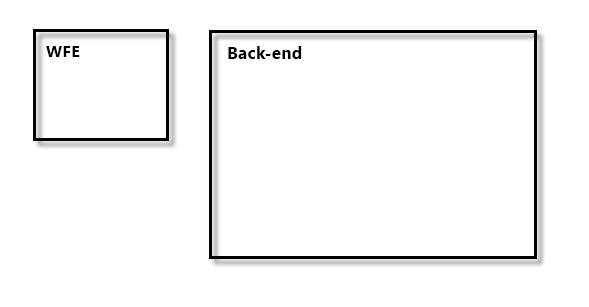
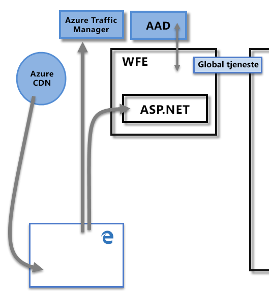
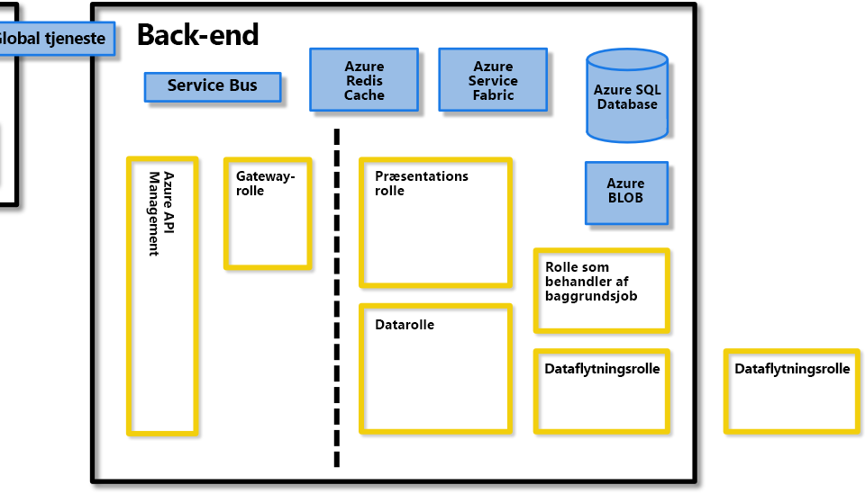
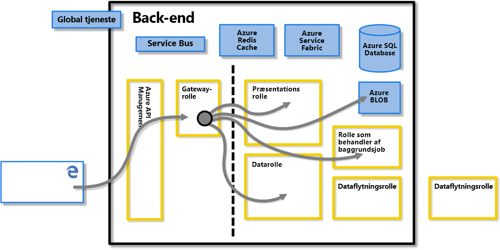
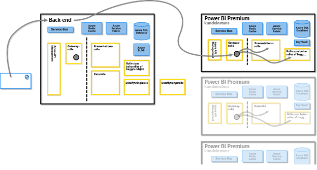
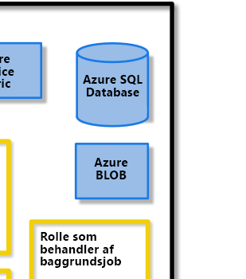
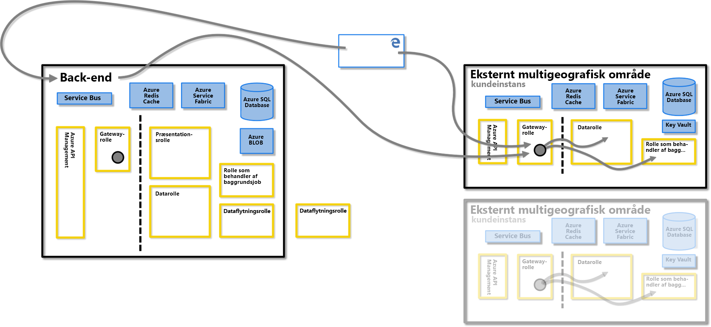
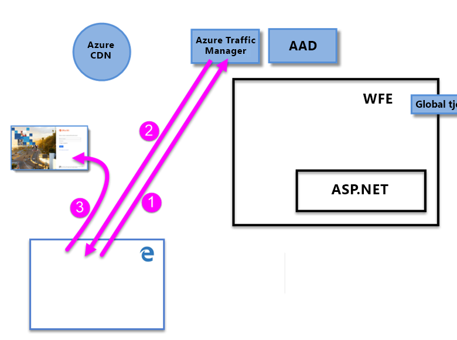
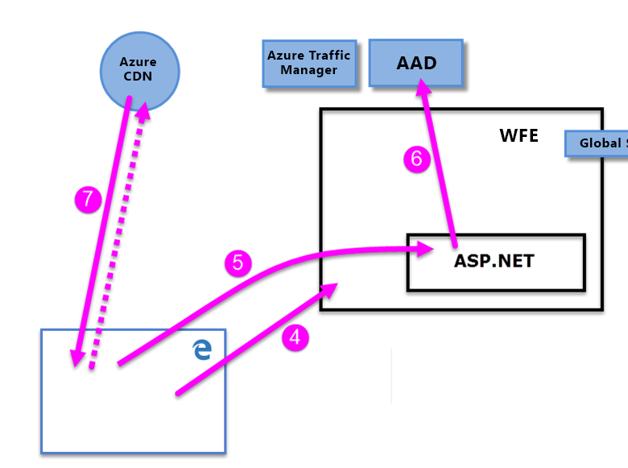

# Whitepaper om sikkerhed i Power BI

**Resumé:** Power BI er en onlinesoftwaretjeneste (*SaaS* eller Software as a Service) fra Microsoft, der gør det nemt og hurtigt for dig at oprette dashboards, rapporter, datasæt og visualiseringer i forbindelse med selvbetjenings-business intelligence. Med Power BI kan du oprette forbindelse til mange forskellige datakilder, kombinere og forme data fra disse forbindelser og derefter oprette rapporter og dashboards, som kan deles med andre.

**Forfatter:** David Iseminger

**Tekniske korrekturlæsere:** Pedram Rezaei, Cristian Petculescu, Siva Harinath, Tod Manning, Haydn Richardson, Adam Wilson, Ben Childs, Robert Bruckner, Sergei Gundorov, Kasper de Jonge

**Gælder for:** Power BI SaaS, Power BI Desktop, Power BI Embedded, Power BI Premium

> [!NOTE]
> Du kan gemme eller udskrive denne whitepaper ved at vælge **Udskriv** i din browser og derefter vælge **Gem som PDF**.

## Introduktion

**Power BI** er en onlinesoftwaretjeneste (_SaaS_ eller Software as a Service) fra Microsoft, der gør det nemt og hurtigt for dig at oprette dashboards, rapporter, datasæt og visualiseringer i forbindelse med selvbetjenings-business intelligence. Med Power BI kan du oprette forbindelse til mange forskellige datakilder, kombinere og forme data fra disse forbindelser og derefter oprette rapporter og dashboards, som kan deles med andre.

Power BI-tjenesten er underlagt [servicebetingelserne for Microsoft Online](http://www.microsoftvolumelicensing.com/DocumentSearch.aspx?Mode=3&amp;DocumentTypeId=31) og [erklæringen om beskyttelse af personlige oplysninger for Microsoft Enterprise](http://www.microsoft.com/privacystatement/OnlineServices/Default.aspx). Hvis du vil have mere at vide om placeringen af databehandling, skal du læse vilkår for placering af databehandling i servicebetingelserne for Microsoft Online. Hvis du vil have flere oplysninger om overholdelse af angivne standarder, skal du gå til [Microsoft Trust Center](https://www.microsoft.com/trustcenter), som er den primære ressource for Power BI. Power BI-teamet arbejder hårdt på at give kunderne de nyeste innovationer og produktivitet. Power BI er i øjeblikket på niveau D i [strukturen for overholdelse i Office 365](http://go.microsoft.com/fwlink/p/?LinkID=618494).

I denne artikel beskrives sikkerhed i Power BI ved at forklare Power BI-arkitekturen og derefter forklare, hvordan brugerne godkender mod Power BI, så der etableres dataforbindelser. Derefter beskrives, hvordan Power BI gemmer og flytter data via tjenesten. Det sidste afsnit er dedikeret til spørgsmål i forbindelse med sikkerhed, og der gives svar for hvert enkelt spørgsmål.

## Power BI-arkitektur

**Power BI**-tjenesten er baseret på **Azure**, som er Microsofts [platform til cloudcomputing](http://azure.microsoft.com/overview/what-is-azure/). Power BI er i øjeblikket udrullet i mange datacentre overalt i verden. Der er mange aktive udrulninger tilgængelige for kunder i de områder, der betjenes af disse datacentre, og et lige antal så stort antal passive udrulninger, der fungerer som sikkerhedskopier for hver aktiv udrulning.

Hver installation af Power BI består af to klynger – en Web Front End (**WFE**) og en **Back-End**. Disse to klynger vises på følgende billede og udgør baggrunden for resten af denne artikel. 

Power BI bruger Azure Active Directory (**AAD**) til godkendelse og administration af konti. Power BI bruger også **Azure Traffic Manager** (ATM) til at dirigere brugertrafik til det nærmeste datacenter, hvilket bestemmes af DNS-posten for den klient, der forsøger at oprette forbindelse, til godkendelsesprocessen og til at downloade statisk indhold og statiske filer. Power BI bruger den WFE, der geografisk er tættest på, til effektivt at distribuere det nødvendige statiske indhold og filerne til brugere, med undtagelse af brugerdefinerede visuelle elementer, der leveres ved hjælp af **Azure Content Delivery Network (CDN)** .

### WFE-klyngen

**WFE**-klyngen administrerer den indledende forbindelses- og godkendelsesproces for Power BI ved hjælp af AAD for at godkende klienter og angive tokens for efterfølgende klientforbindelser til Power BI-tjenesten.

Når brugerne forsøger at oprette forbindelse til Power BI-tjenesten, kommunikerer klientens DNS-tjeneste muligvis med **Azure Traffic Manager** for at finde det nærmeste datacenter med en Power BI-udrulning. Du kan finde flere oplysninger om denne proces i [Metode til routing af trafik for ydeevne til Azure Traffic Manager](https://azure.microsoft.com/documentation/articles/traffic-manager-routing-methods/#performance-traffic-routing-method).

Den WFE-klynge, der er tættest på brugeren, administrerer logon- og godkendelsessekvensen, som beskrevet senere i denne artikel, og leverer et AAD-token til brugeren, når godkendelsen lykkedes. Komponenten ASP.NET i WFE-klyngen opdeler anmodningen for at afgøre, hvilken organisation brugeren tilhører, og konsulterer derefter **Global Service** for Power BI. Global Service er en enkelt Azure-tabel, der deles af alle globale WFE- og Back End-klynger, som knytter brugere og kundeorganisationer til det datacenter, der indeholder deres Power BI-lejer. WFE angiver over for browseren, hvilken Back End-klynge der indeholder organisationens lejer. Når en bruger er godkendt, foregår efterfølgende klientinteraktioner direkte med Back End-klyngen, uden at WFE skal fungere som mellemled for disse anmodninger.

### Back End-klyngen for Power BI

**Back-End**-klyngen styrer, hvordan godkendte klienter interagerer med Power BI-tjenesten. **Back-End**-klyngen styrer visualiseringer, brugerdashboards, datasæt, rapporter, lagring af data, dataforbindelser, dataopdatering og andre aspekter, når du interagerer med Power BI-tjenesten.

**Gatewayrollen** fungerer som en gateway mellem brugeranmodninger og Power BI-tjenesten. Brugerne interagerer ikke direkte med nogen roller bortset fra Gatewayrollen.

**Vigtig!** Det er vigtigt at bemærke, at det _kun_ er rollerne Azure API Management (**APIM**) og Gateway (**GW**), der er tilgængelige via det offentlige internet. De leverer godkendelse, autorisation, DDoS-beskyttelse, begrænsning (throttling), justering af belastning, routing og andre funktioner.

Den stiplede linje på billedet af **Back End**-klyngen herover viser grænsen mellem de eneste to roller, der er tilgængelige for brugerne (til venstre for den stiplede linje), og roller, der kun kan tilgås af systemet. Når en godkendt bruger opretter forbindelse til Power BI-tjenesten, accepteres og administreres forbindelsen og anmodninger fra klienten af **Gatewayrollen** og **Azure API Management**, som derefter interagerer på brugerens vegne med resten af Power BI-tjenesten. Når en klient f.eks. forsøger at få vist et dashboard, accepterer **gatewayrollen** den pågældende anmodning og sender derefter separat en anmodning til **præsentationsrollen** om at hente de data, der skal bruges af browseren til at gengive dashboardet.

### Power BI Premium

**Power BI Premium** er et dedikeret, klargjort og partitioneret arbejdsområde i tjenesten til abonnenter, der har brug for dedikerede ressourcer til deres Power BI-aktiviteter. Når en kunde tilmelder sig et Power BI Premium-abonnement, oprettes Premium-kapaciteten via **Azure Resource Manager**. I forbindelse med udrulningen af abonnementet tildeles et sæt virtuelle maskiner, der svarer til abonnementsniveauet, i det datacenter, hvor kundes Power BI-lejer hostes (med undtagelse af multi-geo-miljøer, som beskrevet senere i dette dokument), startet som en **Azure Service Fabric**-udrulning.

Når det er oprettet, dirigeres al kommunikation med Premium-klyngen via Back End-klyngen i Power BI, hvor der etableres forbindelse til klientens dedikerede virtuelle maskiner under **Power BI Premium**-abonnementet.

### Arkitektur af datalager

Power BI bruger to primære lagre til at gemme og administrere data: Data, der uploades af brugere, sendes typisk til **Azure Blob** Storage, og alle metadata samt artefakter for selve systemet gemmes bag en firewall i **Azure SQL Database**.

Når en bruger f.eks. importerer en Excel-projektmappe i Power BI-tjenesten, oprettes der en tabeldatabase i hukommelsen i Analysis Services, og dataene gemmes i hukommelsen i op til én time (eller indtil der kommer pres på systemets hukommelse). Dataene sendes også til **Azure Blob** Storage.

Metadata om en brugers Power BI-abonnement, f.eks. dashboards, rapporter, seneste datakilder, arbejdsområder, organisationsoplysninger, lejeroplysninger og andre metadata om systemet, gemmes og opdateres i **Azure SQL Database**. Alle oplysninger, der gemmes i Azure SQL Database, krypteres fuldt ud ved hjælp af teknologien [Transparent Data Encryption (TDE) i Azure SQL](https://msdn.microsoft.com/library/dn948096.aspx). Alle data, der gemmes i Azure Blob Storage, krypteres også. Du kan finde flere oplysninger om processen til indlæsning, lagring og flytning af data i afsnittet **Datalager og -flytning**.

## Oprettelse af lejer

Der er dedikeret en lejer af Azure AD-tjenesten, som en organisation modtager og ejer, når den tilmelder sig en Microsoft-cloudtjeneste, f.eks. Azure, Microsoft Intune, Power BI eller Office 365. Hver enkelt Azure AD-lejer er specifik og adskilt fra andre Azure AD-lejere.

En lejer indeholder brugerne i en virksomhed og oplysninger om dem – deres adgangskoder, brugerprofildata, tilladelser og osv. Den indeholder også grupper, programmer og andre oplysninger, der vedrører en organisation og dens sikkerhed. Du kan finde flere oplysninger under [Hvad er en Azure AD-lejer?](https://msdn.microsoft.com/library/azure/jj573650.aspx#BKMK_WhatIsAnAzureADTenant)

Der oprettes en Power BI-lejer i det datacenter, der anses for at være tættest på de oplysninger om land (eller område) og stat, som er angivet for lejeren i Azure Active Directory, og som blev angivet, da Office 365 eller Power BI-tjenesten oprindeligt blev klargjort. Power BI-lejeren flytter i dag ikke fra den pågældende datacenterplacering.

### Flere geografiske områder (multi-geo)

På baggrund af deres forretningsbehov kræver nogle organisationer tilstedeværelse af Power BI i flere lande eller områder. En virksomhed kan f.eks. have sin Power BI-lejer i USA, men kan også gøre forretninger i andre geografiske områder, f.eks. Australien, og have brug for, at Power BI-tjenesterne og dataene forbliver i det eksterne område.  Fra og med anden halvdel af 2018 har organisationer, som har deres lejer i ét område, også kunnet få adgang til Power BI-ressourcer i et andet område, når det er klargjort korrekt. For nemheds skyld kaldes denne funktion **multi-geo** i hele dette dokument.

Der er teknisk konsekvenser, som man skal være opmærksom på, når man bruger forskellige geografiske områder. De forklares i dette dokument. Vigtige overvejelser omfatter følgende:

- En cachelagret forespørgsel, der er gemt i et eksternt område, forbliver i dette område som inaktive data, men andre data under overførsel kan skifte frem og tilbage mellem flere geografiske områder.
- Rapporter i PBIX eller XLSX-filer i et ekstern område, der er publiceret til Power BI, resulterer nogle gang i, at der gemmes en kopi eller et øjebliksbillede i Azure Blob Storage i Power BI. Når det sker, krypteres dataene ved hjælp af Azure Storage Service Encryption (SSE).
- Når du flytter data fra et område til et andet i et multi-geo-miljø, opstår der spildopsamling i det område, som dataene blev flyttet fra, inden for 7 til 10 dage. På dette tidspunkt vil kopien af de data, der blev flyttet fra det oprindelige område, blive destrueret.

Følgende billede viser, hvordan Power BI-tjenesterne i det eksterne område med et multi-geo-miljø dirigeres gennem **Back End-klyngen i Power BI**, hvor der etableres en forbindelse til klientens virtuelle fjernmaskine under Power BI-abonnementet.

### Datacentre og landestandarder

Power BI tilbydes i bestemte områder baseret på, hvor Power BI-klynger er udrullet i regionale datacentre. Microsoft planlægger at udvide sin Power BI-infrastruktur til flere datacentre.

Følgende links indeholder yderligere oplysninger om Azure-datacentre.

- [Azure-områder](http://azure.microsoft.com/regions/) – oplysninger om Azures globale tilstedeværelse og placeringer
- [Azure-tjenester efter område](http://azure.microsoft.com/regions/#services) – en komplet liste over Azure-tjenester (både infrastrukturtjenester og platformstjenester) fra Microsoft i hvert område.

I øjeblikket er Power BI-tjenesten tilgængelig i bestemte områder, der betjenes af datacentre, som beskrevet i [Microsoft Trust Center] ((https://www.microsoft.com/TrustCenter/CloudServices/business-application-platform/data-location). Følgende link viser et kort over placeringen af Power BI-datacentrene. Du kan placere markøren over et område for at se de datacentre, der er placeret i det pågældende område:

* [Power BI-datacentre](https://www.microsoft.com/TrustCenter/CloudServices/business-application-platform/data-location)

Microsoft leverer også datacentre til nationale clouds. Du kan finde flere oplysninger om tilgængeligheden af Power BI-tjenesten i nationale cloudmiljøer i [Power BI i nationale cloudmiljøer](https://powerbi.microsoft.com/clouds/).

Du kan finde flere oplysninger om, hvor dine data gemmes, og hvordan de bruges, under [Microsoft Trust Center](https://www.microsoft.com/TrustCenter/Transparency/default.aspx#_You_know_where). Forpligtelser i forbindelse med placeringen af kundedata som inaktive data er angivet under **Vilkår for databehandling** i [Vilkår for Microsoft Online Services](http://www.microsoftvolumelicensing.com/DocumentSearch.aspx?Mode=3&amp;DocumentTypeId=31).

## Brugergodkendelse

Godkendelse af brugeren til Power BI-tjenesten består af en række anmodninger, svar og omdirigeringer mellem brugerens browser og Power BI-tjenesten eller de Azure-tjenester, som bruges af Power BI. I sekvensen beskrives processen for godkendelse af brugeren i Power BI. Du kan finde flere oplysninger om mulighederne for en organisations modeller til godkendelse af brugeren (logonmodeller) under [Sådan vælges en logonmodel til Office 365](https://blogs.office.com/2014/05/13/choosing-a-sign-in-model-for-office-365/).

### Godkendelsessekvens

Sekvensen til godkendelse af brugeren til Power BI-tjenesten sker, som beskrevet under følgende trin og vist på følgende billeder.

1. En bruger starter en forbindelse til Power BI-tjenesten i en browser enten ved at skrive Power BI-adressen i adresselinjen (f.eks. https://app.powerbi.com) eller ved at vælge _Log på_ på Power BI-landingssiden (https://powerbi.microsoft.com). Forbindelsen oprettes ved hjælp af TLS 1.2 og HTTPS, og HTTPS bruges til al efterfølgende kommunikation mellem browseren og Power BI-tjenesten. Anmodningen sendes til **Azure Traffic Manager**.

2. **Azure Traffic Manager** kontrollerer brugerens DNS-post for at finde det nærmeste datacenter, hvor Power BI er udrullet, og reagerer på DNS-posten med IP-adressen på WFE-klyngen, som brugeren skal sendes til.

3. WFE omdirigerer derefter brugeren til logonsiden for Microsoft Online Services.

    

1. Når brugeren er godkendt, omdirigerer logonsiden brugeren til den tidligere bestemte nærmeste **WFE-klynge** i Power BI-tjenesten.

2. Browseren sender en cookie, der blev hentet ved vellykket logon, til Microsoft Online Services, som kontrolleres af **ASP.NET-tjenesten** i **WFE-klyngen**.

3. WFE-klyngen kontakter tjenesten **Azure Active Directory** (**AAD**) for at godkende brugerens abonnement på Power BI-tjenesten og hente et AAD-sikkerhedstoken. Når AAD returnerer godkendelse af brugeren og returnerer et AAD-sikkerhedstoken, konsulterer WFE-klyngen **Global Service for Power BI**, som bevarer en liste over lejere og deres placeringer for Back End-klyngerne i Power BI og bestemmer, hvilke klynger i Power BI-tjenesten der indeholder brugerens lejer. WFE-klyngen dirigerer derefter brugeren til den Power BI-klynge, hvor lejeren er placeret, og returnerer en samling af elementer til brugerens browser:

      - **AAD-sikkerhedstoken**
      - **Oplysninger om session**
      - Webadressen på **Back End**-klyngen, som brugeren kan kommunikere og interagere med

1. Brugerens browser kontakter derefter det angivne Azure CDN eller for nogle af filerne den angivne WFE for at downloade samlingen af angivne fælles filer, som er nødvendige for at muliggøre browserens interaktion med Power BI-tjenesten. Browsersiden inkluderer derefter AAD-tokenet, oplysningerne om sessionen, placeringen af den tilknyttede Back End-klynge og samlingen af filer, der blev downloadet fra Azure CDN og WFE-klyngen, i hele varigheden af den pågældende browsersession for Power BI-tjenesten.

Når disse elementer er fuldført, indleder browseren kontakt med den angivne Back End-klynge, og brugerens interaktion med Power BI-tjenesten begynder. Fra nu af sker alle kald til Power BI-tjenesten med den angivne Back End-klynge, og alle kald inkluderer brugerens AAD-token. Der er en timeout på én time for AAD-tokenet. WFE opdaterer jævnligt tokenet, hvis en brugers session forbliver åben, for at sikre fortsat adgang.

## Datalager og -flytning

I Power BI-tjenesten er data enten _inaktive_ (data, der er tilgængelige for en Power BI-bruger, men som der i øjeblikket ikke reageres på) eller _i gang_ (for eksempel: kørte forespørgsler, dataforbindelser og modeller, der i øjeblikket reageres på, data og/eller modeller, der uploades til Power BI-tjenesten, og andre handlinger, som brugere eller Power BI-tjenesten kan udføre på data, der aktivt tilgås eller opdateres). Data, der er i gang, kaldes for _data i gang_. Inaktive data i Power BI krypteres. Data, som er under overførsel, hvilket betyder data, der sendes eller modtages af Power BI-tjenesten, krypteres også.

Power BI-tjenesten administrerer også data forskelligt, afhængigt af om der er adgang til dataene via **DirectQuery** eller via import. Så der er to kategorier af brugerdata for Power BI: data, der er adgang til via DirectQuery, og data, der ikke er adgang til via DirectQuery.

**DirectQuery** er en forespørgsel, hvortil en Power BI-brugers forespørgsel er blevet oversat fra Microsofts DAX-sprog (Data Analysis Expressions) – hvilket er det sprog, der bruges af Power BI og andre Microsoft-produkter til at oprette forespørgsler på – til datakildens oprindelige datasprog (f.eks. T-SQL eller andre oprindelig databasesprog). De data, der er knyttet til DirectQuery, gemmes kun som reference, hvilket betyder, at kildedata ikke gemmes i Power BI, når DirectQuery ikke er aktiv (undtagen visualiseringsdata, der bruges til at vise dashboards og rapporter, som beskrevet i afsnittet _Data i gang (dataflytning)_ herunder). Referencer til DirectQuery-data gemmes i stedet, hvilket giver adgang til disse data, når DirectQuery køres. DirectQuery indeholder alle nødvendige oplysninger for at udføre forespørgslen, herunder forbindelsesstrengen og de legitimationsoplysninger, der bruges til at få adgang til datakilderne, hvilket giver DirectQuery mulighed for at oprette forbindelse til de inkluderede datakilder med henblik på automatisk opdatering. Med DirectQuery inkorporeres oplysninger om datamodellen i DirectQuery.

En forespørgsel om et importdatasæt består af en samling DAX-forespørgsler, der _ikke_ er direkte oversat til det oprindelige sprog af en hvilken som helst underliggende datakilde. Importforespørgsler inkluderer ikke legitimationsoplysninger for de underliggende data, og de underliggende data indlæses i Power BI-tjenesten, medmindre det er data i det lokale miljø, som også tilgås via en [Power BI Gateway](service-gateway-onprem.md). Hvis det er tilfældet, gemmes der kun referencer til data i det lokale miljø i forespørgslen.

I følgende tabel beskrives Power BI-data, der er baseret på den type forespørgsel, der bruges. Et **X** angiver tilstedeværelsen af Power BI-data, når du bruger den tilknyttede forespørgselstype.

|  |Importér  |DirectQuery  |Live Connect  |
|---------|---------|---------|---------|
|Skema     |     X    |    X     |         |
|Rækkedata     |    X     |         |         |
|Cachelagring af data for visuelle elementer     |    X     |     X    |    X     |

Forskellen mellem DirectQuery og andre forespørgsler bestemmer, hvordan inaktive data håndteres i Power BI-tjenesten, og om selve forespørgslen krypteres. I følgende afsnit beskrives inaktive data og dataflytning, og kryptering, placering og processer til håndtering af data forklares.

### Inaktive data

Når data er inaktive, gemmes datasæt, rapporter og dashboardfelter i Power BI-tjenesten på den måde, som er beskrevet i de efterfølgende afsnit. Som tidligere nævnt krypteres inaktive data i Power BI. ETL står for Extract, Transform og Load (udtrækning, transformering og indlæsning) i følgende afsnit.

#### Krypteringsnøgler

- Krypteringsnøglerne for Azure Blob-nøgler gemmes og krypteres i Azure Key Vault.
- Krypteringsnøglerne for TDE-teknologien i Azure SQL Database administreres af Azure SQL.
- Krypteringsnøglen for tjenesten Dataflytning og datagateway i det lokale miljø gemmes her:
  - I datagatewayen i det lokale miljø på kundens infrastruktur – for datakilder i det lokale miljø
  - I rollen for Dataflytning – for cloudbaserede datakilder

Content Encryption Key (CEK), som bruges til at kryptere Windows Azure Blob Storage, er en tilfældigt genereret 256-bit nøgle. Den algoritme, som CEK bruger til at kryptere indholdet, er AES\_CBC\_256.

Key Encryption Key (KEK), som derefter bruges til at kryptere CEK, er en foruddefineret 256-bit nøgle. Den algoritme, som KEK bruger til at kryptere CEK, er A256KW.

Gatewaykrypteringsnøgler, der er baseret på genoprettelsesnøglen, forlader aldrig en infrastruktur i det lokale miljø. Power BI kan ikke få adgang til de krypterede værdier for legitimationsoplysninger i det lokale miljø og kan ikke opfange disse legitimationsoplysninger. Webklienter krypterer legitimationsoplysningerne med en offentlig nøgle, der er knyttet til den specifikke gateway, som de kommunikerer med.

I forbindelse med cloudbaserede datakilder krypterer rollen for Dataflytning krypteringsnøgler ved hjælp af metoder af typen [Always Encrypted](https://msdn.microsoft.com/library/mt163865.aspx). Du kan få mere at vide om [databasefunktionen Always Encrypted](https://msdn.microsoft.com/library/mt163865.aspx).

#### Datasæt

1. Metadata (tabeller, kolonner, målinger, beregninger, forbindelsesstrenge osv.)

    a. I forbindelse med Analysis Services i det lokale miljø gemmes intet i tjenesten med undtagelse af en reference til den pågældende database, der er gemt krypteret i Azure SQL.

    b. Alle andre metadata for ETL, DirectQuery og pushdata krypteres og gemmes i Azure Blob Storage.

1. Legitimationsoplysninger til de oprindelige datakilder
  
      a. Analysis Services i det lokale miljø – Ingen legitimationsoplysninger er nødvendige, og derfor gemmes der ingen legitimationsoplysninger.

      b. DirectQuery – Dette afhænger af, om modellen er oprettet direkte i tjenesten. Hvis det er tilfældet, gemmes den i forbindelsesstrengen og krypteres i Azure Blob. Hvis modellen er importeret fra Power BI Desktop, gemmes legitimationsoplysningerne krypteret i Azure SQL Database for Dataflytning. Krypteringsnøglen gemmes på den computer, der kører gatewayen på kundens infrastruktur.

      c. Data sendt via push – ikke relevant

      d. ETL

      - For **Salesforce** eller **OneDrive** – opdateringstokens gemmes krypteret i Azure SQL Database i Power BI-tjenesten.
      - Ellers:
        - Hvis datasættet er indstillet til opdatering, gemmes legitimationsoplysningerne krypteret i Azure SQL Database for Dataflytning. Krypteringsnøglen gemmes på den computer, der kører gatewayen på kundens infrastruktur.
        - Hvis datasættet ikke er indstillet til opdatering, er der ikke gemt nogen legitimationsoplysninger for datakilderne

1. Data

    a. Analysis Services i det lokale miljø og DirectQuery – intet gemmes i Power BI-tjenesten.

    b. ETL – krypteret i Azure Blob Storage, men alle data, der i øjeblikket er i Azure Blob Storage i Power BI-tjenesten, bruger [Azure Storage Service Encryption (SSE)](https://docs.microsoft.com/azure/storage/common/storage-service-encryption), som også kaldes for kryptering på serversiden. Multi-geo bruger også SSE.

    c. Pushdata v1 – gemmes krypteret i Azure Blob Storage, men alle data, der i øjeblikket er i Azure Blob Storage i Power BI-tjenesten, bruger [Azure Storage Service Encryption (SSE)](https://docs.microsoft.com/azure/storage/common/storage-service-encryption), som også kaldes for kryptering på serversiden. Multi-geo bruger også SSE. Push data v1 udgik fra 2016. 

    d. Pushdata v2 – gemmes krypteret i Azure SQL.

Power BI bruger tilgangen med kryptering på klientsiden ved hjælp af CBC-tilstanden (cipher block chaining) med Advanced Encryption Standard (AES) til at kryptere Azure Blob Storage. Du kan [få mere at vide om kryptering på klientsiden](https://azure.microsoft.com/documentation/articles/storage-client-side-encryption/).

Power BI sikrer overvågning af dataintegritet på følgende måder:

* I forbindelse med inaktive data i Azure SQL bruger Power BI dbcc, TDE og konstant kontrolsum for side som en del af det oprindelige tilbud i SQL.

* I forbindelse med inaktive data i Azure Blob Storage bruger Power BI kryptering på klientsiden og HTTPS til at overføre data til lageret, som omfatter integritetskontroller under hentning af dataene. Du kan [få mere at vide om sikkerhed i Azure Blob Storage](https://azure.microsoft.com/documentation/articles/storage-security-guide/).

#### Rapporter

1. Metadata (rapportdefinition)

   a. Rapporter kan enten være Excel til Office 365-rapporter eller Power BI-rapporter. På baggrund af typen af rapport gælder følgende for metadata:
        
    &ensp; &ensp; a. Excel-rapportmetadata gemmes krypteret i SQL Azure. Metadata gemmes også i Office 365.

    &ensp; &ensp; b. Power BI-rapporter gemmes krypteret i Azure SQL Database.

2. Statiske data

   Statiske data omfatter artefakter såsom baggrundsbilleder og brugerdefinerede visualiseringer.

    &ensp; &ensp; a. Der gemmes intet i forbindelse med rapporter, der er oprettet i Excel til Office 365.

    &ensp; &ensp; b. I forbindelse med Power BI-rapporter gemmes og krypteres statiske data i Azure Blob Storage.

3. Cacher

    &ensp; &ensp; a. Der cachelagres intet i forbindelse med rapporter, der er oprettet i Excel til Office 365.

    &ensp; &ensp; b. I forbindelse med Power BI-rapporter cachelagres data for de viste visualiseringer krypteret i Azure SQL Database.
 

4. Oprindelige .pbix-filer (Power BI Desktop) eller .xlsx-filer (Excel), der er publiceret i Power BI

    Nogle gange gemmes en kopi eller et øjebliksbillede af .xlsx- eller .pbix-filerne i Azure Blob Storage i Power BI. Når det sker, krypteres dataene. I Azure Blob Storage bruger alle sådanne rapporter, som er gemt i Power BI-tjenesten, [Azure Storage Service Encryption (SSE)](https://docs.microsoft.com/azure/storage/common/storage-service-encryption), der også kaldes for kryptering på serversiden. Multi-geo bruger også SSE.

#### Dashboards og dashboardfelter

1. Cachelagring – De data, der skal bruges af visualiseringerne på dashboardet, cachelagres normalt og gemmes krypteret i Azure SQL Database. Andre felter såsom fastgjorte visualiseringer fra Excel eller SQL Server Reporting Services (SSRS) gemmes i Azure Blob som billeder og krypteres også.

2. Statiske data – der indeholder artefakter såsom gemte baggrundsbilleder og brugerdefinerede visualiseringer krypteres i Azure Blob Storage.

Uanset hvilken krypteringsmetode der bruges, administrerer Microsoft nøglekrypteringen på kundens vegne enten på et hemmeligt lager eller i Azure Key Vault.

### Midlertidigt gemte data på permanente enheder

Permanente enheder er enheder, der har hukommelse, der bevares uden konstant strøm. I det følgende beskrives data, der gemmes midlertidigt på permanente enheder. 

#### Datasæt

1. Metadata (tabeller, kolonner, målinger, beregninger, forbindelsesstrenge osv.)

2. Nogle skemarelaterede artefakter kan blive gemt på disken for computenoderne i en begrænset periode. Nogle artefakter kan også blive gemt i Azure REDIS Cache ukrypteret i en begrænset periode.

3. Legitimationsoplysninger til de oprindelige datakilder

    a. Analysis Services i det lokale miljø – intet gemmes

    b. DirectQuery – Dette afhænger af, om modellen er oprettet direkte i tjenesten. Hvis det er tilfældet, gemmes den i forbindelsesstrengen i et krypteret format med krypteringsnøglen gemt som klartekst samme sted (sammen med de krypterede oplysninger). Hvis modellen er importeret fra Power BI Desktop, gemmes legitimationsoplysningerne ikke på permanente enheder.

    > [!NOTE]
    > Funktionen til modeloprettelse på tjenestesiden udgik i begyndelsen af 2017.

    c. Data sendt via push – ingen (ikke relevant)

    d. ETL – ingen (intet gemmes på computenoden eller på anden måde end forklaret under afsnittet **Inaktive data** ovenfor)
4. Data

    Nogle dataartefakter kan blive gemt på disken for computenoderne i en begrænset periode.

### Data i gang

Data er i gang, når de aktivt bruges eller tilgås en bruger. Data er f.eks. i gang, når en bruger tilgår et datasæt, reviderer eller ændrer et dashboard eller en rapport, når der opdateres, eller der foregår andre aktiviteter, hvor dataene tilgås. Når nogen af disse hændelser sker og sætter data i gang, opretter **Datarollen** i Power BI-tjenesten en database i hukommelsen i Analysis Services (AS), og datasættet indlæses i denne database i hukommelsen i Analysis Services. Uanset om datasættet er baseret på DirectQuery eller ej, så krypteres indlæste data i AS-databasen ikke for at give **Datarollen** adgang. De opbevares i hukommelsen for at sikre yderligere adgang, indtil Power BI-tjenesten ikke længere har brug for datasættet. For kunder, der har et abonnement på Power BI Premium, opretter Power BI en database i hukommelsen i Analysis Services (AS) i kundens samling af virtuelle maskiner i Power BI, som er klargjort separat.

Når der udføres aktiviteter med data, hvilket omfatter første indlæsning af data i Power BI, kan Power BI-tjenesten cachelagre visualiseringsdataene i en krypteret **Azure SQL Database**, uanset om datasættet er baseret på DirectQuery eller ej.

Power BI bruger HTTPS, TCP/IP og TLS til at overvåge dataintegriteten for data i gang og sikre, at dataene krypteres og integriteten fastholdes under transporten.

## Godkendelse af brugeren til datakilder

Med hver enkelt datakilde, en bruger opretter en forbindelse, der er baseret på deres logon, og får adgang til data ved hjælp af disse legitimationsoplysninger. Brugerne kan derefter oprette forespørgsler, dashboards og rapporter på baggrund af de underliggende data.

Når en bruger deler forespørgsler, dashboards, rapporter eller en visualisering, afhænger adgang til disse data og visualiseringer af, om de underliggende datakilder understøtter sikkerhed på rolleniveau.

Hvis en underliggende datakilde understøtter **sikkerhed på rolleniveau i Power BI****** , anvender Power BI-tjenesten denne sikkerhed på rolleniveau. En bruger, der ikke har tilstrækkelige legitimationsoplysninger til at få adgang til de underliggende data (som kan være en forespørgsel, der bruges i et dashboard, i en rapport eller i andre dataartefakter), kan ikke se data, som brugeren ikke har tilstrækkelige rettigheder til. Hvis en brugers adgang til de underliggende data er forskellig fra den bruger, som oprettede dashboardet eller rapporten, vises der kun data i visualiseringer og andre artefakter på baggrund af det adgangsniveau, som brugeren har til dataene.

Hvis en datakilde **ikke** understøtter sikkerhed på rolleniveau, anvendes legitimationsoplysningerne til Power BI-logon for den underliggende datakilde. Hvis der leveres andre legitimationsoplysninger under forbindelsen, anvendes disse angivne legitimationsoplysninger. Når en bruger indlæser data i Power BI-tjenesten fra datakilder, der ikke understøtter sikkerhed på rolleniveau, gemmes dataene i Power BI, som beskrevet i afsnittet **Datalager og -flytning** i dette dokument. I forbindelse med datakilder, der ikke understøtter sikkerhed på rolleniveau, bruges de oprindelige legitimationsoplysninger til at få adgang til eller vise dataene, når data deles med andre brugere (f.eks. via et dashboard eller en rapport), eller når dataene opdateres.

Et hurtigt eksempel på forskellen mellem datakilder, der understøtter sikkerhed på rolleniveau, og datakilder, der ikke gør, kunne være følgende: Forestil dig, at Sam opretter en rapport og et dashboard og derefter deler dem med Abby og Ralph. Hvis de datakilder, der bruges i rapporten og på dashboardet stammer fra datakilder, der **ikke** understøtter sikkerhed på rolleniveau, vil Abby og Ralph kunne se de data, som Sam har inkluderet på dashboardet (som blev uploadet til Power BI-tjenesten), og både Abby og Ralph kan derefter interagere med dataene. Hvis Sam derimod opretter en rapport og et dashboard fra datakilder, der understøtter sikkerhed på rolleniveau og derefter deler dem med Abby og Ralph, kan Abby kun se følgende, når hun forsøger at få vist dashboardet:

1. Da dashboardet stammer fra en datakilde, som understøtter sikkerhed på rolleniveau, vises der kort en meddelelse om &quot;indlæsning&quot; for dashboardets visualisering, mens Power BI-tjenesten sender en forespørgsel til datakilden om at hente det aktuelle datasæt, der er angivet i den forbindelsesstreng, som er knyttet til dashboardets underliggende forespørgsel.

2. Dataene tilgås og hentes på baggrund af Abbys legitimationsoplysninger og rolle, og det er kun data, som Abby har tilstrækkelig autorisation til, som indlæses på dashboardet og i rapporten.

3. Visualiseringerne på dashboardet og i rapporten vises på baggrund af Abbys rolle.

Hvis Ralph vil have adgang til det delte dashboard eller den delte rapport, vil den samme sekvens ske på baggrund af hans rolleniveau.

## Power BI og ExpressRoute

I forbindelse med Power BI og ExpressRoute kan du oprette en privat netværksforbindelse fra din organisation til Power BI (eller bruge en ISP's colocationsfacilitet), der omgår internettet og sørger for bedre sikkerhed for dine følsomme Power BI-data og -forbindelser.

ExpressRoute er en Azure-tjeneste, der giver dig mulighed for at oprette private forbindelser mellem Azure-datacentre (hvor Power BI er placeret) og infrastrukturen i det lokale miljø eller oprette private forbindelser mellem Azure-datacentre og dit colocationsmiljø. Du kan finde yderligere oplysninger i artiklen [Power BI og ExpressRoute](service-admin-power-bi-expressroute.md).

## Power BI – Mobil

Power BI – Mobil er en samling af apps, der er udviklet til de tre primære mobilplatforme: Android, iOS og Windows Mobile. Sikkerhedsovervejelser i forbindelse med apps til Power BI – Mobil falder i to kategorier:

* Enhedskommunikation
* Appen og dataene på enheden

I forbindelse med **enhedskommunikation** kommunikerer alle apps til Power BI – Mobil med Power BI-tjenesten og bruger de samme forbindelses- og godkendelsessekvenser, som bruges af browsere, hvilket er beskrevet i detaljer tidligere i dette whitepaper. IOS- og Android-apps til Power BI – Mobil åbner en browsersession i selve appen, og Windows Mobile-appen åbner en mægler for at etablere kommunikationskanalen med Power BI.

I følgende tabel vises understøttelse af certifikatbaseret godkendelse for Power BI – Mobil på baggrund af mobilenhedens platform:

| **Understøttelse af certifikatbaseret godkendelse** | **iOS** | **Android** | **Windows** |
| --- | --- | --- | --- |
| **Power BI** (log på tjenesten) | understøttet | understøttet | Ikke understøttet |
| **SSRS ADFS** (opret forbindelse til SSRS-serveren) | Ikke understøttet | Understøttet | Ikke understøttet |

Apps til Power BI – Mobil kommunikerer aktivt med Power BI-tjenesten. Telemetri bruges til at indsamle brugsstatistikker for mobilappen og lignende data, som sendes til tjenester, der bruges til at overvåge brug og aktivitet. Der sendes ingen private oplysninger med telemetridata.

Power BI-**appen på enheden** gemmer data på enheden, der gør brug af appen:

* Azure Active Directory og opdateringstokens gemmes i en sikker mekanisme på enheden ved hjælp af branchestandardens sikkerhedsforanstaltninger.

* Data cachelagres i lageret på enheden, som ikke krypteres direkte af selve appen.

* Indstillingerne gemmes også ukrypteret på enheden, men der gemmes ingen faktiske brugerdata.

Datacachen fra Power BI – Mobil forbliver på enheden i to uger eller indtil: appen fjernes, brugeren logger af Power BI – Mobil, eller brugeren ikke kan logge på (f.eks. hvis et token udløber, eller adgangskoden ændres). Datacachen omfatter dashboards og rapporter, der tidligere blev tilgået fra appen Power BI – Mobil.

Apps til Power BI – Mobil bruger ikke mapper på enheden. 

Alle tre platforme, som Power BI – Mobil er tilgængelig til, understøtter Microsoft Intune, der er en softwaretjeneste, som muliggør administration af mobilenheder og apps. Når Intune er aktiveret og konfigureret, krypteres data på mobilenheden, og selve Power BI-programmet kan ikke installeres på et SD-kort. [Få mere at vide om Microsoft Intune](http://www.microsoft.com/cloud-platform/microsoft-intune).

## Spørgsmål og svar om sikkerhed i Power BI

Følgende spørgsmål er almindelige spørgsmål og svar om sikkerhed i Power BI. De er angivet i den rækkefølge, de blev føjet til denne whitepaper for at hjælpe dig med hurtigt at finde nye spørgsmål og svar, i takt med at dette dokument opdateres. De nyeste spørgsmål føjes til slutningen af denne liste.

**Hvordan opretter brugere forbindelse og får adgang til datakilder under brug af Power BI?**

* **Power BI-legitimationsoplysninger og legitimationsoplysninger til domænet:** Brugere logger på Power BI ved hjælp af en mailadresse. Når en bruger forsøger at oprette forbindelse til en dataressource, bruger Power BI mailadressen til Power BI-logon som legitimationsoplysninger. I forbindelse med ressourcer, der er forbundet med et domæne (enten i det lokale miljø eller cloudbaseret), matches logonmailen med _brugerens hovednavn_ ([UPN](https://msdn.microsoft.com/library/windows/desktop/aa380525(v=vs.85).aspx) – User Principal Name) af katalogtjenesten for at afgøre, om der er tilstrækkelige legitimationsoplysningerne til at tillade adgang. For organisationer, der bruger arbejdsbaserede mailadresser til at logge på Power BI (den samme mailadresse, de bruger til at logge på arbejdsressourcer, f.eks. _david@contoso.com_ ), kan tilknytningen ske uden problemer. For organisationer, der ikke bruger arbejdsbaserede mailadresser (f.eks. _david@contoso.onmicrosoft.com_ ), skal der være tilknyttet et katalog, før der tillades adgang til ressourcer i det lokale miljø med legitimationsoplysningerne til Power BI-logon.

* **SQL Server Analysis Services og Power BI:** For organisationer, der bruger SQL Server Analysis Services i det lokale miljø, tilbydes Power BI-datagatewayen i det lokale miljø (som er en **gateway**, der blev refereret til i forrige afsnit).  Power BI-datagatewayen i det lokale miljø kan gennemtvinge sikkerhed på rolleniveau for datakilder. Du kan finde flere oplysninger om sikkerhed på rolleniveau under **Godkendelse af brugeren til datakilder** tidligere i dette dokument. Du kan også læse en dybdegående artikel om [Power BI Gateway](service-gateway-manage.md).

  Organisationer kan desuden bruge Kerberos til **enkeltlogon** (SSO) og problemfrit oprette forbindelse fra Power BI til datakilder i det lokale miljø såsom SQL Server, SAP HANA og Teradata. Du kan finde flere oplysninger og se de specifikke konfigurationskrav i [**Brug Kerberos til SSO fra Power BI til datakilder i det lokale miljø**](https://docs.microsoft.com/power-bi/service-gateway-kerberos-for-sso-pbi-to-on-premises-data).

* **Forbindelser uden domæne**: Til dataforbindelser, der ikke er tilknyttet et domæne og ikke understøtter sikkerhed på rolleniveau, skal brugeren angive legitimationsoplysninger under forbindelsessekvensen, som Power BI derefter sender til datakilden for at etablere forbindelsen. Hvis der er tilstrækkelige tilladelser, indlæses data fra datakilden i Power BI-tjenesten.

**Hvordan overføres data til Power BI?**

* Alle data, der anmodes om og sendes af Power BI, krypteres under overførslen, og HTTPS bruges til at oprette forbindelse fra datakilden til Power BI-tjenesten. Der etableres en sikker forbindelse med dataprovideren, og det er først, når der er etableret en sikker forbindelse, at data krydser netværket.

**Hvordan cachelagrer Power BI rapport-, dashboard- eller modeldata, og er det sikkert?**

* Når en datakilde tilgås, følger Power BI-tjenesten den proces, der er beskrevet i afsnittet **Datalager og -flytning** tidligere i dette dokument.

**Cachelagrer klienter data for websiden lokalt?**

* Når browserklienter tilgår Power BI, angiver Power BI-webserverne direktivet _Cache-Control_ til _no-store_. Direktivet _no-store_ instruerer browsere til ikke at cachelagre den webside, som brugeren får vist, og til ikke at gemme websiden i klientens cachemappe.

**Hvad med rollebaseret sikkerhed, deling af rapporter eller dashboards og dataforbindelser? Hvordan fungerer det med hensyn til dataadgang, visning af dashboards, adgang til rapporter eller opdateringer?**

* Hvis et dashboard, en rapport eller en datamodel deles med andre brugere via Power BI i forbindelse med datakilder, der **ikke understøtter sikkerhed på rolleniveau**, bliver dataene tilgængelige for brugerne, som de deles med, og brugerne kan få dem vist og interagere med dem. Power BI godkender *ikke* brugerne igen i forhold til den oprindelige datakilde. Når data uploades til Power BI, er den bruger, som blev godkendt i forhold til kildedataene, ansvarlig for at administrere, hvilke andre brugere og grupper der kan få vist dataene.

  Når der oprettes dataforbindelser til en datakilde, der understøtter **sikkerhed på rolleniveau**, f.eks. en Analysis Services-datakilde, er det kun dashboarddata, der cachelagres i Power BI. Hver gang en rapport eller et datasæt vises eller tilgås i Power BI, som bruger data fra en datakilde, der understøtter sikkerhed på rolleniveau, tilgår Power BI-tjenesten datakilden for at hente data på baggrund af brugerens legitimationsoplysninger. Hvis der er tilstrækkelige tilladelser, indlæses dataene i rapporten eller datamodellen for den pågældende bruger. Hvis godkendelse mislykkes, får brugeren vist en fejl.

  Du kan finde flere oplysninger i afsnittet **Godkendelse af brugeren til datakilder** tidligere i dette dokument.

**Vores brugere opretter forbindelse til de samme datakilder hele tiden, hvoraf nogle kræver legitimationsoplysninger, der er forskellig fra brugernes legitimationsoplysninger til domænet. Hvordan kan brugerne undgå at angive disse legitimationsoplysninger, hver gang de opretter en dataforbindelse?**

* Power BI tilbyder [Power BI Personal Gateway](https://support.powerbi.com/knowledgebase/articles/649846), som er en funktion, der giver brugerne mulighed for at oprette legitimationsoplysninger til flere forskellige datakilder og derefter bruge disse legitimationsoplysninger automatisk, når hver af disse datakilder efterfølgende tilgås. Du kan finde flere oplysninger under [Power BI Personal Gateway](https://support.powerbi.com/knowledgebase/articles/649846).

**Hvordan fungerer Power BI-grupper?**

* Med Power BI-grupper kan brugerne hurtigt og nemt samarbejde om oprettelse af dashboards, rapporter og datamodeller i etablerede teams. Hvis du f.eks. har en Power BI-gruppe, som indeholder alle i dit nærmeste team, kan du nemt samarbejde med alle i teamet ved at vælge gruppen i Power BI. Power BI-grupper svarer til universelle grupper i Office 365 (som du kan [få mere at vide om](https://support.office.com/Article/Find-help-about-Groups-in-Office-365-7a9b321f-b76a-4d53-b98b-a2b0b7946de1), [oprette](https://support.office.com/Article/View-create-and-delete-Groups-in-the-Office-365-admin-center-a6360120-2fc4-46af-b105-6a04dc5461c7) og [administrere](https://support.office.com/Article/Manage-Group-membership-in-the-Office-365-admin-center-e186d224-a324-4afa-8300-0e4fc0c3000a)) og bruger de samme godkendelsesmetoder, som bruges i Azure Active Directory til at sikre data. Du kan [oprette grupper i Power BI](https://support.powerbi.com/knowledgebase/articles/654250) eller oprette en universel gruppe i Microsoft 365 Administration. Begge giver det samme resultat i forbindelse med oprettelse af en gruppe i Power BI.

  Bemærk, at data, der deles med Power BI-grupper, følger de samme sikkerhedsovervejelser som alle delte data i Power BI. I forbindelse med datakilder, der **ikke understøtter sikkerhed på rolleniveau**, godkender Power BI **ikke** brugerne igen i forhold til den oprindelige datakilde, og når data uploades til Power BI, er den bruger, der blev godkendt i forhold til kildedataene, ansvarlig for at administrere, hvilke andre brugere og grupper der kan få vist dataene. Du kan finde flere oplysninger i afsnittet **Godkendelse af brugeren til datakilder** tidligere i dette dokument.

  Få mere at vide om [grupper i Power BI](https://support.powerbi.com/knowledgebase/articles/654247).

**Hvilke porte bruges af datagatewayen i det lokale miljø og den personlige gateway? Skal nogle domænenavne være tilladt med henblik på at oprette forbindelse?**

* Du kan få et detaljeret svar på dette spørgsmål ved at følge dette link: [Power BI Gateway](service-gateway-manage.md)

**Når der arbejdes med datagatewayen i det lokale miljø, hvordan bruges genoprettelsesnøglerne så, og hvor gemmes de? Hvad med sikker administration af legitimationsoplysninger?**

* Under installationen og konfigurationen af gatewayen skriver administratoren en **genoprettelsesnøgle** til gatewayen. **Genoprettelsesnøglen** bruges til at generere en stærk **AES** den symmetriske nøgle. En **RSA** asymmetrisk nøgle, oprettes der også på samme tid.

    Disse genererede nøgler (**RSA** og **AES**) gemmes i en fil, der er placeret på den lokale computer. Denne fil er også krypteret. Indholdet af filen kan kun dekrypteres af denne specifikke Windows-computer og kun af denne specifikke konto for gatewaytjenesten.

    Når en bruger angiver legitimationsoplysninger for datakilden i brugergrænsefladen i Power BI-tjenesten, krypteres legitimationsoplysningerne med den offentlige nøgle i browseren. Gatewayen dekrypterer legitimationsoplysningerne ved hjælp af den private RSA-nøgle og igen krypterer dem med en AES symmetriske nøgle, før dataene er gemt i Power BI-tjenesten. Denne proces sikrer, at Power BI-tjenesten aldrig har adgang til ukrypterede data.

**Hvilke kommunikationsprotokoller bruges af datagatewayen i det lokale miljø, og hvordan sikres de?**

* Gatewayen understøtter følgende to kommunikationsprotokoller:

  - **AMQP 1.0 – TCP + TLS**: Denne protokol kræver, at portene 443, 5671-5672 og 9350-9354 er åbne for udgående kommunikation. Denne protokol foretrækkes, da den har lavere kommunikationsspild.

  - **HTTPS – WebSockets via HTTPS + TLS**: Denne protokol bruger kun port 443. WebSocket startes af en enkelt HTTP CONNECT-meddelelse. Når kanalen er etableret, er kommunikationen i bund og grund TCP + TLS. Du kan tvinge gatewayen til at bruge denne protokol ved at ændre en indstilling, som beskrevet i [artiklen Gateway i det lokale miljø](service-gateway-manage.md).

**Hvilke rolle spiller Azure CDN i Power BI?**

* Som tidligere nævnt bruger Power BI **Azure Content Delivery Network** (CDN) til effektivt at distribuere det nødvendige statiske indhold og de nødvendige statiske filer til brugerne på baggrund af geografisk landestandard. Sagt mere detaljeret, så bruger Power BI-tjenesten flere **CDN'er** til effektivt at distribuere det nødvendige statiske indhold og de nødvendige statiske filer til brugerne via det offentlige internet. Disse statiske filer omfatter produktdownloads (f.eks. **Power BI Desktop**, **datagatewayen i det lokale miljø** eller Power BI-apps fra forskellige uafhængige tjenesteudbydere), browserkonfigurationsfiler, der bruges til at starte og etablere relevante efterfølgende forbindelser med Power BI-tjenesten, samt den indledende sikre Power BI-logonside.

  På baggrund af de oplysninger, der angives under den indledende forbindelse til Power BI-tjenesten, kontakter en brugers browser det angivne Azure **CDN** (eller for nogle filer den angivne **WFE**) for at downloade samlingen af angivne fælles filer, som er nødvendige for at muliggøre browserens interaktion med Power BI-tjenesten. Browsersiden inkluderer derefter AAD-tokenet, oplysningerne om sessionen, placeringen af den tilknyttede **Back End**-klynge og samlingen af filer, der blev downloadet fra Azure **CDN** og **WFE**-klyngen, i hele varigheden af den pågældende browsersession for Power BI-tjenesten.

**I forbindelse med brugerdefinerede visualiseringer udfører Microsoft så alle sikkerhedsvurderinger eller vurderinger af beskyttelse af personlige oplysninger for den pågældende kode for den brugerdefinerede visualisering, før elementerne publiceres i galleriet?**

* Nej. Det er kundens ansvar at gennemse og afgøre, om der kan være tillid til koden for den brugerdefinerede visualisering. Alle koder for brugerdefinerede visualiseringer håndteres i et sandkassemiljø, så en evt. fejlbehæftet kode i en brugerdefineret visualisering ikke påvirker resten af Power BI-tjenesten.

**Er der andre Power BI-visualiseringer, som sender oplysninger uden for kundens netværk?**

* Ja. Bing Kort og ESRI-visualiseringer overfører data ud af Power BI-tjenesten for visualiseringer, der bruger disse tjenester. Du kan finde flere oplysninger og detaljerede beskrivelser af trafik ud af Power BI-lejeren under [**Power BI og ExpressRoute**](service-admin-power-bi-expressroute.md).

**I forbindelse med skabelonapps udfører Microsoft da alle vurderinger af skabelonappens sikkerhed eller beskyttelse af personlige oplysninger før udgivelse af elementer i galleriet?**
* Nej. Appudgiveren er ansvarlig for indholdet, mens kundens ansvar er at gennemse og bestemme, om der er tillid til skabelonappens udgiver. 

**Er der skabelonapps, der kan sende oplysninger til steder uden for kundenetværket?**
* Ja. Det er kundens ansvar at gennemse udgiverens beskyttelse af personlige oplysninger og afgøre, om skabelonappen skal installeres i lejeren. Udgiveren er desuden ansvarlig for at underrette om appens funktionalitet og funktioner.

**Hvad med nationale data? Kan vi klargøre lejere i datacentre, der er placeret i bestemte geografiske områder, for at sikre, at dataene ikke forlader landets grænser?**

* Nogle kunder i visse geografiske områder har mulighed for at oprette en lejer i et nationalt cloudmiljø, hvor datalagring og -behandling er isoleret fra alle andre datacentre. Nationale cloudmiljøer har en lidt anderledes type sikkerhed, da en separat dataforvalter driver det nationale cloudmiljø i Power BI-tjenesten på vegne af Microsoft.

  Kunderne kan også konfigurere en lejer i et bestemt område, men sådanne lejere har ikke en separat dataforvalter fra Microsoft. Priserne på nationale cloudmiljøer er forskellig fra den offentligt tilgængelige kommercielle Power BI-tjeneste. Du kan finde flere oplysninger om tilgængeligheden af Power BI-tjenesten i nationale cloudmiljøer i [Power BI i nationale cloudmiljøer](https://powerbi.microsoft.com/clouds/).

**Hvordan behandler Microsoft forbindelser til kunder, der har Power BI Premium-abonnementer? Er disse forbindelser anderledes end dem, der er etableret for kunder, der ikke har Premium-versionen af Power BI-tjenesten?**

* De forbindelser, der etableres for kunder med Power BI Premium-abonnementer, implementerer en godkendelsesproces af typen [Azure Business-to-Business (B2B)](https://docs.microsoft.com/azure/active-directory/active-directory-b2b-what-is-azure-ad-b2b) ved hjælp af Azure Active Directory (AD) for at muliggøre adgangskontrol og godkendelse. Power BI håndterer forbindelser fra Power BI Premium-abonnenter til Power BI Premium-ressourcer på samme måde som for alle andre Azure AD-brugere.

## Konklusion

Arkitekturen i Power BI-tjenesten er baseret på to klynger – Web Front End (WFE) og Back End. WFE-klyngen er ansvarlig for indledende forbindelse og godkendelse i forhold til Power BI-tjenesten, og når den er godkendt, håndterer Back End alle efterfølgende brugerinteraktioner. Power BI bruger Azure Active Directory (AAD) til at gemme og administrere brugeridentiteter og administrerer lagring af data og metadata ved hjælp af henholdsvis Azure Blob og Azure SQL Database.

Lagring af data og databehandling i Power BI varierer, afhængigt af om data tilgås ved hjælp af DirectQuery, og er også afhængig af, om datakilderne er i cloudmiljøet eller det lokale miljø. Power BI er også i stand til at gennemtvinge sikkerhed på rolleniveau og interagerer med gateways, der giver adgang til data i det lokale miljø.

## Feedback og forslag

Vi sætter pris på din feedback. Vi er interesseret i at høre alle de forslag, du måtte have, til forbedring, tilføjelser eller præciseringer vedrørende denne whitepaper eller andet indhold, der er relateret til Power BI. Send dine forslag til [pbidocfeedback@microsoft.com](mailto:pbidocfeedback@microsoft.com).

## Yderligere ressourcer

Du kan finde flere oplysninger om Power BI i følgende ressourcer.

- [Grupper i Power BI](https://support.powerbi.com/knowledgebase/articles/654247)
- [Introduktion til Power BI Desktop](https://support.powerbi.com/knowledgebase/articles/471664)
- [Power BI Gateway](service-gateway-manage.md)
- [REST API til Power BI – oversigt](https://msdn.microsoft.com/library/dn877544.aspx)
- [Reference til Power BI-API](https://msdn.microsoft.com/library/mt147898.aspx)
- [On-premises data gateway (Datagateway i det lokale miljø)](service-gateway-manage.md)
- [Power BI og ExpressRoute](service-admin-power-bi-expressroute.md)
- [Nationale Power BI-cloudmiljøer](https://powerbi.microsoft.com/clouds/)
- [Power BI Premium](https://aka.ms/pbipremiumwhitepaper)
- [Brug Kerberos til SSO fra Power BI til datakilder i det lokale miljø](service-gateway-sso-overview.md)
